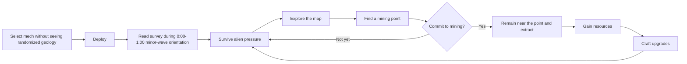

# Core Game Loop

## Purpose and player promise

The core loop combines automatic multi-weapon combat and continuous horde pressure with deliberate exploration and location-bound resource extraction. The game has no experience-point progression. Instead of gaining ordinary run power through XP level-ups or random treasure-chest weapon rewards, the player seeks mining opportunities and converts different kinds of extracted resources into crafted weapons and upgrades.

## Initial loop

The following is the standard-mode loop. Its order can vary moment to moment because exploration, mining, and fabrication remain player-directed, but its systems and timing rules are decided.

The fabrication menu is available on demand anywhere during the run, with no access limit. Crafting and upgrading freeze the entire gameplay simulation to create a break in the action.

## Decided player-facing rules

### Exploration

- Resources that matter to upgrade crafting are found by exploring the map.
- The game is intended to require more map exploration than its *Vampire Survivors* reference point.
- Each level is a large, finite, bounded world rather than an infinite, wrapping, or endlessly generated space.
- Its randomized authored regions are mostly open and joined by multiple wide routes. Solid obstacles are sparse, and no narrow mandatory chokepoint controls access to a major region. Optional dead ends provide readable exits and enough room to fight and mine.
- Each level randomizes which four specialized materials are present and whether each has eight, nine, or ten geodes while keeping unlocked blueprints, recipes, effects, and prices fixed.
- The randomized resource profile is not shown before deployment or used to choose a mech.
- At the start of active play, map information reveals the four present specialized materials, their detected counts of eight, nine, or ten geodes, and corresponding abundance labels during a one-minute orientation phase with deliberately minor enemy waves.
- The survey appears automatically as a compact, non-modal display without pausing the simulation or taking away movement control.
- The same survey remains available throughout the run from the fabrication interface, where reviewing it uses the fabrication menu's normal full-simulation pause.
- The orientation phase runs from 0:00 through 1:00 of active simulation. The player retains normal control and can begin moving, exploring, fighting, mining, and fabricating.
- Standard enemy escalation begins at 1:00, leaving six active minutes before the first interval boss.
- Every playable mech must remain viable on every valid resource profile; randomized geology may influence the build but cannot make the selected mech fundamentally unsuitable for the run.
- Exact mining-point and geode positions remain unknown until the player explores during the run.
- A compact fogged minimap reveals terrain as the player explores and retains markers for observed active or depleted deposits, landmarks, and opened or unopened relic caches.
- A larger version of the explored map is reviewable through the paused fabrication interface; neither map shows undiscovered terrain or content.
- The first-pass map scale, deposit distribution, connection widths, obstacle density, deployment fairness, and boundary behavior are fixed by the [Standard Map Generation Contract](./51-standard-map-generation-contract.md). Exact world signaling, biome art, minimap reveal behavior, and optional navigation aids remain open.
- The camera remains north-up and does not rotate; both map views use the same orientation as the playfield.

### Mining

- The map contains resource-bearing mining points.
- Mining activates automatically when the player enters and remains within the relevant point's valid area.
- Every mining point uses a clearly visible circular extraction zone.
- Extracting resources requires the player to remain within that area.
- Leaving grants a 0.5-second no-loss grace period, then unfinished extraction progress decays linearly at four times that point's forward extraction rate.
- This proximity requirement creates a positional challenge while other gameplay pressures continue.
- Standard and rich ore seams both deplete in 15 seconds. Standard seams pay 10 ore every 1.5 seconds for 100 total; rich seams pay 40 ore every 3 seconds for 200 total, doubling the income rate while taking twice as long to secure each larger installment.
- Material geodes take 20 seconds of forward extraction and award one specialized unit plus 50 common ore only at completion, while their resonance fields strengthen nearby enemies.
- Common ore points contain a finite amount and eventually run out.
- Common ore already awarded remains in the player's run inventory after leaving the point so it can be spent later on crafting.
- Each map has three Hyper Gold sites. Each awards 100 Hyper Gold only when its 45-second extraction completes.
- Mining Hyper Gold acts as a progress-escalating threat beacon and attracts a focused alien response.
- The beacon activates with the first Hyper Gold extraction progress and escalates once each at 25%, 50%, and 75%. Retreat stops further escalation while absent but leaves summoned enemies active; completion stops new beacon responses but does not remove survivors.
- A collected cross-run resource is secured only if the player survives until the level's time limit and completes mission extraction; death beforehand forfeits it.
- Mining is designed to produce push-your-luck decisions because remaining inside the area limits dodging options, while leaving sacrifices rapidly decaying progress—especially when a completion-only geode or Hyper Gold site has not finished.

Taking damage does not interrupt mining or move the mech out of the extraction zone. Standard enemies and bosses do not physically block the mech. The [Standard Wave and Beacon Schedule](./32-standard-wave-and-beacon-schedule.md) defines the four escalating Hyper Gold response packages. Zone radius, explicitly authored displacement edge cases, and playtest tuning of the 0.5-second grace and four-times decay remain open; deposit placement constraints are fixed by the standard map contract.

### Crafting and upgrades

- Mining produces resources.
- The player uses ordinary mined resources primarily to craft weapons and upgrades for the current run.
- The game supports multiple weapons and weapon upgrades.
- The run loadout has four weapon slots and three utility slots.
- The signature weapon begins in one weapon slot, leaving three empty weapon slots; all three utility slots begin available unless a later mech-specific exception is explicitly defined.
- Fabricating a weapon or utility permanently fills an empty slot for that run. Weapons and utilities cannot be removed, replaced, dismantled, sold, or refunded; relic replacement is the explicit exception.
- Crafting provides intentional weapon progression in place of XP level-up choices and random treasure-chest weapon rewards.
- The three sites contain 300 potential Hyper Gold, and four boss loot bursts can add another 100, for a 400-unit standard-run ceiling. Hyper Gold funds both permanent content or option unlocks and account-wide PowerUps spanning combat, survivability, mobility, and mining/economy. No PowerUp increases either payout source.
- Each standard map contains 20 standard ore seams and 8 rich ore seams at randomized locations, holding 3,600 common ore before geode payouts.
- Crafting and upgrading freeze the entire gameplay simulation, including the level timer, mining, enemies, attacks, and timed effects.
- The player can open the fabrication menu anywhere, at any time, and as often as desired.
- Unspent ordinary resources are lost when the run ends.
- The player must have a fair opportunity to turn mined resources into increased power before each interval boss arrives.
- Once a weapon is equipped, common basic ore purchases separate upgrades to its individual stats.
- Each weapon has a fixed bundle of upgradeable stats appropriate to its attack pattern.
- Stat ranks have no explicit cap; each rank adds a fixed linear amount to its displayed stat while its common-ore price rises nonlinearly.
- Exactly two units of the assigned specialized material purchase one of three mutually exclusive major weapon branches: a base-pattern amplification, a moderate functional variant, or a substantial playstyle conversion.
- A fabricated base weapon costs one unit of each of its two recipe materials; common ore alone cannot force the same full arsenal every run.
- The resource radar costs 300 common ore and occupies one utility slot.
- Once installed, the radar continuously displays up to seven active-play screen-edge directions: one toward the nearest unopened geode of each of the four present specialized materials, plus the nearest nondepleted standard ore seam, rich ore seam, and incomplete Hyper Gold site. It requires no manual targeting or pause.
- The content-complete catalog has twelve non-radar utilities, two assigned to each specialized material. Each costs one unit of its single assigned material, so every four-material profile offers exactly eight of them in addition to the radar. A first playable may use six, one per material.
- Every installed non-radar utility has three run-local ore ranks costing 50, 100, then 150 common ore. Utilities are passive or automatic support systems and add no manual gameplay input; the radar is not upgradeable initially.
- Each run includes exactly four of six specialized resource families. Their complete pair graph supports exactly six of 15 normal base-weapon recipes. Because the equipped signature cannot be duplicated, five or six distinct additional weapons remain available for three open slots. At least two of the selected signature weapon's three branch-resource colors are guaranteed. Profiles may favor particular combat patterns as long as they remain plausibly playable rather than restart-worthy.
- Each weapon can commit to only one mutually exclusive major branch during a run.
- The mech has one run-local relic slot, separate from weapon and utility slots.
- Every standard map contains exactly three clearly recognizable relic caches at randomized locations. A cache opens automatically on mech contact and freezes the complete gameplay simulation. Its relic must be installed or sold for common ore before play resumes; installing it replaces the active relic and automatically sells the displaced relic for common ore.
- Relics significantly change gameplay through unusual rules or tradeoffs rather than primarily providing unconditional stat increases.

The complete twelve-item [Utility Catalog](./68-utility-catalog.md), two-per-material assignments, base effects, and three ore ranks are accepted for playtesting. Radar bearing layout and overlap behavior are fixed by the [interface specification](./73-interface-screen-flow-and-information-architecture.md#radar-bearings-and-waypoint-bearing). Fabrication access itself does not gate pre-boss power growth; available resources and recipe rules do.

### Combat pressure

- Before deployment, the player selects one mech from the unlocked roster.
- Each mech begins with one fixed signature automatic weapon and its own gameplay trait.
- Direct moment-to-moment combat control is movement only. Digital input supports eight normalized directions, analog input supports the full circle, and releasing movement stops the mech immediately.
- Movement has no acceleration, braking lag, momentum, turn radius, sprint, dash, dodge, stamina, reverse penalty, or strafing penalty in the standard rules. The mech retains its last nonzero movement direction as its facing when stationary.
- Weapons attack automatically.
- Weapons determine their own targeting or attack patterns; the player does not manually aim or fire them.
- The player can have multiple weapons, following the broad multi-weapon combat pattern of *Vampire Survivors*.
- Enemy hordes create sustained pressure through a deterministic, minute-authored 35-minute wave schedule. Each minute defines enemy families, target population pressure, spawn cadence, and any authored swarm or encirclement events; it does not scale adaptively to the player's build.
- Ordinary enemies enter from valid navigable ground just outside the camera and can be recycled after traveling far away. Bosses do not despawn, and an offscreen boss that falls far behind is repositioned to make a readable offscreen re-entry.
- The content-complete initial map has ten ordinary enemy identities: six substantially distinct silhouette families plus four readable variants. A first playable may stage only six, and each authored minute uses at most three ordinary identities.
- The large majority of standard enemies use the same simple behavior: pursue the mech continuously and deal contact damage. Enemy identities primarily vary through statistics, size, appearance, density, and wave placement. Enemies may overlap one another and do not form physical walls around the mech.
- Each ordinary identity retains one fixed base statistic profile throughout the standard run. Pressure escalates through stronger identities, density, cadence, combinations, formations, elites, bosses, and explicit signaled modifiers rather than hidden time- or player-responsive stat scaling.
- Scheduled events may use simple fixed-direction swarms, walls, streams, or encirclements. Exactly one of the ten ordinary identities is a specialist: it retains pursuit and contact damage but periodically telegraphs and fires one straight, non-homing projectile toward the mech. It first appears during the 14:00–21:00 phase. The other nine are pure pursuers. Elites and bosses are outside the ten-identity count.
- The mech deploys at full Hull Integrity. The shared baseline is 100 maximum Hull Integrity and zero passive Recovery before account and mech modifiers; reaching zero causes death unless an explicit revival applies.
- Player movement is a primary gameplay input and defensive tool.
- The camera is fully top-down, north-up, and fixed-scale with a wide field of view. It tracks the mech at screen center except when clamped by the finite map boundary; there is no manual pan, rotation, aiming offset, combat zoom, or intentional follow lag.
- Ordinary enemies and elites drop no items, XP, resources, healing, consumables, or temporary effects. Their immediate reward is space and safety; kills may still drive explicitly described traits, relics, challenges, achievements, or unlocks.
- Mining is the primary source of common ore, specialized ordinary resources, and Hyper Gold. Relic sale and boss loot add common ore; boss loot also adds limited present-profile specialized materials and unsecured Hyper Gold.
- Standard mode maintains up to 16 active destructible non-enemy rocks around the player's explored area. It begins with 16 offscreen rocks and, during active simulation, makes one offscreen replenishment attempt per second with a 10% success chance; a successful attempt fills an empty slot or replaces the farthest eligible offscreen rock at the cap. Each non-solid rock has 100 Hull and a 0.80M weapon-damage footprint. Automatic weapons can break it under the accepted enemy-priority rules. Each destroyed rock has a fixed 20% chance to release one health pack and otherwise releases nothing. The pack persists until collected or run end, is collected when its 0.25M radius touches the mech, and immediately restores 25 Hull Integrity. Rocks have no other drop and never award common ore, specialized materials, or Hyper Gold.
- Defeating a boss creates a non-modal physical loot explosion worth 300 common ore, 25 unsecured Hyper Gold, and one present-profile specialized-material unit for the first two bosses or two independently selected units for the final two. Pieces persist, appear on the minimap, and require contact collection while combat continues.
- Exploration can reveal relics that significantly alter the mech's behavior; this reward is separate from enemy drops, mining, and fabrication.

Weapon-specific automatic targeting, timing, and first-playable values are defined in the [weapon concept catalog](./66-weapon-catalog-and-resource-graph.md) and [numeric catalog](./71-initial-weapon-numeric-catalog.md). The initial enemy roster, contact-damage cadence, sole specialist, bosses, minute-by-minute populations, formation events, and beacon responses are fixed in the [Initial Alien and Boss Roster](./31-initial-alien-roster.md) and [Standard Wave and Beacon Schedule](./32-standard-wave-and-beacon-schedule.md), with numerical tuning expected. The [Player Survivability and Damage Baseline](./72-player-survivability-and-damage-baseline.md) fixes initial mech movement speed, collision shapes, damage resolution, health packs, rocks, control, and failure margins. Camera scale remains tuning work. Activated utility abilities are not part of the baseline control scheme but may be considered later through an explicit decision.

The initial presentation targets Windows PC through Steam and Steam Deck in landscape. Desktop layouts use 1920×1080 as their reference; every gameplay and menu screen also supports 1280×800 without dropping required information. Keyboard-and-mouse and gamepad are complete methods, gamepad alone reaches every function, and prompts automatically match the active device. Mobile, touch-first, portrait, and console requirements are outside the initial scope.

### Timed completion and bosses

- One timed level is one complete run.
- A standard run has a 35-minute active-simulation time limit as the current playtest target.
- Surviving until the time limit completes the level.
- Successful completion is presented as the player's mission extraction.
- Mission extraction culminates the completed build and ends the run.
- No ordinary resources, weapons, or run-local upgrades carry into another level after extraction.
- Boss aliens arrive at 7:00, 14:00, 21:00, and 28:00 of active simulation, riffing on the pacing role of bosses in *Vampire Survivors*.
- Each boss persists until killed while ordinary horde pressure continues.
- Later bosses arrive on schedule even if an earlier boss remains alive, allowing boss overlap.
- No additional boss spawns at 35:00; the 28:00–35:00 phase is the final horde crescendo before extraction.
- Surviving to mission extraction permanently banks Hyper Gold collected during the level.
- Dying before the time limit forfeits that unsecured Hyper Gold.
- The 35:00 threshold succeeds immediately even if one or more bosses remain alive.
- The run timer advances only while the combat simulation is active. The pause menu, fabrication, relic decisions, tutorials, blocking modal prompts, operating-system suspension, and loss of application focus all freeze it; the opening survey is the explicit active-play exception.
- Death ends the run unless an explicit revival effect applies. Abandoning requires confirmation and uses the same failure settlement as death.
- After death, abandonment, or extraction, a results screen summarizes outcome and time, kills and bosses, final build and account PowerUps, damage by weapon, mining, resource income and spending, unsecured or banked Hyper Gold, exploration, and new unlocks before returning to the hangar.

The four boss identities, one-mechanic behaviors, arrival warnings, surrounding horde intensity, persistence, overlap, and reward model are defined in the encounter baseline. Extraction presentation and any alternate mode or map durations remain open. The standard specification is single-player; any multiplayer mode requires its own pause, camera, collision, and mining rules.

### Standard difficulty contract

- Standard mode targets an approachable, low-input survival experience that escalates from a forgiving opening into sustained routing and build pressure, then lets a successful late build feel extremely powerful.
- A fresh account with no PowerUps must have a plausible path to completing a standard run. PowerUps improve consistency and widen options but are not a prerequisite for basic viability.
- A highly upgraded account should make early standard play substantially easier, but starting gear plus permanent stats never substitutes for a coherent late-run build. PowerUps do not enable universal stationary survival, automatic resource acquisition, or a bypass around exploration and fabrication.
- The director does not secretly reduce pressure for a weak build or low-health player. Difficulty comes from authored waves, the selected map, and the player's route and commitments.

## Intended decision pattern

At a high level, a mining opportunity asks the player:

1. Is this mining point worth diverting toward?
2. Is the current position and threat state safe enough to begin extraction?
3. How long should I remain committed before the danger is no longer worth the expected reward?
4. How should I convert the resulting resources into power?

All four questions follow directly from the current brief. Exact values, threat-beacon encounter rules, and crafting choices still need to be defined.

## Required feedback

To make the decided loop legible, the eventual presentation must communicate at least:

- That a mining point exists and can be reached.
- Whether the player is within its valid extraction area.
- Whether extraction is active, paused, interrupted, or complete.
- Mining progress or another accurate indication of expected reward.
- Resources gained and their crafting relevance.
- The distinction between ordinary run resources and unsecured Hyper Gold.
- The level timer, upcoming boss intervals, and final mission-extraction threshold.
- Current danger strongly enough to support an informed commitment decision.
- Which upgrades can be crafted and what each will change.

### Active HUD baseline

During standard active play, the HUD persistently exposes:

- The upward-counting run timer, next scheduled boss threshold, and 35:00 extraction threshold.
- Current Hull Integrity through a continuously readable gauge.
- Current common ore, each carried specialized material, and unsecured Hyper Gold.
- The four weapon slots, three utility slots, and active relic identity, including empty slots.
- Total defeats and the compact north-up exploration minimap.

Mining progress, grace/decay, geode resonance, Hyper Gold beacon state, temporary field effects, and repair gains appear contextually when relevant. Exact numerical Hull Integrity and complete build statistics are always available through pause even if the active view uses compact gauges or icons.

The pause and results surfaces expose the summaries defined above through the accepted run-console and four-page Results structure. Exact screen regions, grouping, controller flow, and reference-resolution reflow are fixed by the [interface specification](./73-interface-screen-flow-and-information-architecture.md); final icon artwork, animation style, and audiovisual treatment remain presentation work.

## Open questions

- [OQ-004 — How does a mining point behave?](./open-questions.md#oq-004--how-does-a-mining-point-behave)
- [OQ-005 — What makes mining a push-your-luck system?](./open-questions.md#oq-005--what-makes-mining-a-push-your-luck-system)
- [OQ-008 — How does exploration work?](./open-questions.md#oq-008--how-does-exploration-work)
- [OQ-013 — What resource types exist, and what does each purchase?](./open-questions.md#oq-013--what-resource-types-exist-and-what-does-each-purchase)

## Related documents

- [Game Vision](./00-game-vision.md)
- [Interface, Screen Flow, and Information Architecture](./73-interface-screen-flow-and-information-architecture.md)
- [Run Structure and Timing](./20-run-structure-and-timing.md)
- [Combat, Weapons, Movement, and Camera](./30-combat-weapons-movement-camera.md)
- [Playable Mechs and Starting Loadouts](./35-playable-mechs.md)
- [Mining and Extraction](./40-mining-and-extraction.md)
- [Maps, Resource Surveys, Exploration, and Navigation](./50-maps-resources-and-navigation.md)
- [Resources, Crafting, and Progression](./60-resources-crafting-progression.md)
- [Weapon Stat and Branch Upgrades](./65-weapon-stat-and-branch-upgrades.md)
- [Mech Relics](./67-mech-relics.md)
- [Player Survivability and Damage Baseline](./72-player-survivability-and-damage-baseline.md)
- [Glossary](./glossary.md)
- [DEC-096 — Use Vampire Survivors as the default precedent](./decisions/DEC-096-use-vampire-survivors-as-the-default-precedent.md)
- [DEC-097 — Inherit direct movement, collision, and camera](./decisions/DEC-097-inherit-direct-movement-collision-and-camera.md)
- [DEC-098 — Use minute-authored horde waves](./decisions/DEC-098-use-minute-authored-horde-waves.md)
- [DEC-099 — Use single-player pause and results flow](./decisions/DEC-099-use-single-player-pause-and-results-flow.md)
- [DEC-100 — Commit installed weapons and utilities](./decisions/DEC-100-commit-installed-weapons-and-utilities.md)
- [DEC-101 — Target an approachable escalating standard difficulty](./decisions/DEC-101-target-an-approachable-escalating-standard-difficulty.md)
- [DEC-102 — Separate enemy kills from field pickups](./decisions/DEC-102-separate-enemy-kills-from-field-pickups.md)
- [DEC-103 — Use Hull Integrity and contact-collected field pickups](./decisions/DEC-103-use-hull-integrity-and-contact-collected-field-pickups.md)
- [DEC-122 — Use destructible rocks as the health-pack source](./decisions/DEC-122-use-destructible-rocks-for-health-packs.md)
- [DEC-123 — Replenish destructible rocks around the player](./decisions/DEC-123-replenish-destructible-rocks-around-the-player.md)
- [DEC-126 — Adopt the initial player survivability baseline](./decisions/DEC-126-adopt-the-initial-player-survivability-baseline.md)
- [DEC-104 — Show a compact survivor-like active HUD](./decisions/DEC-104-show-a-compact-survivor-like-active-hud.md)
- [DEC-105 — Use a simple pursuer-first enemy roster](./decisions/DEC-105-use-a-simple-pursuer-first-enemy-roster.md)
- [DEC-106 — Use ten ordinary enemy identities](./decisions/DEC-106-use-ten-ordinary-enemy-identities.md)
- [DEC-107 — Use fixed ordinary enemy stat profiles](./decisions/DEC-107-use-fixed-ordinary-enemy-stat-profiles.md)
- [DEC-108 — Use one straight-shot enemy specialist](./decisions/DEC-108-use-one-straight-shot-enemy-specialist.md)
- [DEC-109 — Use single-material utilities with three ore ranks](./decisions/DEC-109-use-single-material-utilities-with-three-ore-ranks.md)
- [DEC-110 — Use an open multi-route map topology](./decisions/DEC-110-use-open-multi-route-map-topology.md)
- [DEC-111 — Make bosses explode into collectible resources](./decisions/DEC-111-make-bosses-explode-into-resources.md)
- [DEC-112 — Bound permanent power below run-build power](./decisions/DEC-112-bound-permanent-power-below-run-build-power.md)
- [DEC-113 — Target Windows PC and Steam Deck first](./decisions/DEC-113-target-windows-pc-and-steam-deck-first.md)
