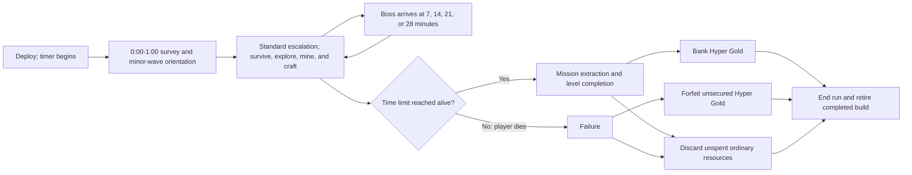

# Run Structure, Timing, Bosses, and Mission Extraction

## Purpose and player promise

A visible time limit gives each level a clear survival arc. Horde pressure and interval bosses test the run build while the player decides how much of the map to explore and how long to commit to mining. Reaching the time limit completes the level and is presented as a successful mission extraction, securing Hyper Gold carried by the player.

One timed level is one complete run. Mission extraction is the final culmination of the run's build rather than a transition into another level with that build.

## Player-facing summary

- Each level has a time limit.
- The standard-run target is 35 minutes of active simulation.
- Each run consists of exactly one timed level.
- The 35-minute timer and one-minute minor-wave orientation phase begin when the player deploys.
- The geological survey first becomes available during this active opening phase.
- The player succeeds by remaining alive until that limit.
- Reaching the limit completes the level and triggers mission extraction.
- Boss aliens arrive at 7:00, 14:00, 21:00, and 28:00 of active simulation.
- The final seven minutes are a horde crescendo, with no new boss spawned at extraction.
- Ordinary resources and their crafted benefits are run-local.
- Unspent ordinary resources are lost when the run ends.
- Hyper Gold remains unsecured during play.
- Successful mission extraction banks unsecured Hyper Gold; death before the limit forfeits it.
- Success or failure ends the run and removes its ordinary resources, weapons, and run-local upgrades.
- The standard specification is single-player. Multiplayer is a possible future mode with separately defined pause, camera, collision, and mining behavior.

## High-level timeline

An interval boss does not block mission extraction: if the player is alive when the time limit is reached, the level completes. Later bosses arrive on schedule even when an earlier boss remains active.

## Level timer

The level timer is the objective clock. It counts upward from 0:00 to 35:00. Remaining alive until it reaches 35:00 completes the level. Fabrication and relic-resolution pauses do not consume those 35 minutes, so total wall-clock session time will normally be longer.

The timer advances only while the combat simulation is active. It freezes during the pause menu, fabrication, relic resolution, tutorial overlays that block play, other modal prompts, operating-system suspension, and loss of application focus. The automatic opening survey is the explicit exception: it is non-modal, the simulation remains active, and the timer advances.

Alternate modes or maps may eventually use different time limits, but do not change the standard-mode rule. Standard boss warnings begin 15 seconds before arrival and use the HUD, a directional boss icon, a distant cry, and an edge treatment; final audiovisual styling and mission-extraction presentation remain open.

## Opening orientation phase

From deployment at 0:00 through 1:00 of active simulation, enemy waves are deliberately minor so the player can absorb the newly revealed geological survey, orient, and begin moving. This time counts normally toward the 35-minute run and pauses only under the same global rules as other gameplay time, including fabrication and relic resolution.

The player retains normal control and may explore, fight, mine, or fabricate during the opening phase. The survey appears 0.5 active seconds after deployment in a compact, non-modal form, remains expanded for 12 active seconds, and does not pause or capture movement. It remains reviewable later through the fabrication interface, which freezes the simulation under the normal fabrication rule. Eight Skitterlings form the initial desired population, with deliberately slow two-enemy replenishment pulses; standard escalation begins at 1:00, leaving six active minutes before the first boss at 7:00. First-run tutorial accommodations remain open under OQ-032.

## Mission extraction

“Mission extraction” is the thematic framing for successful timed completion. It is distinct from extracting a resource at a mining point.

Mission extraction triggers automatically when the living player reaches the time limit; it does not require travel to a separate evacuation location or a final interaction. The simulation ends at that threshold even if a boss remains alive. A short presentation may communicate the mech's successful departure, but it cannot add a new survival check after 35:00. Exact animation, camera treatment, and audiovisual presentation remain open.

## Boss cadence

Boss aliens arrive when the active-simulation timer reaches 7:00, 14:00, 21:00, and 28:00. Because fabrication freezes the simulation, time spent fabricating does not advance these arrival thresholds. The four bosses create regular seven-minute threat and build-readiness checks within the ordinary horde curve.

| Active time | Phase role | Boundary event |
| --- | --- | --- |
| 0:00–1:00 | Survey and deliberately minor orientation waves | Standard escalation begins at 1:00 |
| 1:00–7:00 | Initial exploration, mining, and build establishment | Boss 1 arrives at 7:00 |
| 7:00–14:00 | Early-build escalation | Boss 2 arrives at 14:00 |
| 14:00–21:00 | Mid-build escalation | Boss 3 arrives at 21:00 |
| 21:00–28:00 | Mature-build escalation | Boss 4 arrives at 28:00 |
| 28:00–35:00 | Final horde crescendo | Automatic mission extraction at 35:00 |

The ten minutes added to the former run structure are distributed through these longer phases. Wave beats are re-spaced and escalated within each phase rather than leaving the added time as low-pressure padding.

The standard horde director is deterministic and authored by active minute. The [Standard Wave and Beacon Schedule](./32-standard-wave-and-beacon-schedule.md) fixes all 35 initial compositions, desired minimum populations, replenishment pulses, formation events, boss relief, and Hyper Gold responses. The [Initial Alien and Boss Roster](./31-initial-alien-roster.md) defines ten fixed-profile ordinary identities: six substantially distinct silhouette families and four production-efficient but readable variants. Nine are pure contact pursuers; Needler retains pursuit and adds the sole telegraphed straight projectile. Elites are visible stat-enhanced pure pursuers, and the four one-mechanic bosses are separate. The schedule does not adapt to the player's build strength, health, account PowerUps, or mining route. Exact numeric values remain playtest-tunable without introducing hidden scaling.

Each boss persists until killed. Ordinary horde pressure continues during the boss encounter, and the next scheduled boss arrives even if an earlier boss remains alive. Failing to defeat a boss can therefore compound the danger through boss overlap, but boss kills are not required for timed success.

Bosses never despawn because of distance. If a boss falls far enough offscreen that ordinary pursuit would allow permanent avoidance, it is repositioned outside the camera on valid ground so it can make a readable re-entry. Repositioning cannot place a damaging boss or attack directly on the player. Bosses have greater resistance than ordinary enemies to knockback, control, and instant-kill effects; exact resistance profiles are boss-specific.

No new boss or separate Reaper-like end-state attacker spawns at the 35-minute extraction threshold. The phase from 28:00 through 35:00 is the final horde crescendo and culmination of the completed build. A boss still alive at 35:00 does not prevent extraction.

### Boss-defeat reward

Every boss dies in a conspicuous physical loot explosion while combat and the timer continue. Each burst contains 300 common ore and 25 unsecured Hyper Gold. The 7:00 and 14:00 bosses add one specialized-material unit; the 21:00 and 28:00 bosses add two. Each unit independently selects one of the four materials present in the geological profile, with duplicates allowed and absent materials excluded.

The pieces scatter onto valid nearby ground, persist until contact-collected or run end, and receive an immediate minimap marker. No chest, reward menu, choice, or pause occurs. A complete four-boss collection adds 1,200 ore, 100 Hyper Gold, and six specialized units. Exact currency values remain playtest tuning, while the physical resource-burst model is fixed.

Each interval contains exactly one named boss: Riftjaw, Brood Titan, Prism Crown, and Skybreaker Apex. Their arrival minute briefly lowers baseline ordinary population by roughly 10–20% and adds no separate formation so the entrance remains readable; the following minute restores and exceeds the prior pressure. The final crescendo raises population from 230 during the fourth boss's arrival minute to 420 in minute 34 and layers increasingly frequent walls, encirclements, convergence, and streams without adding another ordinary behavior.

### Pre-boss power-growth guardrail

Before each interval boss arrives, the player must have a fair opportunity to spend mined resources and increase the run's power. Unrestricted on-demand fabrication access satisfies the access portion of this guardrail. Boss tuning must also ensure that enough appropriate resources can reasonably be mined before arrival.

## Success, failure, and resource settlement

### Success

When the player survives until the time limit:

- The level is completed through mission extraction.
- Collected Hyper Gold becomes permanently banked.
- Unspent ordinary resources are discarded.
- Run-local weapons and upgrades end immediately with the run unless explicitly exempted by a later decision.
- The player does not continue into another level with the completed build.

### Failure

When the player dies before the time limit:

- The level is not completed.
- Unsecured Hyper Gold collected in the level is forfeited.
- Unspent ordinary resources are discarded.
- Run-local weapons and upgrades end with the run.
- The player does not continue into another level with the failed build.

Death occurs when the mech reaches zero Hull Integrity and ends the run unless an explicitly equipped effect provides a revival. Choosing **Abandon Run** from the pause menu requires confirmation and then uses the same resource settlement as death. The standard mode has no other failure condition.

### Results and return to the hangar

Every success, death, or confirmed abandonment proceeds to a results screen and then returns the player to the hangar. Results must report at least:

- Outcome and active survival time.
- Total kills and boss defeats.
- Final mech, weapons and branches, utilities, relic, and active account PowerUps.
- Damage dealt by each weapon.
- Mining points attempted and completed by class.
- Common ore and specialized materials collected, spent, and discarded.
- Hyper Gold collected and either banked or forfeited.
- Map exploration and any newly earned unlocks.

Exact grouping, comparisons, records, animations, and post-run unlock presentation remain open.

## On-demand crafting pauses

The player can open the fabrication menu anywhere and at any time during a run, with no limit on how often it is opened. Crafting and upgrading freeze the entire gameplay simulation, providing a deliberate rest and planning beat within the timed survival arc. Resource costs and recipe rules constrain actual power growth; no timer milestone, boss event, fabrication charge, or map location gates menu access.

While the menu is open, the level timer, enemies, spawning, projectiles, automatic attacks, cooldowns, mining progress and decay, threat-beacon events, hazards, status durations, pickups, and gameplay physics do not advance. Only the fabrication interface and its non-gameplay presentation continue.

This rule is intentionally subject to playtesting. If players interrupt action too frequently, use the menu primarily as a panic pause, or trivialize pressure through its pause behavior, access constraints may be reconsidered. See [RES-003](./research/RES-003-crafting-break-cadence.md).

## General pause menu

The player may pause standard single-player play at any time. The complete simulation and active timer freeze. The pause surface shows the current timer and phase, mech, weapons and branches, utilities, relic, carried resources, unsecured Hyper Gold, relevant combat and mining statistics, and explored map. It offers Resume, Settings, Controls, and Abandon Run. Abandonment uses the confirmation and settlement rules above.

## Relic-resolution pauses

Discovering a relic also freezes the complete gameplay simulation while the player compares the new effect, current relic, and common-ore sale outcomes. The same timer, enemy, attack, mining, hazard, effect-duration, pickup, and physics freeze applies. Unlike fabrication, this pause is triggered by a finite map discovery rather than opened on demand.

The simulation resumes only after the player installs the new relic or sells it. The decision cannot be deferred.

## Standard difficulty contract

Standard mode is an approachable, low-input survival challenge with a forgiving orientation minute, steadily rising mid-run routing and build pressure, and a final crescendo in which a successful mature build can feel overwhelmingly powerful. A fresh account with no PowerUps must have a plausible path to extraction. A highly upgraded account should find early play substantially easier and tolerate more imperfect decisions, but starting gear plus permanent stats still cannot replace late-run build development or universally eliminate movement demands. The [Player Survivability and Damage Baseline](./72-player-survivability-and-damage-baseline.md) fixes the initial milestone-reach bands, 30–50% fresh-account extraction target, and 85–97% maximum-PowerUp experienced-player target. The director never secretly weakens a wave because the player is underpowered, scales up to cancel earned PowerUps, or responds to low health.

## Open questions

- [OQ-032 — What onboarding, accessibility, and settings does standard mode require?](./open-questions.md#oq-032--what-onboarding-accessibility-and-settings-does-standard-mode-require)

## Related documents

- [Game Vision](./00-game-vision.md)
- [Core Game Loop](./10-core-game-loop.md)
- [Interface, Screen Flow, and Information Architecture](./73-interface-screen-flow-and-information-architecture.md)
- [Combat, Weapons, Movement, and Camera](./30-combat-weapons-movement-camera.md)
- [Mining and Extraction](./40-mining-and-extraction.md)
- [Resources, Crafting, and Progression](./60-resources-crafting-progression.md)
- [Mech Relics](./67-mech-relics.md)
- [Player Survivability and Damage Baseline](./72-player-survivability-and-damage-baseline.md)
- [DEC-005 — Use timed survival, interval bosses, and mission extraction](./decisions/DEC-005-timed-survival-and-mission-extraction.md)
- [DEC-006 — Pause combat for crafting and discard unspent ordinary resources](./decisions/DEC-006-paused-crafting-and-run-resource-reset.md)
- [DEC-010 — Make one timed deployment one complete run](./decisions/DEC-010-one-deployment-per-run.md)
- [DEC-011 — Start with a 25-minute standard run timer](./decisions/DEC-011-twenty-five-minute-run-timer.md) — superseded by DEC-079
- [DEC-012 — Schedule four bosses before the final horde crescendo](./decisions/DEC-012-four-boss-five-minute-cadence.md) — cadence superseded by DEC-079
- [DEC-013 — Keep bosses active and allow scheduled overlap](./decisions/DEC-013-persistent-overlapping-bosses.md)
- [DEC-015 — Reveal randomized geology during the active opening](./decisions/DEC-015-in-run-opening-geological-survey.md)
- [DEC-016 — Use a one-minute minor-wave orientation phase](./decisions/DEC-016-one-minute-opening-orientation.md)
- [DEC-029 — Pause and resolve relic discoveries through installation or common-ore sale](./decisions/DEC-029-pause-and-resolve-relic-discoveries.md)
- [DEC-079 — Use a 35-minute run and seven-minute boss cycle](./decisions/DEC-079-thirty-five-minute-seven-minute-boss-cycle.md)
- [DEC-080 — Use 20-second geodes and 45-second super-resource sites](./decisions/DEC-080-twenty-second-geodes-forty-five-second-super-resources.md)
- [DEC-091 — Name and quantify Hyper Gold](./decisions/DEC-091-name-and-quantify-hyper-gold.md)
- [DEC-096 — Use Vampire Survivors as the default precedent](./decisions/DEC-096-use-vampire-survivors-as-the-default-precedent.md)
- [DEC-098 — Use minute-authored horde waves](./decisions/DEC-098-use-minute-authored-horde-waves.md)
- [DEC-099 — Use single-player pause and results flow](./decisions/DEC-099-use-single-player-pause-and-results-flow.md)
- [DEC-101 — Target an approachable escalating standard difficulty](./decisions/DEC-101-target-an-approachable-escalating-standard-difficulty.md)
- [DEC-103 — Use Hull Integrity and contact-collected field pickups](./decisions/DEC-103-use-hull-integrity-and-contact-collected-field-pickups.md)
- [DEC-105 — Use a simple pursuer-first enemy roster](./decisions/DEC-105-use-a-simple-pursuer-first-enemy-roster.md)
- [DEC-106 — Use ten ordinary enemy identities](./decisions/DEC-106-use-ten-ordinary-enemy-identities.md)
- [DEC-107 — Use fixed ordinary enemy stat profiles](./decisions/DEC-107-use-fixed-ordinary-enemy-stat-profiles.md)
- [DEC-108 — Use one straight-shot enemy specialist](./decisions/DEC-108-use-one-straight-shot-enemy-specialist.md)
- [DEC-111 — Make bosses explode into collectible resources](./decisions/DEC-111-make-bosses-explode-into-resources.md)
- [DEC-112 — Bound permanent power below run-build power](./decisions/DEC-112-bound-permanent-power-below-run-build-power.md)
- [Initial Alien and Boss Roster](./31-initial-alien-roster.md)
- [Standard Wave and Beacon Schedule](./32-standard-wave-and-beacon-schedule.md)
- [DEC-119 — Accept the initial alien encounter baseline](./decisions/DEC-119-accept-initial-alien-encounter-baseline.md)
- [DEC-126 — Adopt the initial player survivability baseline](./decisions/DEC-126-adopt-the-initial-player-survivability-baseline.md)
