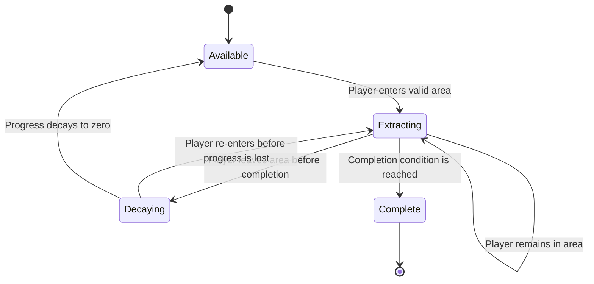

# Mining and Extraction

## Purpose and player promise

Mining turns progression into a spatial commitment. The player explores to find a resource-bearing point, enters its mining area, and tries to remain there while automatic weapons hold back alien hordes. The player may leave to survive, but unfinished progress decays very quickly, making each retreat costly without requiring a separate mining control.

## Player-facing summary

- Mining is automatic.
- Entering and remaining close enough to a mining point causes extraction to progress.
- No interaction button or repeated mining input is required.
- Leaving the valid area causes unfinished progress to decay very quickly.
- Different resource categories use different payout rules.
- Mining is the primary source of common ore, specialized ordinary resources, and Hyper Gold. Relic sales and boss loot provide common ore; boss loot also provides limited present-profile specialized materials and unsecured Hyper Gold. Ordinary enemies and elites never drop crafting materials.
- Standard ore seams pay small, frequent common-ore installments; rich ore seams pay larger installments at twice the interval and twice the overall ore rate.
- Material geodes pay one specialized material plus 50 common ore only when fully opened.
- Every unopened material geode projects a material-specific resonance field that makes nearby enemies more dangerous.
- Each map's three Hyper Gold sites take 45 seconds, pay 100 Hyper Gold only when extraction completes, and use progress-threshold threat beacons.
- Cross-run resources are only kept if the player survives to timed mission extraction.

## Mining state flow

This diagram describes unfinished extraction progress. Ore seams repeat the flow once per payout installment until their finite capacity is depleted. Each completed installment is a permanent checkpoint for that run. Material geodes and Hyper Gold sites withhold their primary reward until the `Complete` transition.

## Automatic proximity activation

When the player enters a mining point's clearly visible circular zone, mining begins automatically. It continues for as long as the player remains inside. This preserves the movement-focused control model: the player expresses commitment through position rather than through a held button or separate mining action.

The boundary must be readable before the player commits and must provide immediate feedback when the player crosses it in either direction. Exact radius and any resource-specific size variation remain open.

## Progress decay

Leaving the circular zone begins a 0.5-second grace period. Unfinished progress holds steady during that grace period. If the player remains outside after it expires, progress decays linearly at four times that point's forward extraction rate. Re-entering before progress reaches zero resumes extraction from the remaining progress.

These are initial playtest values. At four-times decay, half of a full extraction's progress disappears in one eighth of the time needed to complete that extraction from zero, after the grace period. Common ore already paid out remains in inventory; only unfinished progress decays.

Taking ordinary contact or projectile damage does not interrupt extraction, reset progress, or move the mech. Explicitly authored displacement or teleportation effects use the same inside/outside test as voluntary movement; if they move the mech outside, the ordinary grace and decay rules begin. Opening fabrication, pause, relic resolution, or another blocking modal freezes both forward progress and decay. Death ends the run and discards all unspent ordinary resources under the normal failure settlement.

## Resource payout profiles

### Standard ore seams

A standard ore seam awards 10 common ore whenever the player completes a 1.5-second extraction installment. It contains ten installments and therefore takes 15 seconds of uninterrupted forward extraction to deplete, paying 100 ore in total.

Ore from completed intervals remains secured in the run inventory. Leaving only threatens progress toward the current unfinished interval. After the ordinary grace period, that interval progress decays at four times its forward rate; it never removes previously awarded ore.

Each standard map contains 20 standard seams at randomized locations, for 2,000 common ore and five minutes of uninterrupted extraction if all are depleted. Exact spatial distribution remains a tuning variable. The count, 10-ore payout, 1.5-second cadence, ten-installment capacity, and 15-second total depletion time are the initial playtest baseline.

### Rich ore seams

A rich ore seam awards 40 common ore whenever the player completes a 3-second extraction installment. It contains five installments and therefore also takes 15 seconds of uninterrupted forward extraction to deplete, paying 200 ore in total. It produces twice the common ore per second and total seam while requiring twice the exposure before each secured payout. Rich seams are less common world finds than standard seams.

The same checkpoint and decay rules apply: a completed 40-ore installment is retained, while only the unfinished current 3-second interval can decay. Each standard map contains 8 rich seams at randomized locations, for 1,600 common ore and two minutes of uninterrupted extraction if all are depleted. Exact spatial distribution remains a tuning variable.

“Rich ore” refers to a high-yield source of ordinary common ore. It is not [Hyper Gold](./glossary.md#hyper-gold) and does not persist between runs.

### Specialized-material geodes

Every material geode contains exactly one unit of Asterite, Barysteel, Cinderglass, Driftmetal, Eidolon Coral, or Flux Amber. Its extraction bar takes 20 seconds of uninterrupted forward progress from zero. It awards that unit and 50 common ore only at completion and provides no partial material or ore payout.

Each of the four materials selected for the run appears in exactly eight, nine, or ten geodes:

| Survey state | Geodes on map | Meaning |
| --- | ---: | --- |
| Scarce | 8 | Lowest accepted supply; still broadly plentiful |
| Moderate | 9 | Middle supply |
| Rich | 10 | Highest standard supply |

The geological survey reports both the abundance label and detected geode count, but not their locations. A standard map therefore contains 32–40 material geodes. Even the eight-geode floor makes each present material broadly available, while time, travel, combat pressure, and successful extraction determine how much of that supply the player actually obtains. The 32-unit map minimum comfortably exceeds the 17 specialized units needed for a completely filled and fully branched four-weapon, three-utility loadout. A pathological allocation can still demand as many as 11 units of one material, so the ten-geode ceiling does not literally guarantee every possible concentration; no conversion system is included in the baseline.

Opening a geode depletes it permanently for the run and collapses its resonance field. Like a depleted ore seam or completed Hyper Gold site, it remains as a non-interactive mapped landmark for the rest of the run and cannot be reactivated. The specialized material and 50 common ore are run-local and are lost if unspent when the run ends.

At minimum uninterrupted pace, six geodes for three additional weapons take 2:00. Fourteen geodes for four branched weapons take 4:40. A completely filled and branched build takes 5:20 with the common-ore radar or 5:40 with three material utilities—15.2% or 16.2% of the 35-minute run. Exploration, retreats, failed attempts, and other mining add to those minimums.

The corresponding geode jackpots are 300 ore for six base-weapon geodes, 700 ore for fourteen weapon-and-branch geodes, 800 ore for a sixteen-geode radar build, and 850 ore for a seventeen-geode all-material-utility build. At the accepted shared-depth price curve, 800 ore can purchase the first four stat upgrades on each of four weapons when distributed evenly.

Opening every material geode on a standard map would take 10:40–13:20 of uninterrupted extraction—30.5%–38.1% of the run—before routing or interruptions. The increased population is intended to create route choice and build recovery, not an expectation that the player clears every geode.

### Geode resonance fields

An unopened material geode projects a visible circular resonance field larger than its extraction zone. Enemies physically inside the resonance field receive the geode's thematic modifier. The field exists before extraction begins, remains active during interruptions, and ends immediately when the geode opens. Enemies do not retain the modifier after leaving the field or after its collapse.

| Geode | Resonance effect on enemies within the field |
| --- | --- |
| Asterite | **Focused Assault:** outgoing enemy damage is 20% higher |
| Barysteel | **Dense Plating:** enemies take 20% less damage |
| Cinderglass | **Charged Payloads:** enemy projectile damage is 20% higher |
| Driftmetal | **Vector Lock:** player-imposed displacement magnitude and control-effect duration are 20% lower |
| Eidolon Coral | **Synchronized Aggression:** enemy attack cadence is 20% faster without increasing movement speed |
| Flux Amber | **Overclocked Motion:** enemy movement speed is 20% higher without increasing attack cadence |

These initial 20% modifiers are playtest values. Their common magnitude does not assert equal practical difficulty; wave composition and the player's build may make one field more dangerous than another.

The field affects ordinary enemies, elites, and bosses whenever they are inside it. Cinderglass determines bonus projectile damage when the empowered enemy creates the projectile; that projectile retains the decided damage after crossing the boundary. Barysteel reduces incoming damage only while the enemy remains inside and never restores health when the effect ends. Driftmetal reduces both forced-movement magnitude and timed control duration without granting immunity.

Standard map generation separates unopened geodes far enough that their resonance fields do not overlap. The field adds local combat pressure but does not summon enemies or use progress thresholds. Progress-escalating reinforcements remain the distinct behavior of Hyper Gold sites.

### Hyper Gold sites

**Hyper Gold** is the resource used for cross-run progression. Every standard map contains exactly three Hyper Gold sites at randomized locations. Each site takes 45 seconds of uninterrupted forward progress to complete from zero and awards 100 Hyper Gold only at completion. No partial Hyper Gold is granted merely for building progress. Leaving the area puts the entire pending reward at risk because unfinished progress decays rapidly.

The sites contain 300 Hyper Gold in total. Separately, each interval boss drops 25 physical Hyper Gold on death, creating another 100-unit ceiling if all four bosses are defeated and their loot collected. Boss Hyper Gold requires no mining progress but follows the same unsecured-until-extraction rule.

The first extraction progress on a Hyper Gold site activates its threat beacon and begins a focused alien response. Stronger responses trigger the first time progress reaches 25%, 50%, and 75%—11.25, 22.5, and 33.75 seconds of uninterrupted forward progress from zero. Each threshold can trigger only once for that site, even if decay later pulls progress below it. Beacon enemies enter from valid navigable ground outside the camera using the horde director's normal readable-spawn rule.

Leaving the zone stops further beacon escalation while the player is absent, but every summoned enemy remains active. Returning resumes extraction and permits any not-yet-triggered thresholds to fire. Completion stops all new beacon-generated responses; surviving summoned enemies remain. The [Standard Wave and Beacon Schedule](./32-standard-wave-and-beacon-schedule.md#hyper-gold-threat-beacon-response) fixes each response's phase-scaled count, formation, two-second warning, current-roster composition, elite additions, persistence, and capacity behavior.

Completing the site places its resource in an unsecured state for the remainder of the level. The player keeps it permanently only by surviving until the level's time limit and completing mission extraction. Dying before the time limit forfeits it.

### Other resource profiles

Standard ore seams, rich ore seams, specialized-material geodes, and Hyper Gold sites are the accepted initial mining-point classes. Any additional profile requires an explicit distinct player decision rather than variety alone.

## Push-your-luck pressure

Mining pressure arises from three general rules:

1. Alien hordes continue to constrain the battlefield.
2. Extraction requires the player to remain within a limited area, making dodging harder.
3. Leaving causes rapid progress decay, making a temporary retreat costly.

The player therefore chooses between staying to preserve progress and leaving to regain freedom of movement. Completion-only geodes and Hyper Gold sites increase the stakes because an incomplete attempt pays nothing. A geode's resonance field also raises immediate local difficulty throughout the attempt.

Hyper Gold mining adds another rule: the site functions as a progress-escalating threat beacon. The initial response and 25%, 50%, and 75% escalation events should be clearly attributable to the site. Retreat prevents further escalation while absent but leaves existing threats in the world, so probing one has a lasting combat cost. [RES-002](./research/RES-002-holdout-extraction-pressure-patterns.md) compares relevant pressure patterns.

## Feedback requirements

The game must clearly communicate:

- The mining point's resource category before or at commitment.
- The valid mining area and whether the mech is currently inside it.
- Automatic activation and active extraction.
- Current progress, completion condition, and approximate remaining commitment.
- The start, speed, and consequence of progress decay after leaving.
- Each secured ore-seam installment and progress toward the next installment.
- Standard-versus-rich ore cadence and yield.
- The fact that a geode's material and 50 common ore remain unearned until completion.
- The geode's material identity, extraction zone, larger resonance field, active enemy modifier, and field collapse.
- The fact that 100 Hyper Gold remains unearned until its 45-second extraction completes.
- Threat-beacon activation, escalation, and completion.
- Whether a collected cross-run resource is currently unsecured or has been permanently banked.
- Completion, depletion, interruption, and any resource-specific danger.

The difference between continuous and completion-only rewards must not depend on color alone.

## Interactions and edge cases

The following cases require later rules:

- The player is within range of more than one mining point.
- An explicitly authored specialist effect pushes, pulls, or teleports the player across the boundary.
- The player crosses the boundary repeatedly in quick succession.
- A movement ability temporarily leaves or ignores ordinary terrain.
- An explicit revival, invulnerability, or incapacitation effect occurs during mining.
- Mining completes on the same update that the player exits the area.
- An ore seam is interrupted at the exact instant an installment completes.
- An enemy or projectile crosses a geode resonance boundary during an attack.
- A cross-run upgrade explicitly modifies a depleted point.

The standard specification is single-player. Any future multiplayer mode requires a separate decision for shared mining occupancy and progress.

## Onboarding and accessibility

The first mining interaction must teach automatic activation, the valid area, and exit decay without requiring the player to infer them during maximum horde pressure. Boundary, progress, decay, and resource profile cues require non-color channels and scalable visual clarity.

## Open questions

- [OQ-004 — How does a mining point behave?](./open-questions.md#oq-004--how-does-a-mining-point-behave)
- [OQ-005 — What makes mining a push-your-luck system?](./open-questions.md#oq-005--what-makes-mining-a-push-your-luck-system)
- [OQ-008 — How does exploration work?](./open-questions.md#oq-008--how-does-exploration-work)
- [OQ-013 — What resource types exist, and what does each purchase?](./open-questions.md#oq-013--what-resource-types-exist-and-what-does-each-purchase)
- [OQ-032 — What onboarding, accessibility, and settings does standard mode require?](./open-questions.md#oq-032--what-onboarding-accessibility-and-settings-does-standard-mode-require)
- [Initial Alien and Boss Roster](./31-initial-alien-roster.md)
- [Standard Wave and Beacon Schedule](./32-standard-wave-and-beacon-schedule.md)
- [DEC-119 — Accept the initial alien encounter baseline](./decisions/DEC-119-accept-initial-alien-encounter-baseline.md)

## Related documents

- [Game Vision](./00-game-vision.md)
- [Core Game Loop](./10-core-game-loop.md)
- [Run Structure and Timing](./20-run-structure-and-timing.md)
- [Combat, Weapons, Movement, and Camera](./30-combat-weapons-movement-camera.md)
- [Resources, Crafting, and Progression](./60-resources-crafting-progression.md)
- [Specialized Resource Identities](./61-specialized-resource-identities.md)
- [Weapon Stat and Branch Upgrades](./65-weapon-stat-and-branch-upgrades.md)
- [DEC-003 — Use automatic proximity mining with resource-specific payouts](./decisions/DEC-003-proximity-mining-and-resource-payouts.md)
- [DEC-004 — Use finite common deposits, rare threat beacons, and survival-gated banking](./decisions/DEC-004-mining-retention-threat-and-banking.md)
- [DEC-020 — Keep ordinary crafting materials exclusive to mining](./decisions/DEC-020-mining-exclusive-ordinary-materials.md) — superseded by DEC-029
- [DEC-029 — Pause and resolve relic discoveries through installation or common-ore sale](./decisions/DEC-029-pause-and-resolve-relic-discoveries.md)
- [DEC-031 — Use visible circular mining zones with fast exit decay](./decisions/DEC-031-circular-mining-zone-and-fast-decay.md)
- [DEC-032 — Escalate rare threat beacons at progress thresholds](./decisions/DEC-032-progress-threshold-threat-beacons.md)
- [DEC-077 — Use ore seams and completion-only material geodes](./decisions/DEC-077-ore-seams-and-material-geodes.md)
- [DEC-078 — Give material geodes thematic enemy resonance fields](./decisions/DEC-078-geode-resonance-fields.md)
- [DEC-080 — Use 20-second geodes and 45-second super-resource sites](./decisions/DEC-080-twenty-second-geodes-forty-five-second-super-resources.md)
- [DEC-081 — Place eight to ten geodes for each present material](./decisions/DEC-081-eight-to-ten-geodes-per-material.md)
- [DEC-082 — Deplete both ore-seam classes in fifteen seconds](./decisions/DEC-082-fifteen-second-ore-seams.md)
- [DEC-083 — Set the common-ore installment unit to ten](./decisions/DEC-083-set-common-ore-unit-to-ten.md)
- [DEC-086 — Award fifty common ore from each material geode](./decisions/DEC-086-fifty-ore-geode-jackpot.md)
- [DEC-090 — Place twenty standard and eight rich ore seams](./decisions/DEC-090-place-twenty-standard-and-eight-rich-ore-seams.md)
- [DEC-091 — Name and quantify Hyper Gold](./decisions/DEC-091-name-and-quantify-hyper-gold.md)
- [DEC-097 — Inherit direct movement, collision, and camera](./decisions/DEC-097-inherit-direct-movement-collision-and-camera.md)
- [DEC-098 — Use minute-authored horde waves](./decisions/DEC-098-use-minute-authored-horde-waves.md)
- [DEC-099 — Use single-player pause and results flow](./decisions/DEC-099-use-single-player-pause-and-results-flow.md)
- [DEC-104 — Show a compact survivor-like active HUD](./decisions/DEC-104-show-a-compact-survivor-like-active-hud.md)
- [DEC-111 — Make bosses explode into collectible resources](./decisions/DEC-111-make-bosses-explode-into-resources.md)
