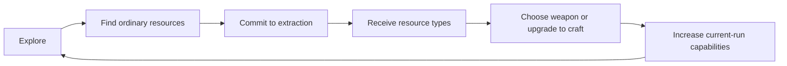

# Resources, Crafting, and Progression

## Purpose and player promise

Progression makes exploration and positional commitment the source of power. Instead of passively accumulating XP from defeated monsters and receiving randomized weapon progression from levels or treasure chests, the player finds mining points, extracts several kinds of resources, discovers relics, and intentionally develops the run build.

## Progression layers

The game has two resource scopes.

| Scope | Availability | Primary purpose | Persistence |
| --- | --- | --- | --- |
| Ordinary crafting resources | Found primarily in finite deposits through map exploration; common ore also comes from selling relics | Craft weapons, utilities, individual stat upgrades, and major weapon branches for the current run | Retained after collection for the rest of the run; discarded when the run ends |
| Hyper Gold | 100 from each of three completion-only 45-second threat-beacon sites | Buy permanent numerical power and permanent content or option unlocks | Banked at timed mission extraction; forfeited on death beforehand |

Ordinary resources, installed equipment, relics, and their run upgrades are strictly run-local under the standard rules. Any future persistence exception requires an explicit decision.

## Replacement of XP and treasure chests

- The game has no experience points.
- Defeated enemies do not drop XP gems.
- XP thresholds and XP-driven level-up choices are not the ordinary route to weapons or upgrades.
- *Vampire Survivors*-style treasure chests do not provide the ordinary random weapon and weapon-upgrade progression.
- Mining multiple resource types and crafting with them fill those progression functions.

This does not yet prohibit every possible chest-shaped object, random event, or non-XP level concept. It specifically excludes XP progression and chest-driven weapon progression.

## Run-local progression loop

Resource composition adds a planning dimension: what the player can craft depends not only on how much was mined, but on which resource types were obtained. Base-weapon recipes, branch assignments, initial unit costs, and the complete single-material utility catalog are fixed; resource fungibility remains open.

Standard ore seams award 10 common ore every 1.5 seconds for ten installments, paying 100 ore over 15 seconds. Each map has 20. Rich seams award 40 ore every 3 seconds for five installments, paying 200 ore over the same 15 seconds. Each map has 8. Those 28 seams contain 3,600 ore. Material geodes require 20 seconds of forward extraction and withhold their one specialized material and 50 common ore until completion, adding another 1,600–2,000 ore across the map's 32–40 geodes. See [Mining and Extraction](./40-mining-and-extraction.md).

Boss loot can add another 1,200 common ore and six specialized units if all four bosses are defeated and every piece collected. The resulting complete-run ceiling before relic sales is 6,400–6,800 common ore and 38–46 specialized units. Boss rewards are substantial, but mining still supplies most available ore and specialized materials.

## Cross-run progression loop

Completing a Hyper Gold site awards 100 Hyper Gold but does not permanently secure it. Each map has three sites, for 300 site-based Hyper Gold. Each of the four interval bosses also drops 25 physical Hyper Gold pieces, for another 100 if every boss is defeated and every piece collected. The player banks collected Hyper Gold from either source only by surviving until the level's 35-minute time limit and completing mission extraction. Dying before then forfeits it.

### Hyper Gold purchase categories

Hyper Gold has two required classes of between-run purchase:

- **Permanent PowerUps** add capped numerical improvements that apply account-wide to every current and future mech. Each rank is purchased once for the account; changing or unlocking mechs never requires repurchasing it. PowerUps provide direct account growth but do not replace the much larger run-local power curve created by mining and fabrication.
- **Permanent option unlocks** expand the content or choices available in future runs. The accepted initial catalog contains one six-blueprint utility bundle and five relic-pool additions for 2,150 Hyper Gold total. Later mechs, weapons, maps, modes, relics, cosmetics, or other additions require separate decisions.

The accepted [Permanent PowerUp Catalog](./62-permanent-powerup-catalog.md) contains thirteen tracks across combat, survivability, mobility/exploration, and mining/run-local economy. A fully active account gains +15% weapon Damage, +10% Attack Rate, +15% Area, +16% applicable Duration, +25 maximum Hull, +3 Armor, +0.15 Hull/s Recovery, one Emergency Reboot, +10% movement speed, +25% discovery radius, +10% extraction rate, +15% extraction-zone radius, and +15% mined common ore. The complete catalog costs 9,450 Hyper Gold. Exact values remain catalog-wide playtest variables.

The accepted [Permanent Option-Unlock Catalog](./63-permanent-option-unlock-catalog.md) costs 2,150 Hyper Gold. A fresh profile already has all six initial mechs, all 15 base weapons, the radar, one basic utility per specialized material, five relics, the standard map, and standard mode. The six permanent purchases unlock the alternate utility for all six materials as one bundle and add the other five initial relics individually to random caches.

A highly upgraded account should feel substantially stronger during early standard play and tolerate more imperfect routing, but permanent stats cannot replace a developed run build, make late positioning universally optional, or automate resource acquisition. The standard director does not secretly scale up to cancel this advantage.

PowerUps never multiply, duplicate, or otherwise increase Hyper Gold payouts. A completed site always awards exactly 100 Hyper Gold, each boss always drops 25, and a standard run has a 400-unit ceiling across both sources. Mining/economy PowerUps may modify ordinary resources or other mining behavior only when their descriptions explicitly say so.

Unlocking content does not bypass its ordinary run rules. For example, an unlocked weapon still follows signature selection, specialized-resource availability, duplicate prohibition, slot limits, and fabrication requirements unless that unlock explicitly establishes an exception. Account-wide PowerUps modify the shared starting baseline, after which each mech's inherent traits and stat differences apply. Numerical purchases, prices, caps, and between-run active-rank behavior are fixed by the PowerUp catalog. Initial option purchases, prices, fresh-profile availability, and ownership rules are fixed by the option-unlock catalog. Later content expansion and final spending-interface composition remain open.

Between runs, **Refund PowerUps** resets all purchased numerical PowerUp ranks and returns exactly the Hyper Gold actually spent on them. It has no fee, penalty, cooldown, or usage limit, and the player may immediately buy a different allocation. It cannot be used during an active run. Permanent content and option unlocks are not refunded and remain available.

Between runs, each purchased PowerUp may also use any active rank from zero through its owned maximum without refunding or surrendering ownership. Buying a rank activates it by default. This supports voluntary challenge configurations while Refund PowerUps remains the only way to recover spent Hyper Gold.

## Crafting intent

Crafting gives the player greater agency over a run build than randomized XP level-up offerings or random chest contents. The current brief does not require crafting outcomes to be completely deterministic; any random inputs, outputs, recipe discovery, or availability restrictions must be decided explicitly.

Crafting must support:

- Filling up to four weapon slots, including the signature weapon already equipped at deployment.
- Filling up to three separate utility slots.
- Improving weapons during a run.
- Spending different kinds of mined resources.
- Making the randomized specialized-resource profile determine which base weapons are theoretically fabricable.
- Making choices meaningful enough that resource route and mining risk affect the resulting build.
- Both permanent numerical power upgrades and permanent content or option unlocks purchased with Hyper Gold.

Fabricating a weapon or utility fills one empty slot and irrevocably commits it for that run. Equipment cannot be removed, replaced, dismantled, sold, or refunded. At a full category limit, additional equipment of that category cannot be fabricated. The interface previews the item, cost, and permanent slot commitment before confirmation. Relic replacement follows its separate install-or-sell rule.

## Base-weapon availability

Common ore alone cannot fabricate every unlocked base weapon. There are six specialized ordinary-resource families, and every unordered pair defines one normal base-weapon recipe, creating a complete catalog of 15 pair-weapons. Exactly four resource families appear in a run, so exactly `C(4,2) = 6` recipes—40% of the catalog—are theoretically supported by every profile.

Fabricating a base weapon costs exactly one unit of each material in its recipe pair. The signature weapon begins equipped without paying that cost.

The selected mech's signature weapon belongs to this same catalog and begins equipped without paying its normal recipe. Its two recipe colors and its distinct assigned third branch color form a three-color signature set. Map generation guarantees at least two of those three colors among the four selected resources. Another mech may fabricate the weapon under the normal blueprint, profile, cost, uniqueness, and slot rules. No mech may equip two copies of the same weapon.

“Theoretically craftable” means that every required resource type exists on the map. The player must still find sufficient deposits, survive mining, and pay the fixed recipe quantity. The fabrication interface must distinguish:

- A recipe supported by the current profile but not yet affordable.
- A recipe currently affordable.
- A recipe impossible this run because a required resource type is absent.

The structure treats resource types as graph vertices and two-resource weapon recipes as edges in the complete graph `K_6`. The exact 15 recipe pairs follow automatically. Each weapon's third branch uses its accepted fixed non-endpoint resource. The complete assignments are recorded in the [Weapon Specification Index](./weapons/README.md) and validated in [RES-006](./research/RES-006-resource-color-weapon-graph.md).

## Specialized material identities

The six specialized families now have accepted player-facing identities:

| Graph code | Player-facing material | Loose personality |
| --- | --- | --- |
| `A` | Asterite | Precision, focus, stable fields, and anchoring |
| `B` | Barysteel | Mass, impact, armor, and force redirection |
| `C` | Cinderglass | Charge, conduction, propagation, and controlled release |
| `D` | Driftmetal | Direction, momentum, displacement, and geometry |
| `E` | Eidolon Coral | Coordination, autonomous systems, cycling, and reserves |
| `F` | Flux Amber | Multiplication, instability, conversion, and unusual patterns |

These are soft fictional and presentational associations rather than exclusive mechanical schools. The exact recipe shown in fabrication is always authoritative. Each material uses a unique name, icon contour, deposit silhouette, surface behavior, color family, particle path, and sound; the player never has to distinguish them through color alone. See [Specialized Resource Identities](./61-specialized-resource-identities.md).

Each selected material appears in eight, nine, or ten 20-second completion-only geodes, corresponding to Scarce, Moderate, or Rich survey abundance. Each geode awards exactly one material unit and 50 common ore, producing 32–40 material geodes and 1,600–2,000 potential jackpot ore on a standard map. The 32-unit floor exceeds the 17 specialized units required for a completely filled and fully branched four-weapon, three-utility loadout; exploration and survival determine what the player actually collects. An extreme allocation can still demand 11 units of one material and is not guaranteed by the ten-geode ceiling.

At uninterrupted pace, the six geodes needed to add three base weapons take 2:00. A fully slotted and branched build requires 5:20 of geode extraction with the common-ore radar or 5:40 with three material utilities—15.2% or 16.2% of the 35-minute run before travel, retreats, ore mining, or Hyper Gold pursuits.

## Utility availability

The common-ore resource radar remains universally craftable for 300 ore as a navigation safety valve. Other utilities consume specialized ordinary resources without using the same narrow `A AND B` availability rule as base weapons.

The content-complete catalog has twelve non-radar utilities, exactly two assigned to each material. Each has one fixed recipe costing one unit of that material. A fresh profile begins with six, one per material, so each profile initially offers four plus the radar. The 600-Hyper-Gold Advanced Utility Suite permanently unlocks the other six together; every subsequent four-material profile then offers eight non-radar utilities plus the radar.

Every installed non-radar utility has exactly three run-local common-ore ranks. Rank 1 costs 50 ore, rank 2 costs 100, and rank 3 costs 150, for 300 total. Each blueprint defines and previews its base effect and each rank improvement. Utility ranks are independent of weapon depth and other utilities, consume no slot, and are discarded at run end. The radar has no initial upgrade track.

The accepted [Utility Catalog](./68-utility-catalog.md) assigns the following two options to each material:

| Material | Utilities |
| --- | --- |
| Asterite | Harmonic Calibrator for weapon damage; Survey Aperture for discovery radius |
| Barysteel | Reinforced Bulkhead for maximum Hull; Extraction Accelerator for mining speed |
| Cinderglass | Cycle Capacitor for attack rate; Capacitor Screen for rechargeable one-hit negation |
| Driftmetal | Vector Thrusters for movement speed; Extraction Tether for mining-zone radius |
| Eidolon Coral | Repair Swarm for Recovery; Priority Uplink for elite and boss damage |
| Flux Amber | Ore Catalyzer for mined common ore; Field Expander for weapon area |

All base effects, rank totals, stacking rules, exclusions, rounding behavior, and affected-system disclosures are authoritative in that catalog. Their exact numeric values remain playtest baselines.

## Weapon stat and branch upgrading

Once a weapon is equipped, each of its defined upgradeable stats can be improved independently by spending common basic ore. A weapon has at most three such stats by default and may have fewer. The player chooses the exact stat to buy—such as damage, fire rate, area, projectile speed, duration, or another weapon-relevant property—rather than purchasing one bundled weapon level.

Each weapon has a fixed, weapon-appropriate bundle of upgradeable stats. Specialized ordinary resources buy one of three larger weapon-specific branches: an amplification that is “samey but bigger and better,” a functional variant that is “a bit different in function,” or a playstyle conversion that is “much different in play style.” A weapon can commit to only one branch during a run. The categories measure transformation rather than power; all three should be credible choices. These upgrades modify the existing weapon within its slot rather than adding another weapon. Their outcomes and prices remain fixed and visible; randomized geology changes which branches are economical, not what a chosen branch does.

One of the weapon's two recipe colors funds amplification, and the other funds its functional variant. The assigned third color always funds the playstyle conversion. Thus a newly fabricated weapon always has its two more familiar paths represented in the map's resource profile, while its most transformative path depends on an off-color geological opportunity.

Native amplification-versus-functional mappings are assigned as a catalog-balancing pass. The assignment process considers category distribution, profile access, branch desirability, signature guarantees, and emerging resource relationships; it does not require a separate creative approval for every abstract color orientation. Every assignment remains fixed and documented once made unless a later explicit rebalance changes it.

Branches have no common-ore rank or milestone prerequisite. Each costs exactly two units of its assigned specialized material and is available as soon as the weapon is equipped and affordable. Existing ore-upgradeable stats carry into the branched form. The selected branch is irreversible for the run; the weapon itself cannot be removed or reacquired.

Stat ranks have no explicit cap. Each rank adds a fixed linear amount to its displayed stat. Every weapon has one shared upgrade depth equal to all stat ranks purchased on that weapon, and stat purchase number `n` costs `5n(n + 1)` ore regardless of which stat receives it. Every weapon also has one irreversible choice among three immediately eligible two-material-unit branches. All 15 fixed three-stat bundles, 45 exact stat increments, and 45 numerically specified branch effects are accepted in the [Weapon Specification Index](./weapons/README.md) and [Initial Weapon Numeric Catalog](./71-initial-weapon-numeric-catalog.md). The initial catalog has no follow-on branch upgrades.

## Relic sale

Relics are discovered through map exploration and are not fabricated from resources. Discovering one freezes the complete gameplay simulation. A discovered relic can be installed in the mech's single relic slot or sold for common basic ore. Selling a new find retains the currently installed relic. Installing it replaces the active relic and automatically sells the displaced relic for its common-ore value.

The sale option ensures that exploring to an unsuitable relic still advances the current build. Every initial relic sells for a fixed 150 common ore regardless of identity, discovery order, installed duration, or account progress. Relic sales are the sole established exception to mining as the source of ordinary crafting materials and never award specialized resources. The discovery must be resolved before play resumes and cannot be deferred. Installing over a current relic automatically sells the displaced relic for the same 150 ore after confirmation. See [Mech Relics](./67-mech-relics.md) and the [relic-resolution interface](./73-interface-screen-flow-and-information-architecture.md#relic-cache-discovery-and-resolution).

## Crafting break

The player can open the fabrication menu anywhere and at any time during the run, without consuming a charge or waiting for a milestone. Opening it freezes the entire gameplay simulation and creates an intentional break from continuous action. The player can review available resources and make build decisions without gameplay time advancing.

There is no usage limit on opening the menu. Actual crafting remains constrained by stored resources, recipes, and any later-decided equipment limits. A single visit can include multiple crafts as long as their requirements are met.

Unrestricted access ensures the player can spend available resources before an interval boss. The resource distribution and recipe economy must still make meaningful pre-boss growth feasible. The simulation freeze includes the level timer, mining progress and decay, threat beacons, enemies, attacks, hazards, physics, and timed effects.

Unlimited access is a playtest-sensitive decision. Tests should measure menu-opening frequency, interruption fatigue, panic-pause behavior, time spent in menus, and whether the ability to pause on demand trivializes horde or mining pressure.

## Build randomization through resource ecology

A fully deterministic environment would eventually let players repeat an optimal or favorite loadout. Randomizing the fabrication menu every time it opens would instead reward fishing. The decided first model places uncertainty in map geology while keeping crafting itself deterministic:

1. Keep unlocked blueprints, recipes, effects, and resource prices fixed.
2. Randomize which specialized resources are available and whether each has eight, nine, or ten geodes.
3. Show the resulting resource profile immediately after deployment so the player can form an early-run plan during the one-minute minor-wave orientation phase.
4. Keep exact deposit locations unknown until the player explores during the run.
5. Keep the unlimited fabrication catalog stable; opening or reopening the menu never rerolls anything.

The random resource profile constrains both which base-weapon recipes are theoretically possible and which upgrades are practical without hiding what a purchase will do. Six of 15 base recipes are supported per run. Because duplicate weapons are forbidden and the signature weapon is already equipped, this leaves five or six different additional pair-weapons theoretically available depending on whether the signature's own recipe pair is present. This connects build adaptation directly to exploration and mining rather than importing another random reward screen.

The resource profile is hidden during mech selection. The selected signature weapon nevertheless constrains generation to the 12 four-color profiles containing at least two of its three branch-resource colors. Immediately after deployment, a compact non-modal survey reveals the four present specialized materials, each detected geode count, and its corresponding Scarce, Moderate, or Rich label while the timer and one-minute minor-wave orientation phase remain active. The survey remains available throughout the run inside the paused fabrication interface. Exact geode locations remain hidden until exploration. Fairness constraints include useful common-ore growth for the guaranteed signature weapon, at least two available signature branch paths, viability of every mech on every valid profile, enough geodes for every supported base-weapon combination, and overlapping uses for every specialized resource. Equal tactical-role coverage is not required; the rejection threshold is an impossible or predictably abandoned profile or a repeated systemic bias.

If resource ecology alone still produces repetitive builds in playtesting, [RES-004](./research/RES-004-run-randomization-and-build-agency.md) retains fixed run-specific blueprint manifests and stable major-upgrade drafts as additional layers to test later.

### Resource-radar safety valve

The resource radar is available from the beginning and always offered in the fixed fabrication catalog. It costs 300 common ore. Once installed, the active-play HUD continuously shows up to seven screen-edge directions: one toward the nearest remaining unopened geode of each of the four specialized materials listed in the geological survey, plus the nearest nondepleted standard ore seam, rich ore seam, and incomplete Hyper Gold site. It reveals neither exact locations nor distances and requires no manual targeting or fabrication pause to operate.

The radar gives a player who is missing ingredients or seeking another mining-point class a dependable navigation tool while preserving the need to travel, survive, and mine. Its 300-ore price makes that certainty compete with substantial weapon development. It consumes and permanently commits one utility slot for the run. Each category automatically switches to its next-nearest target when the current target is exhausted or completed. Edge bearings, overlap fanning, clustering, and exhaustion feedback are fixed by the [interface specification](./73-interface-screen-flow-and-information-architecture.md#radar-bearings-and-waypoint-bearing).

Ordinary enemies and elites never drop items, XP, crafting materials, repairs, consumables, or temporary effects. Mining remains the primary source of common ore, specialized ordinary resources, and Hyper Gold. Selling a discovered or displaced relic supplies common ore. Each boss creates a physical, non-modal burst of 300 common ore, 25 unsecured Hyper Gold, and one present-profile specialized unit for the first two bosses or two for the final two. Every specialized unit rolls independently among the four present types. Boss pieces persist, appear on the minimap, and require contact collection while combat continues. Standard mode replenishes a dynamic population capped at 16 destructible rocks; every destroyed rock independently has a fixed 20% chance to supply one persistent, contact-collected health pack and otherwise drops nothing. Rocks never award resources or temporary effects.

## Failure and persistence

Ordinary resources already paid out remain available for crafting throughout the current run; leaving a mining point does not remove them. Ordinary resources and crafted equipment or upgrades are run-local. Any ordinary resources left unspent when the run ends are lost without conversion. Hyper Gold becomes safe for cross-run use only after the player survives to the time limit and completes mission extraction. Death or confirmed abandonment forfeits unsecured Hyper Gold. These rules must be visible before the player makes an irreversible risk decision and summarized on the results screen.

## Open questions

- [OQ-004 — How does a mining point behave?](./open-questions.md#oq-004--how-does-a-mining-point-behave)
- [OQ-005 — What makes mining a push-your-luck system?](./open-questions.md#oq-005--what-makes-mining-a-push-your-luck-system)
- [OQ-013 — What resource types exist, and what does each purchase?](./open-questions.md#oq-013--what-resource-types-exist-and-what-does-each-purchase)

## Related documents

- [Game Vision](./00-game-vision.md)
- [Core Game Loop](./10-core-game-loop.md)
- [Interface, Screen Flow, and Information Architecture](./73-interface-screen-flow-and-information-architecture.md)
- [Run Structure and Timing](./20-run-structure-and-timing.md)
- [Combat, Weapons, Movement, and Camera](./30-combat-weapons-movement-camera.md)
- [Mining and Extraction](./40-mining-and-extraction.md)
- [Maps, Resource Surveys, Exploration, and Navigation](./50-maps-resources-and-navigation.md)
- [Specialized Resource Identities](./61-specialized-resource-identities.md)
- [Permanent PowerUp Catalog](./62-permanent-powerup-catalog.md)
- [Permanent Option-Unlock Catalog](./63-permanent-option-unlock-catalog.md)
- [Weapon Stat and Branch Upgrades](./65-weapon-stat-and-branch-upgrades.md)
- [Weapon Specification Index](./weapons/README.md)
- [Mech Relics](./67-mech-relics.md)
- [DEC-002 — Replace XP and treasure chests with mining and crafting](./decisions/DEC-002-mining-replaces-xp-and-chests.md)
- [DEC-008 — Use fixed fabrication rules with surveyed randomized resource profiles](./decisions/DEC-008-fixed-blueprints-randomized-resource-profiles.md)
- [DEC-009 — Provide an ore-powered directional resource radar](./decisions/DEC-009-ore-powered-directional-resource-radar.md)
- [DEC-015 — Reveal randomized geology during the active opening](./decisions/DEC-015-in-run-opening-geological-survey.md)
- [DEC-017 — Keep the survey reviewable through fabrication](./decisions/DEC-017-persistent-survey-review.md)
- [DEC-018 — Use four weapon slots and three utility slots](./decisions/DEC-018-four-weapons-three-utilities.md)
- [DEC-020 — Keep ordinary crafting materials exclusive to mining](./decisions/DEC-020-mining-exclusive-ordinary-materials.md) — superseded by DEC-029
- [DEC-023 — Use per-stat ore upgrades and specialized-resource weapon branches](./decisions/DEC-023-weapon-stat-and-branch-upgrades.md)
- [DEC-025 — Use uncapped linear stat ranks with nonlinear prices](./decisions/DEC-025-uncapped-linear-stat-ranks.md)
- [DEC-027 — Make major weapon branches mutually exclusive](./decisions/DEC-027-mutually-exclusive-weapon-branches.md)
- [DEC-076 — Give the six specialized resources strong non-exclusive identities](./decisions/DEC-076-specialized-resource-identities.md)
- [DEC-077 — Use ore seams and completion-only material geodes](./decisions/DEC-077-ore-seams-and-material-geodes.md)
- [DEC-078 — Give material geodes thematic enemy resonance fields](./decisions/DEC-078-geode-resonance-fields.md)
- [DEC-079 — Use a 35-minute run with a seven-minute boss cycle](./decisions/DEC-079-thirty-five-minute-seven-minute-boss-cycle.md)
- [DEC-080 — Use 20-second geodes and 45-second super-resource sites](./decisions/DEC-080-twenty-second-geodes-forty-five-second-super-resources.md)
- [DEC-081 — Place eight to ten geodes for each present material](./decisions/DEC-081-eight-to-ten-geodes-per-material.md)
- [DEC-082 — Deplete both ore-seam classes in fifteen seconds](./decisions/DEC-082-fifteen-second-ore-seams.md)
- [DEC-083 — Set the common-ore installment unit to ten](./decisions/DEC-083-set-common-ore-unit-to-ten.md)
- [DEC-084 — Price stat upgrades by total weapon upgrade depth](./decisions/DEC-084-price-stat-upgrades-by-weapon-depth.md)
- [DEC-085 — Use a triangular shared-depth price curve](./decisions/DEC-085-use-triangular-shared-depth-prices.md)
- [DEC-086 — Award fifty common ore from each material geode](./decisions/DEC-086-fifty-ore-geode-jackpot.md)
- [DEC-087 — Price the resource radar at three hundred ore](./decisions/DEC-087-price-resource-radar-at-three-hundred-ore.md)
- [DEC-088 — Show continuous multi-material radar directions](./decisions/DEC-088-show-continuous-multi-material-radar-directions.md)
- [DEC-089 — Expand the radar to all mining categories](./decisions/DEC-089-expand-radar-to-all-mining-categories.md)
- [DEC-090 — Place twenty standard and eight rich ore seams](./decisions/DEC-090-place-twenty-standard-and-eight-rich-ore-seams.md)
- [DEC-091 — Name and quantify Hyper Gold](./decisions/DEC-091-name-and-quantify-hyper-gold.md)
- [DEC-092 — Use Hyper Gold for power and option unlocks](./decisions/DEC-092-use-hyper-gold-for-power-and-option-unlocks.md)
- [DEC-093 — Make permanent power account-wide](./decisions/DEC-093-make-permanent-power-account-wide.md)
- [DEC-094 — Allow free PowerUp refunds](./decisions/DEC-094-allow-free-powerup-refunds.md)
- [DEC-095 — Include mining and economy PowerUps](./decisions/DEC-095-include-mining-and-economy-powerups.md)
- [DEC-099 — Use single-player pause and results flow](./decisions/DEC-099-use-single-player-pause-and-results-flow.md)
- [DEC-100 — Commit installed weapons and utilities](./decisions/DEC-100-commit-installed-weapons-and-utilities.md)
- [DEC-109 — Use single-material utilities with three ore ranks](./decisions/DEC-109-use-single-material-utilities-with-three-ore-ranks.md)
- [DEC-111 — Make bosses explode into collectible resources](./decisions/DEC-111-make-bosses-explode-into-resources.md)
- [DEC-112 — Bound permanent power below run-build power](./decisions/DEC-112-bound-permanent-power-below-run-build-power.md)
- [DEC-120 — Accept the permanent PowerUp catalog](./decisions/DEC-120-accept-permanent-powerup-catalog.md)
- [DEC-121 — Accept the initial option-unlock catalog](./decisions/DEC-121-accept-initial-option-unlock-catalog.md)
- [DEC-102 — Separate enemy kills from field pickups](./decisions/DEC-102-separate-enemy-kills-from-field-pickups.md)
- [DEC-103 — Use Hull Integrity and contact-collected field pickups](./decisions/DEC-103-use-hull-integrity-and-contact-collected-field-pickups.md)
- [DEC-122 — Use destructible rocks as the health-pack source](./decisions/DEC-122-use-destructible-rocks-for-health-packs.md)
- [DEC-123 — Replenish destructible rocks around the player](./decisions/DEC-123-replenish-destructible-rocks-around-the-player.md)
- [DEC-028 — Use one exploration-found mech relic](./decisions/DEC-028-one-exploration-found-mech-relic.md)
- [DEC-029 — Pause and resolve relic discoveries through installation or common-ore sale](./decisions/DEC-029-pause-and-resolve-relic-discoveries.md)
- [DEC-034 — Gate base weapons through the specialized-resource profile](./decisions/DEC-034-gate-base-weapons-by-resource-profile.md)
- [DEC-036 — Use six-color signature-aware resource profiles](./decisions/DEC-036-six-color-signature-aware-resource-profiles.md)
- [DEC-037 — Use unique weapons and soft profile balance](./decisions/DEC-037-unique-weapons-and-soft-profile-balance.md)
- [Weapon Catalog and Resource Graph](./66-weapon-catalog-and-resource-graph.md)
- [DEC-040 — Use a three-level weapon-branch transformation gradient](./decisions/DEC-040-three-branch-transformation-gradient.md)
- [DEC-041 — Use an equal-tier base-weapon catalog](./decisions/DEC-041-equal-tier-base-weapon-catalog.md)
- [DEC-044 — Use immediate permanent branch commitment](./decisions/DEC-044-immediate-permanent-branch-commitment.md)
- [DEC-047 — Limit weapons to three common-ore stats](./decisions/DEC-047-three-stat-weapon-bundles.md)
- [DEC-050 — Give Pulse Repeater damage, rate, and range stats](./decisions/DEC-050-pulse-repeater-stat-bundle.md)
- [DEC-053 — Give Gravity Projector damage, radius, and duration stats](./decisions/DEC-053-gravity-projector-stat-bundle.md)
- [DEC-059 — Give Cluster Mortar damage, radius, and rate stats](./decisions/DEC-059-cluster-mortar-stat-bundle.md)
- [DEC-060 — Assign native branch funding for catalog balance](./decisions/DEC-060-balance-native-branch-funding.md)
- [DEC-035 — Integrate utilities without fixed weapon pairing](./decisions/DEC-035-integrate-utilities-without-fixed-weapon-pairing.md)
- [RES-006 — Resource-color graph for weapon availability](./research/RES-006-resource-color-weapon-graph.md)
