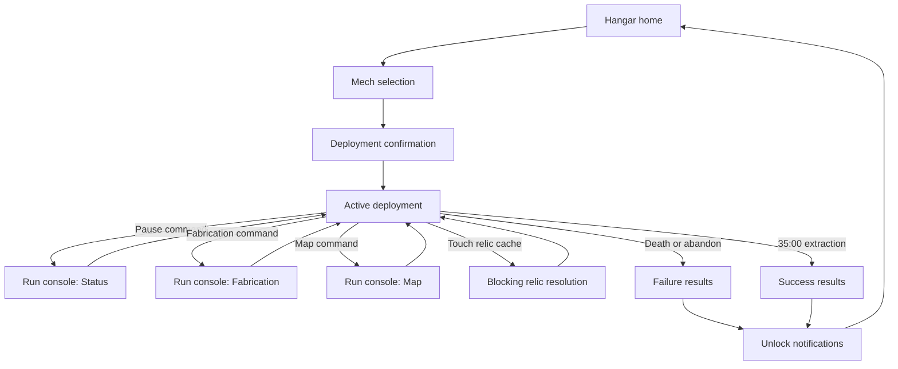

# Interface, Screen Flow, and Information Architecture

Status: **authoritative first-playable baseline**. This document defines the player-visible organization and behavior of active play, the paused run console, fabrication, maps, relic resolution, results, and the hangar. Visual styling may change without changing the information hierarchy or interaction rules.

[DEC-127](decisions/DEC-127-adopt-the-first-playable-interface-and-screen-flow.md) accepts this baseline. Existing gameplay documents remain authoritative for the underlying rules and values.

## Purpose and Player Promise

The interface lets the player answer four questions quickly:

1. **Am I in immediate danger?**
2. **Where should I move or mine next?**
3. **What can I afford, and what permanent run choice will it create?**
4. **What did this run accomplish and retain?**

Active play favors compact recognition over exact arithmetic. Paused surfaces expose complete numbers, comparisons, explanations, and consequences. No important choice relies on memorized recipes, color alone, a mouse hover, or information that disappears before it can be reviewed.

## Interface Principles

- **World first:** Persistent HUD elements stay near the edges and do not occupy the central movement and mining area.
- **Context before density:** Mining, boss, beacon, damage, and pickup information appears when relevant rather than creating permanent meters for every possible state.
- **Exact on pause:** Every compact active-play value has an exact paused representation.
- **One action, one consequence:** Irreversible installation, branch, relic-replacement, abandonment, and permanent-purchase choices state their consequence before confirmation.
- **No false urgency while paused:** Timers, animations that communicate gameplay state, progress, cooldowns, and warnings freeze with the complete simulation.
- **Controller complete:** Every surface has a stable focus order and can be operated without a cursor, touch, text entry, or mouse hover.
- **Redundant identity:** Shape, icon, label, pattern, and audio support color wherever confusion could alter play.
- **Progressive detail:** A concise summary appears first; exact formulas, edge cases, and interaction notes are available without leaving the current decision.

## Screen and Pause Model

The game uses three top-level states:

1. **Hangar:** Between-run selection, progression, records, settings, and deployment.
2. **Active deployment:** Movement, automatic combat, exploration, mining, and contextual HUD feedback.
3. **Paused run surfaces:** The run console, fabrication, map, settings, controls, and blocking relic resolution.

The **run console** is a shared fully paused shell with Status, Fabrication, Map, Settings, and Controls destinations. The pause, fabrication, and map commands open the relevant destination directly. Switching between run-console destinations never resumes the simulation.

Relic resolution uses the same visual language but is a separate blocking modal. It cannot be bypassed for another run-console destination; the player must install or sell the relic first.

## Default Inputs and Navigation Grammar

All bindings are remappable except platform-reserved system inputs. The labels below describe the default logical actions, not a dependency on one controller brand.

### Active deployment

| Action | Keyboard and mouse | Gamepad | Result |
|---|---|---|---|
| Move | `WASD` or arrow keys | Left stick or directional pad | Direct normalized mech movement |
| Open Status | `Esc` | Menu/Start | Freezes simulation on Status |
| Open Fabrication | `Tab` | Face North / `Y` | Freezes simulation on Fabrication |
| Open Map | `M` | View/Select | Freezes simulation on Map |

There is no attack, aim, interact, mine, dodge, sprint, reload, or utility-activation input in the baseline game. Entering mining zones and touching pickups or relic caches remain automatic.

When the player presses two pause-surface shortcuts on the same frame, priority is Relic Resolution, then Status, then Fabrication, then Map. Operating-system focus loss pauses to Status where supported.

### Menu grammar

| Logical action | Keyboard and mouse | Gamepad |
|---|---|---|
| Move focus | Arrow keys or pointer | Directional pad or left stick |
| Confirm / primary action | `Enter`, `Space`, or primary click | Face South / `A` |
| Back / cancel | `Esc` or secondary click | Face East / `B` |
| Previous / next top tab | `Q` / `E` | Left / right bumper |
| Previous / next subpage | `Z` / `C` | Left / right trigger |
| Details / comparison | `F` | Face West / `X` |
| Secondary contextual action | `R` | Face North / `Y` |

- Focus is always visible with more than color: outline, scale, or cursor shape identifies it.
- Opening a surface places focus on a safe non-destructive element.
- Returning from details restores the prior item and scroll position.
- A disabled action remains inspectable and states why it is unavailable.
- Mouse and gamepad may be alternated at any time. Prompts switch to the most recently used input family after a deliberate input, not from stick drift or pointer jitter.
- No required information exists only in a tooltip. Hover duplicates focus behavior but never unlocks unique content.

### Confirmation hierarchy

| Action | Confirmation behavior |
|---|---|
| Buy a common-ore weapon-stat rank | One deliberate confirm from its preview row; no second dialog |
| Buy a utility rank | One deliberate confirm from its preview row; no second dialog |
| Fabricate a weapon or utility into an empty permanent run slot | Explicit confirmation dialog |
| Commit a mutually exclusive weapon branch | Explicit confirmation dialog |
| Install or replace a relic | Explicit side-by-side choice followed by one confirm |
| Sell a relic | Explicit choice showing exact ore payout followed by one confirm |
| Refund account PowerUps | Confirmation showing the resulting ranks and full refund |
| Buy a permanent nonrefundable option unlock | Confirmation stating that it cannot be refunded or disabled |
| Abandon deployment | Destructive confirmation showing resources that will be forfeited |

Holding a button is never the sole confirmation method. This preserves accessibility for players who cannot comfortably sustain presses.

## Active-Play HUD

The HUD uses a stable edge-anchored layout at both reference resolutions.

| Region | Persistent content |
|---|---|
| Upper left | Current Hull gauge; current and maximum Hull numerals; compact Armor, Recovery, shield, or revival indicators only when nonzero or available |
| Upper center | Active timer; next boss or extraction threshold; active boss health bars beneath it |
| Upper right | Compact north-up minimap; total defeats immediately below |
| Right edge beneath map | Common ore, four present specialized-material counts, and unsecured Hyper Gold |
| Lower left | Four weapon slots in stable loadout order |
| Lower right | Three utility slots and the single relic slot |
| Lower center | Contextual mining, beacon, major warning, and pickup feedback |

Empty weapon, utility, and relic slots remain visible with distinct outlines and their category icon. An empty slot never resembles an unavailable or disabled installed item.

### Hull and damage feedback

- The Hull bar remains continuously visible and includes exact whole-number current/maximum text.
- At 30% Hull or lower, the frame gains a persistent warning notch and restrained pulse. At 15% or lower, the notch doubles and the warning audio escalates no more than once every eight active seconds.
- Reduced-motion mode replaces pulsing with a steady patterned border. Reduced-flash mode removes full-screen flashes.
- A damage event produces a brief directional edge wedge when a meaningful source direction exists, a Hull loss number near the gauge, and a world-space hit response on the mech.
- Repair shows `+N Hull` near the gauge. Overheal waste is not shown as gained Hull.
- Capacitor Screen, Emergency Reboot, Armor prevention, and revival each use distinct icon and sound language rather than an identical generic shield flash.

### Timer, thresholds, and bosses

- The timer counts upward as `MM:SS` and visibly stops on every full-simulation pause.
- Beside it, the next scheduled threshold reads as a boss name and time or `EXTRACTION 35:00` after Skybreaker Apex arrives.
- A ten-second countdown appears below the timer before each boss threshold and before extraction. It supplements rather than replaces the absolute time.
- Every living boss has a named health bar. Bars remain ordered by arrival time, oldest first, and may stack to four.
- At 1280×800, only the oldest boss bar remains full width; later bars use shorter named rows with exact percentage. No boss disappears from the HUD.

### Resources

- The active wallet always shows common ore, each of the four present specialized materials, and unsecured Hyper Gold.
- Each specialized resource uses its icon, canonical letter, material pattern, and color. The full name appears on focus or in paused surfaces.
- A gain briefly animates the relevant count and shows a signed amount. Spending does the same without crossing the central play area.
- Unsecured Hyper Gold uses a broken-lock emblem throughout a deployment. It never visually resembles banked Hyper Gold.
- Counts are whole numbers. Active HUD counts at 10,000 or greater may abbreviate with one decimal place; pausing always reveals the exact integer.

### Loadout slots

- Weapon slots show icon, branch emblem if committed, and a compact shared upgrade-depth number. Their ordinary automatic cooldowns may use a subtle radial sweep but do not show distracting countdown numerals.
- Utility slots show icon and rank `0–3`; conditional utilities visibly illuminate only while their condition is active.
- The relic slot shows the installed relic icon. A concise status pip or meter appears beside it only when the relic has meaningful live state such as Redline heat or Sequential Reactor phase.
- Loadout icons never imply that clicking or pressing them activates an ability.

### Minimap

The compact minimap is north-up and centered on the mech. It shows:

- explored traversable terrain and recorded blocking terrain;
- the mech and its facing tick;
- discovered active and depleted deposits using different states;
- discovered opened and unopened relic caches;
- uncollected boss-loot pieces;
- the active user waypoint; and
- the world boundary only where explored.

Undiscovered terrain and content remain absent. The minimap does not rotate, accept active-play cursor control, or display enemy dots. Bosses are tracked by their HUD bars and world presentation rather than turning the minimap into a combat radar.

### Radar bearings and waypoint bearing

After the resource radar is installed, up to seven resource bearings sit at the nearest point on the safe edge of the play viewport. Each uses the exact category icon and non-color pattern already used in the wallet and map.

- Bearings communicate direction only: no distance, nameplate, target outline, or path appears.
- Each bearing persists when its target enters the gameplay view and remains until that category retargets or exhausts.
- Bearings within six degrees form a small outward fan ordered clockwise. If more than three occupy that fan, the nearest three to the original bearing remain individually visible and the rest collapse into a `+N` cluster that expands briefly when its target categories change.
- The Hyper Gold bearing uses a diamond frame; ordinary and rich seams use distinct rock silhouettes; materials use their canonical letter and pattern.
- Exhausted categories disappear after a short `DEPLETED` strike-through confirmation and never point to an invalid target.
- A player waypoint uses a pin-shaped bearing visually separate from the radar and may coexist with all seven category bearings.

### Contextual mining panel

Entering a mining zone opens a lower-center panel without obscuring the mech or zone boundary. It shows deposit identity, payout, current progress, effective remaining time, and current state.

| State | Required presentation |
|---|---|
| Extracting | Forward progress bar and inward animated chevrons |
| Outside-zone grace | `SIGNAL HOLD` plus a draining 0.5-second grace pip |
| Decaying | Reversed bar direction, `DECAYING ×4`, and outward chevrons |
| Depleted / completed | One completion burst, exact payout, then panel dismissal |

- Ore seams mark each secured installment on the bar and show every `+Ore` payout.
- Geodes show completion-only payout, the specialized material icon, and a clear `PAYS ON COMPLETION` label.
- A geode's resonance field creates a persistent compact enemy-modifier chip while the mech remains inside the field. It names the affected property rather than relying on material lore.
- Hyper Gold sites divide the bar into four segments. The next 25%, 50%, or 75% escalation marker is explicit, and its two-second warning uses both a world-space ring and the panel.
- Leaving a mine dismisses the large panel after grace expires, but a small decaying-progress marker remains while unfinished progress is above zero and the site is still within the visible world.

### Transient feedback priority

When several messages compete for the lower-center region, priority is lethal warning, boss or beacon warning, mining state, relic/cache notice, resource gain, then ordinary informational toast. Lower-priority messages queue briefly or collapse into their corresponding HUD counter; they never cover a lethal warning.

## Opening Geological Survey

The opening survey appears automatically 0.5 active seconds after deployment as a compact non-modal card beneath the minimap. It never captures movement or menu focus.

- It lists the four present materials in canonical order.
- Each row shows icon, letter, full name, exact geode count, and Scarce, Moderate, or Rich label.
- The signature weapon's three possible branch materials are marked; an absent off-color branch is visibly labeled unavailable this deployment.
- The card remains expanded for 12 active-simulation seconds, then collapses into the normal resource wallet.
- Opening Fabrication during those 12 seconds lands on its Survey page and freezes the remaining display time. Closing Fabrication resumes the remaining active duration.
- The complete survey remains reviewable throughout the run from Fabrication and Status.

No deposit positions, nearest directions, relics, or Hyper Gold positions are disclosed by the survey.

## Paused Run Console

The run console uses a consistent header with current timer, exact wallet, current Hull, and input prompts. Its top destinations are Status, Fabrication, Map, Settings, and Controls.

- `Q/E` or bumpers switch top destinations.
- Back from a subordinate page returns to its destination root; Back from a root resumes only from Status, Fabrication, or Map.
- Settings and Controls display an explicit `Resume` action because Back returns to the previous run-console destination.
- Simulation status is continuously labeled `PAUSED` near the timer.

### Status

Status is the default pause landing page and contains:

- current and maximum Hull, Armor, Recovery, movement speed, mining speed, shields, revival charges, and account modifiers;
- all weapons with branch, shared depth, each stat rank, rank-zero and effective values, DPS estimate, and relic interactions;
- all utilities with installed rank and exact effective value;
- active relic with complete rule and live state;
- geological survey and exact carried resource counts;
- living bosses and exact current/maximum Hull;
- active run statistics: defeats, elapsed active time, damage taken, healing, ore and materials collected/spent, completed sites, and exploration share; and
- Resume, Settings, Controls, and Abandon Deployment actions.

The DPS estimate is labeled an estimate and uses the same analytical method as the weapon numeric catalog. It is not represented as guaranteed realized damage.

## Fabrication

Fabrication is available anywhere and at any time through its direct command. Opening it freezes the complete simulation before any pointer, focus, or purchase can change.

### Layout and navigation

At 1920×1080, Fabrication uses three columns:

1. category and installed-loadout rail;
2. blueprint or upgrade list; and
3. selected-item detail and comparison.

At 1280×800, the category rail becomes a top row and the detail column becomes a full-height drawer toggled by Details. The same information and actions remain available.

Fabrication has four pages:

1. **Weapons** — available weapon recipes and empty weapon slots;
2. **Weapon Upgrades** — installed weapon stats and branches;
3. **Utilities** — available utility recipes, installed utility ranks, and the resource radar;
4. **Survey** — full geological survey, recipes supported this deployment, and absent materials.

The interface remembers its last page, selection, and scroll position for the current run. The first opening of a run starts on Weapons unless it was opened during the initial survey, in which case it starts on Survey.

### Blueprint availability

- The default list shows only blueprints available under the current four-material profile plus already installed equipment.
- A secondary `All Blueprints` view shows every owned blueprint and clearly labels recipes unavailable this deployment. It is reference-only and cannot fabricate absent-material recipes.
- Locked permanent blueprints show their name, effect summary, and exact hangar unlock requirement; they do not appear as mystery silhouettes.
- A blueprint row simultaneously shows slot availability, owned ingredients, recipe cost, and whether it can be fabricated now.
- Affordability never relies on tint: each ingredient displays `owned / required` and a pass or shortage icon.

### Weapon fabrication

Selecting a base weapon shows:

- its one-sentence automatic behavior;
- targeting or direction rule;
- rank-zero numerical stats and analytical DPS or throughput estimate;
- its three ore stat tracks;
- all three branch summaries and materials, including branches absent from this deployment;
- interactions with the selected mech, installed utilities, and active relic; and
- the permanent empty-slot commitment.

Confirmation names the slot being filled and states that the weapon cannot be removed, sold, or replaced this run. If all four slots are occupied, the action is disabled and states `ALL WEAPON SLOTS COMMITTED`.

### Weapon stat ranks

- The player first selects an installed weapon, then one of its three stat tracks.
- The shared weapon depth and next common price remain visible above all three rows.
- Each row shows current rank, current value, next value, absolute change, and percentage change where meaningful.
- Selecting one rank purchases immediately after one deliberate confirm, advances shared depth once, updates all three next-price displays, and keeps focus on the purchased row.
- Repeated purchase is allowed while affordable. There is no bulk-buy shortcut in the first playable because every purchase changes the shared price and allocation decision.
- The interface never suggests a maximum rank. Exceptionally expensive ranks remain available if affordable.

### Weapon branches

- Unbranched weapons show all three branches side by side in increasing transformation order: amplification, functional change, and play-style transformation.
- Each branch shows its exact two-unit material cost, complete rule, changed numerical values, and compatibility notes.
- A branch unavailable because its material is absent remains readable but cannot be purchased.
- Confirmation states that the branch is mutually exclusive and irreversible for the run.
- After commitment, the selected branch receives a permanent emblem; the other two remain inspectable as `LOCKED BY [BRANCH]` but cannot be purchased.

### Utilities

- Available non-radar utilities show their one-material cost, Installed value, three ore-rank totals, and affected systems.
- The radar appears in the same page with its 300-common-ore cost, seven tracked categories, no ranks, and permanent utility-slot commitment.
- Fabricating a utility requires confirmation naming the slot and irreversibility.
- Utility ranks use the same one-confirm purchase pattern as weapon stat ranks and show exact current and next totals.
- When all three slots are occupied, uninstalled utilities remain inspectable but cannot be fabricated.

### Closing Fabrication

Back from the Fabrication root resumes active play. If the player has an affordable meaningful purchase but leaves without buying, the game does not nag, confirm, or imply an error. Unlimited access makes deliberate saving a valid decision.

## Full Map and Waypoints

The Map destination presents the explored world north-up. It never reveals information hidden by exploration fog.

### Map content

The full map shows everything on the compact minimap plus landmark names, resource names, deposit remaining state, cache state, boss-loot categories, deployment point, and one player waypoint.

Markers have four visibility filters:

1. all discovered markers;
2. mining sites;
3. relics and boss loot; and
4. landmarks and waypoint.

Filtering hides clutter only; it never changes discovery, radar behavior, or the world.

### Map controls

- Mouse drag or right stick pans the map.
- Mouse wheel or triggers select among three zoom levels: region, route, and local.
- `Home` or clicking the player icon, or pressing the right stick, recenters on the mech.
- Confirm on explored terrain places or moves the single waypoint.
- Secondary action removes the waypoint.
- Confirm on a discovered marker opens its detail card; it never fast-travels, fabricates, or starts mining.

The waypoint appears on both maps and as a distinct screen-edge pin during active play. It provides direction but no pathfinding line or distance countdown. Placing a waypoint in explored terrain that later proves unreachable does not move the player or alter map generation; the player may move or remove it normally.

## Relic Cache Discovery and Resolution

### Cache selection and signaling

- Every standard run draws three distinct relics without replacement from the player's currently unlocked relic pool and assigns one to each cache during generation.
- Duplicate relics cannot occur within one run.
- Caches do not receive dedicated guards or scripted defenders; the normal horde and travel cost provide pressure.
- A cache has a unique tall silhouette, ground emblem, and intermittent vertical signal visible whenever the cache is inside the gameplay view. It does not signal through undiscovered fog or create a global bearing.
- Once observed, the unopened cache remains recorded on both maps.

### Sale value

Every initial relic sells for exactly **150 common ore**. Relic identity, discovery order, installed state, elapsed time, player Hull, and account progress do not change this value.

- Selling the newly discovered relic awards 150 ore and retains the current relic.
- Installing a relic into an empty slot awards no ore.
- Installing over an active relic automatically sells the displaced relic for 150 ore after confirmation.
- If the player somehow discovers the currently installed identity through future content, it still follows the normal choice; the initial without-replacement rule prevents this case.

### Resolution screen

The screen compares **Discovered Relic** against **Installed Relic**.

- The discovered relic's one-sentence benefit and tradeoff is the largest text after its name.
- Expanded details show exact values, ordering, live state behavior, and tagged interactions for every equipped weapon: `FULL`, `PARTIAL`, `NONE`, or `SPECIAL` with one-line reasoning.
- Install shows the resulting active relic and any displaced-relic 150-ore payout.
- Sell shows the resulting active relic and the new-relic 150-ore payout.
- At an empty slot, the installed side reads `NO RELIC INSTALLED`; Sell remains valid.
- The player must choose Install or Sell. Back does not close the screen.
- Each choice uses one final confirmation summarizing the resulting relic and ore total. Cancel returns to the comparison.

After resolution, the HUD relic slot and affected weapon presentations update before simulation resumes. A concise toast restates the active relic rule or sale payout.

## Results

Success or final failure freezes the simulation, completes the corresponding extraction or destruction presentation, and then opens Results. No reward is banked or discarded invisibly before its result is shown.

Results uses four pages:

1. **Summary**
2. **Build and Combat**
3. **Mining and Economy**
4. **Exploration**

### Summary

- `MISSION EXTRACTED` or `MECH LOST` appears with active survival time.
- Success shows unsecured Hyper Gold transforming into banked Hyper Gold.
- Failure shows the exact unsecured Hyper Gold forfeited.
- Bosses defeated, total enemies defeated, sites completed, explored-map share, and final Hull or death source appear as compact headline metrics.
- Newly completed unlock conditions appear after the factual run summary, not as an interruption before resource settlement is understood.

### Build and Combat

- Final mech, inherent trait, account PowerUps, weapons, branches, stat ranks, utilities, and relic are preserved as the run's final loadout record.
- Each weapon shows damage, share of weapon damage, effective active-time DPS, and enemy defeats credited where attribution is defined.
- The page separately reports damage taken by source, healing received, Armor prevented, shields consumed, and revivals used.
- Weapons with support or control value do not receive a fabricated damage score to make their contribution look comparable.

### Mining and Economy

- Attempted and completed standard seams, rich seams, geodes by material, and Hyper Gold sites are listed separately.
- The page shows common ore collected, spent on weapons, spent on weapon ranks, spent on utilities, spent on utility ranks, received from bosses, received from geodes, received from relic sales, and lost unspent.
- Specialized materials show collected, spent, and lost unspent by identity.
- Hyper Gold shows site collection, boss collection, total unsecured, banked, and forfeited.

### Exploration

- The final explored map remains inspectable with the same marker filters.
- It shows explored share, regions visited, landmarks discovered, relic caches found, rocks destroyed, and health packs collected.
- Undiscovered content remains hidden even after the run; Results does not reveal the seed's missed rewards.

### Exit from Results

Continue applies and presents unlock notifications in a queue, then returns to the Hangar. The player may advance notifications rapidly but cannot lose an unlock by skipping its animation. Results remain available in Run History after returning.

## Hangar and Between-Run Flow

The Hangar home presents six destinations in this order:

1. **Deploy**
2. **Mechs**
3. **PowerUps**
4. **Blueprints**
5. **Records**
6. **Settings**

`Deploy` opens mech selection directly. The selected mech card shows silhouette, name, signature weapon, exact trait, starting global stats, and whether it is available. Locked mechs show their exact requirement.

Deployment confirmation shows the chosen mech, signature, trait, current account PowerUps, and the statement `GEOLOGY IS SURVEYED AFTER DEPLOYMENT`. It never reveals or rerolls the coming four-material profile. Confirming begins one deployment; Back returns safely to mech selection.

PowerUps shows all thirteen tracks, active ranks, next values, prices, total invested Hyper Gold, and the full-refund action. Blueprints separates permanent option unlocks from already owned content and clearly distinguishes refundable PowerUp spending from nonrefundable option purchases. Records contains run history, aggregate statistics, unlocked codex entries, and achievements without granting gameplay power.

## Number and Language Standards

- Time uses `MM:SS` during a standard run.
- Hull, Armor, currency, defeats, ranks, and material units use whole numbers.
- Percentages use whole numbers unless a tenths digit is required to distinguish two real outcomes.
- Weapon timings show at most two decimal places in paused details and avoid false precision beyond the authored value.
- Active HUD abbreviations use `K` and `M`; paused surfaces and confirmations use exact values with digit grouping.
- Positive and negative changes use words or arrows in addition to signs and color.
- `Installed` means the utility or relic occupies its slot; weapon stat tracks use `Rank`; weapon branches use their proper branch name; no system uses `Level` as a generic substitute.
- Run-local ordinary resources say `LOST AT RUN END` where relevant. Hyper Gold says `UNSECURED UNTIL EXTRACTION` throughout active and paused deployment surfaces.

## Reference Resolution Behavior

### 1920×1080 desktop

- Full three-column Fabrication and side-by-side relic comparison are visible simultaneously.
- Mouse hover may expose the same detail available through focus.
- HUD corners use no more than roughly one quarter of screen width each, preserving the central battlefield.

### 1280×800 Steam Deck

- Required interface text targets at least 12 physical pixels and never falls below 9.
- Full-screen menus reflow rather than uniformly shrinking the desktop layout.
- Fabrication uses a detail drawer, Results pages use vertical sections, and relic comparison stacks when necessary.
- Active HUD labels shorten before icons or required counts disappear.
- All required actions remain available through default controller bindings, and no scroll region traps focus.

Every reference screen respects platform safe areas. No essential meter, bearing, prompt, or focus outline touches the display edge.

## Accessibility Baseline and Later Work

The interface baseline requires:

- full input remapping for movement and interface actions;
- automatic glyph switching plus a manual glyph-family override;
- adjustable HUD and menu text scale;
- UI contrast controls and non-color resource identities;
- independent screen-shake, damage-flash, and VFX-intensity controls;
- reduced-motion and reduced-flash presentation paths;
- subtitles or captions for any spoken or otherwise gameplay-relevant audio; and
- a preview of every visibility setting before it is applied.

The dedicated onboarding and accessibility specification still defines exact ranges, tutorial sequencing, audio-caption vocabulary, difficulty assists, photosensitivity limits, and record treatment. See [OQ-032](open-questions.md#oq-032--what-onboarding-accessibility-and-settings-does-standard-mode-require).

## Interaction and Edge Cases

- If a boss threshold, mine completion, lethal damage, and menu command would occur together, already eligible gameplay events resolve for that simulation step before the requested run-console pause opens. A relic-cache collision instead opens only if the mech survives that step.
- Reaching 35:00 succeeds before a later step can deal damage. Results records the actual final Hull.
- A pending confirmation contains no simulation time and survives switching input family.
- The game never spends resources merely because focus moved, a tab changed, or Details opened.
- If a purchase becomes invalid after another purchase, its row updates immediately and explains the new shortage or slot conflict.
- Menu-open and menu-close inputs are consumed and cannot also move the mech on the first resumed simulation step. Held movement resumes only after the active-play state reads current input on the following step.
- A disconnected gamepad pauses to Status. Reconnection restores focus; keyboard and mouse remain usable.
- Suspending or closing the application never banks unsecured Hyper Gold. Recovery-save behavior may restore the run but cannot advance time or duplicate choices.
- Screenshots, streaming, and reduced-HUD modes may hide optional presentation, but required gameplay state must remain recoverable through an immediate input and cannot be permanently disabled.

## Validation Requirements

The first-playable interface passes only if usability testing demonstrates that players can:

- identify current Hull, timer, next boss, carried resources, and open slots during pressure;
- distinguish all six materials without color;
- understand mining progress, grace, decay, payout timing, resonance, and beacon escalation;
- fabricate a legal weapon, upgrade one chosen stat, and commit a branch without misunderstanding irreversibility;
- explain what a discovered relic changes and what each choice will sell;
- find a previously discovered site with the full map and a waypoint;
- determine exactly why Hyper Gold was banked or forfeited from Results; and
- complete every flow at 1280×800 using gamepad alone.

Measure time to first correct action, navigation errors, canceled confirmations, accidental purchases, map-task completion, survey recall, and whether critical warnings were noticed. Revise grouping and feedback before changing underlying game rules to compensate for misunderstood presentation.

## Remaining Presentation Work

This baseline intentionally does not fix:

- final typography, icon artwork, palette, panel skin, animation style, or sound assets;
- exact camera world-to-screen scale;
- ultrawide behavior outside the two reference aspect ratios;
- final text-scale ranges and difficulty-assist policy;
- biome-specific map skins and landmark art; or
- localization scope and string expansion budgets.

Those items belong to [OQ-011](open-questions.md#oq-011--what-is-the-intended-platform-and-presentation-format), [OQ-023](open-questions.md#oq-023--which-asset-medium-and-visual-style-best-fit-the-free-asset-constraint), and [OQ-032](open-questions.md#oq-032--what-onboarding-accessibility-and-settings-does-standard-mode-require).

## Related Documents

- [Run Structure, Timer, Bosses, and Mission Extraction](20-run-structure-and-timing.md)
- [Combat, Weapons, Movement, and Camera](30-combat-weapons-movement-camera.md)
- [Mining and Extraction](40-mining-and-extraction.md)
- [Maps, Resource Surveys, Exploration, and Navigation](50-maps-resources-and-navigation.md)
- [Resources, Crafting, and Progression](60-resources-crafting-progression.md)
- [Weapon Stat and Branch Upgrades](65-weapon-stat-and-branch-upgrades.md)
- [Mech Relics](67-mech-relics.md)
- [Initial Relic Catalog](69-initial-relic-catalog.md)
- [Player Survivability and Damage Baseline](72-player-survivability-and-damage-baseline.md)
- [DEC-099: Use single-player pause and results flow](decisions/DEC-099-use-single-player-pause-and-results-flow.md)
- [DEC-104: Show a compact survivor-like active HUD](decisions/DEC-104-show-a-compact-survivor-like-active-hud.md)
- [DEC-113: Target Windows PC and Steam Deck first](decisions/DEC-113-target-windows-pc-and-steam-deck-first.md)
- [DEC-127: Adopt the first-playable interface and screen flow](decisions/DEC-127-adopt-the-first-playable-interface-and-screen-flow.md)
