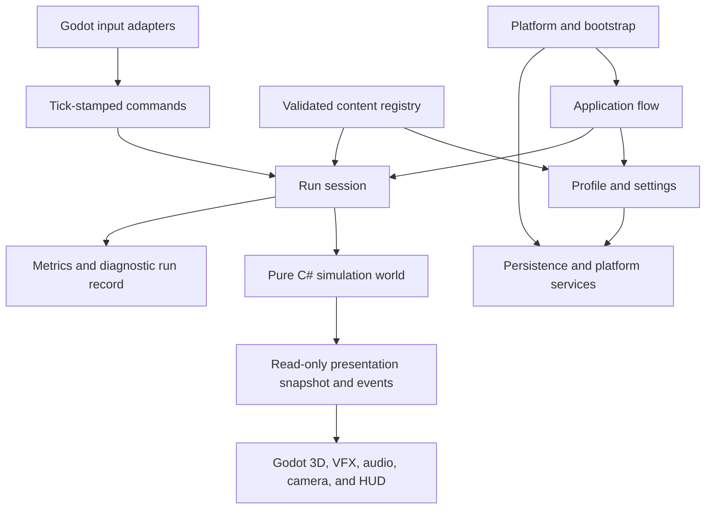
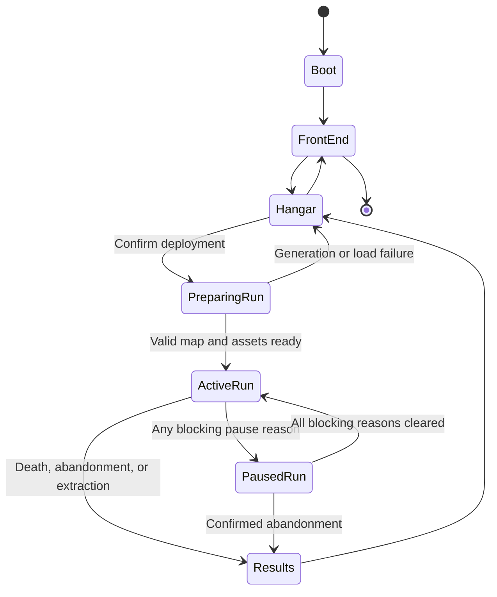

# Runtime Architecture

## Purpose

This document defines the top-level runtime decomposition, ownership rules, lifecycle, clock domains, pause behavior, command boundaries, random ownership, and initial concurrency policy. Detailed simulation and presentation documents will refine the internal systems without violating these contracts.

## Architectural style

The game is a single-process, offline-capable native client with a data-oriented authoritative simulation and a thin Godot presentation shell.

The simulation is the sole authority for active-run gameplay state. Rendering, audio, UI animation, and scene nodes may predict or interpolate presentation but never decide damage, mining progress, resource ownership, cooldown completion, targeting results, extraction, or failure.

## Accepted project decomposition

| Project | Responsibility | Godot dependency |
| --- | --- | --- |
| `MechaMiner.Simulation` | clocks, entities, systems, commands, rules, RNG abstractions, snapshots | None |
| `MechaMiner.Content` | typed definitions, stable IDs, schemas, catalog loading and validation | None |
| `MechaMiner.Persistence` | save envelopes, migrations, checksums, atomic storage contracts | None |
| `MechaMiner.Game` | Godot scenes, composition root, input, rendering, UI, audio, platform adapters | Yes |
| `MechaMiner.Tools` | content validation, generation audits, balance simulations, converters, external Godot process orchestration | None |
| `MechaMiner.Simulation.Tests` | unit, property, fixture, and integration tests for pure logic | None |
| `MechaMiner.Persistence.Tests` | serialization, migration, atomicity, recovery, and settlement tests | None |
| `MechaMiner.Game.Tests` | engine integration, scene, rendering, input, and export smoke tests | Yes |

Dependencies point inward: Game and Tools may depend on the pure projects; Simulation depends only on Content; Persistence depends only on Content and narrow immutable Simulation snapshot/result types. No pure project depends on Game. The full logical ownership and dependency rules live in the [Component, Contract, and Schema Registry](./115-component-contract-and-schema-registry.md).

## Runtime ownership

### Application flow

The application flow owns boot, profile selection, hangar, deployment preparation, run creation, results, and shutdown. Only one standard run session exists at a time.

### Run session

The run session owns:

- the simulation world and active run configuration;
- master seed and authoritative random streams;
- simulation tick count and pause reasons;
- command admission and paused transactions;
- generation manifest and content-version references;
- terminal result and diagnostic record; and
- creation and disposal of the presentation binding.

Disposing a run session releases all run-local state. Persistent profile mutation occurs only through an explicit terminal transaction after successful extraction or an allowed between-run purchase.

### Simulation world

The simulation world owns authoritative entities and components, scheduled events, combat state, mining state, run-local economy, installed equipment, world-query structures, and gameplay events. It does not load files, call platform APIs, create Godot nodes, query real time, or mutate persistent saves.

### Presentation

Presentation owns scene nodes, render instances, model animation, VFX, audio voices, HUD widgets, menu transitions, screen-edge indicators, and accessibility presentation. It consumes immutable snapshots and ordered presentation events. Presentation state may be discarded and reconstructed without changing the run result.

## Application lifecycle

Run preparation is transactional: the player never enters an incompletely generated or invalid map. Failure returns to the hangar with a diagnostic identifier and without profile loss.

## Clock domains

| Clock | Advances when | Used for | Forbidden uses |
| --- | --- | --- | --- |
| Monotonic wall clock | Process is running | frame pacing, profiling, timeouts, diagnostics | gameplay durations or cooldown outcomes |
| Simulation tick | Run active and unpaused | movement, AI, spawning, attacks, mining, damage, run timer | UI animation while paused |
| Render frame | Godot draws a frame | interpolation, visibility, animation sampling, VFX | authoritative gameplay decisions |
| UI clock | UI is active, including gameplay pause | menu transitions, focus feedback, non-gameplay animation | anything that advances the run |

The simulation frequency is **60 ticks per second**. It is constant within a run. Game time is derived from integer tick count, not accumulated floating-point frame deltas. Changing it is architectural because it changes schedules, numeric fixtures, recovery, and performance; it requires measured evidence and a TDR rather than a local optimization.

The host uses an accumulator to execute zero or more complete ticks per rendered frame. It never passes a variable delta to authoritative systems. A bounded catch-up limit prevents an unresponsive spiral after a stall; reaching that bound produces a performance diagnostic. Operating-system suspension or focus-loss pause discards elapsed wall time rather than catching up gameplay.

## Pause contract

Pause is represented as a set of reasons rather than a single toggle. Initial blocking reasons are general pause, fabrication, relic resolution, blocking tutorial/modal, focus loss, operating-system suspension, and terminal transition.

- The simulation executes no ticks while any blocking reason is present.
- Run time, AI, movement, spawning, projectiles, attacks, cooldowns, status effects, mining progress and decay, hazards, pickups, and gameplay physics remain unchanged.
- Render and UI clocks continue so menus remain responsive and pause presentation can animate.
- Opening fabrication or relic resolution captures an immutable view of the relevant authoritative state.
- A fabrication purchase or relic choice is submitted as a validated paused transaction. It mutates the frozen simulation atomically between ticks and publishes a replacement snapshot before resumption.
- Invalid or stale transactions change nothing and return a typed rejection reason for UI presentation.
- Multiple reasons may overlap. Simulation resumes only when all blocking reasons are cleared.
- Focus recovery never dismisses a menu, tutorial, relic choice, or user-requested pause.

## Commands and mutations

All authoritative external intent crosses into the run through typed commands or paused transactions.

- Active-play movement input is sampled by the input adapter and converted into the command for the next simulation tick.
- Menu navigation, camera-only actions, and UI animation remain outside the simulation.
- Fabrication, relic, abandonment, and other state-changing menu actions use explicit transactional commands.
- Commands are validated at application boundaries and again against authoritative state when applied.
- A command is applied at most once. Commands that can cross an asynchronous boundary carry a run-session identity and monotonic command sequence.
- Simulation systems do not call UI callbacks directly. They append ordered domain or presentation events to tick-local buffers.

## System phase ordering

Every tick uses a fixed phase order. Detailed systems may be subdivided, but observable ordering changes require regression tests and an update here.

1. Admit and normalize commands for the tick.
2. Evaluate authored schedule boundaries for the current tick; the 35:00 terminal boundary is handled before another tick can begin.
3. Materialize queued spawns that have capacity and valid positions.
4. Resolve player intent and enemy steering.
5. Integrate movement and enforce terrain/world constraints.
6. Rebuild or incrementally update spatial-query structures.
7. Acquire automatic-weapon targets and advance attack schedules.
8. Simulate projectiles, beams, zones, pulses, drones, and weapon contacts.
9. Collect collision, overlap, and damage candidates.
10. Resolve damage, status changes, deaths, and boss/resource consequences in stable order.
11. Advance mining, extraction progress/decay, resource payouts, pickups, and run-local transactions caused by gameplay.
12. Apply deferred entity creation/removal and capacity queues.
13. Evaluate death or extraction terminal conditions.
14. Publish metrics, ordered events, and the presentation snapshot.

Structural changes are deferred so systems do not invalidate collections while iterating. Simultaneous outcomes use documented stable ordering rather than collection or thread timing.

## Entity and scene boundary

- Ordinary enemies, routine projectiles, pickups, and short-lived effects are lightweight simulation records identified by generational entity IDs.
- Hot populations use packed or structure-of-arrays storage with explicit capacity growth and reuse.
- Spatial queries use simulation-owned broad-phase structures suited to circular and swept-area tests; they do not require a Godot physics body per entity.
- Durable presentation objects such as the player mech, bosses, mining sites, terrain chunks, cameras, and screens may use normal Godot scenes.
- Hordes and repeated transient visuals use pooled or server-level/batched rendering with handles mapped to simulation IDs.
- Presentation mappings tolerate simulation entities disappearing before their final visual event completes.

## Randomness and reproducibility

[TDR-002](./decisions/TDR-002-use-seeded-reproducibility-without-lockstep-replay.md) governs reproducibility.

- Authoritative random streams are injected into the systems that own them.
- A stable repository-owned algorithm and derivation function are versioned explicitly.
- Map topology, site placement, run-content selection, combat, loot, and presentation use separate stream families.
- Presentation randomness is never read by the simulation.
- The run diagnostic record contains enough identity information to reconstruct generated content with a compatible build.
- No cross-build or cross-platform bit-exact replay guarantee exists.

## Concurrency baseline

The authoritative simulation initially runs serially on the main game thread. This makes ordering, diagnostics, pause, and Godot synchronization straightforward. The expected accepted maximum of hundreds rather than tens of thousands of active enemies does not justify speculative job-system complexity.

Background work is allowed for isolated immutable tasks such as candidate map generation, file I/O, compression, and non-authoritative analytics when:

- inputs are immutable copies;
- cancellation and application lifetime are explicit;
- results return through a single owned boundary;
- no Godot object is accessed off an allowed engine thread; and
- authoritative state changes only when the main thread validates and commits a completed result.

Parallelizing simulation systems requires profiling evidence, deterministic merge rules, race tests, and a new TDR.

## Failure and shutdown

- An unhandled simulation invariant violation terminates the current run safely, preserves the existing profile, and emits a diagnostic package; it must not continue with partially trusted state.
- Content or generation validation failure prevents deployment.
- Presentation failure should degrade or rebuild presentation when authoritative state remains valid; it must not fabricate gameplay results.
- Save failure keeps the prior known-good save, reports the failure, and prevents falsely confirming a persistent purchase or extracted reward.
- Application shutdown requests orderly run diagnostic flush and atomic profile persistence but must not hang indefinitely.

## Performance posture

The architecture uses a 60 Hz simulation and a data-oriented peak scenario containing the gameplay ceiling of 450 baseline ordinary enemies, 100 event overflow, 150 beacon-tagged enemies, bosses, weapon entities, pickups, rocks, mining presentation, and HUD. [TDR-003](./decisions/TDR-003-require-sixty-fps-on-steam-deck.md) and the [performance specification](./90-performance-diagnostics-and-observability.md) allocate the final frame budget.

Regardless of the final target:

- runtime allocations after warm-up are treated as defects in high-frequency systems;
- entity counts and capacity saturation are observable;
- every major system exposes CPU timing;
- rendering reports instance, draw-call, material, light, particle, and overdraw pressure; and
- the minute-34-plus-beacon-plus-boss case is an automated or repeatable device benchmark.

## Verification requirements

- Unit tests prove clock, phase order, pause-reason composition, command idempotence, transaction atomicity, and terminal ordering.
- Integration tests open and close every pause source in overlapping combinations.
- A headless simulation can execute a seeded 35-minute run faster than real time without Godot scenes.
- Repeated compatible runs produce identical generation manifests and stable diagnostic checksums for specifically declared fixtures.
- A presentation reconstruction test binds to a mid-run snapshot without mutating simulation state.
- Stress tests reach every accepted population ceiling and report graceful queueing rather than silent cancellation.

## Gameplay traceability

- [Run Structure and Timing](../20-run-structure-and-timing.md)
- [Combat, Weapons, Movement, and Camera](../30-combat-weapons-movement-camera.md)
- [Standard Wave and Beacon Schedule](../32-standard-wave-and-beacon-schedule.md)
- [Mining and Extraction](../40-mining-and-extraction.md)
- [Standard Map Generation Contract](../51-standard-map-generation-contract.md)
- [Resources, Crafting, and Progression](../60-resources-crafting-progression.md)
- [Interface, Screen Flow, and Information Architecture](../73-interface-screen-flow-and-information-architecture.md)

## Related technical documents

- [Technical Foundation](./00-technical-foundation.md)
- [Technical Decision Log](./decisions/README.md)
- [Technical Open Questions](./open-questions.md)
