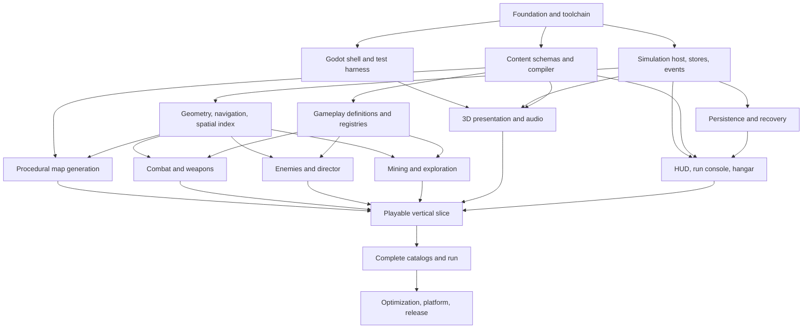

# Implementation Plan for AI Agents

## Purpose

This document turns the gameplay and technical specifications into dependency-ordered, independently verifiable work packages suitable for AI coding agents. It defines how work is scoped, what agents may decide locally, required evidence, milestone gates, and the path from empty repository to internal demo and production-ready game.

## Agent operating contract

Every implementation task must provide:

1. **Objective:** one concrete outcome stated in observable repository terms.
2. **Authority:** exact gameplay/technical documents and requirement IDs governing it.
3. **Prerequisites:** completed work-package IDs and existing contracts it may rely on.
4. **Owned scope:** files/directories/components it may modify.
5. **Inputs and outputs:** typed contracts, schemas, events, artifacts, or scenes crossing its boundary.
6. **Invariants and edge cases:** copied by reference from the relevant specification.
7. **Verification:** named automated suites, fixtures, captures, reports, and device checks.
8. **Non-goals:** adjacent features it must not opportunistically implement.
9. **Completion evidence:** concise commands/results and artifact locations.

An agent reads all cited normative sections before editing. It may make local implementation choices only when they do not change a documented boundary, data shape, ordering, performance budget, persistence behavior, player-visible rule, or another agent's ownership.

### Task decomposition and handoff protocol

- A work-package row is an implementation epic, not automatically a single agent task. Split it into the smallest vertical increments that each produce executable evidence without temporary duplicate ownership.
- Contract-first tasks land stable domain types, schemas, fixtures, and fakes before consumers begin. Parallel consumers may start only from a reviewed contract revision.
- Each task owns an explicit, nonoverlapping file set. Changes to a shared contract are a separate prerequisite or coordinated integration task, never an incidental edit hidden in a consumer task.
- A task must leave the repository buildable and its owned tests passing. Partial scaffolding is acceptable only behind a development-only composition root and with its successor work-package ID recorded.
- Handoffs report changed contracts, generated artifacts, verification commands/results, measured budget deltas, deferred work by package ID, and any discovered specification conflict.
- Review compares behavior against cited `TR-*` requirements and acceptance evidence, not only code shape. A reviewer must be able to rerun the evidence from a clean checkout.

### Required task brief template

Every assigned task uses these headings:

| Heading | Required contents |
| --- | --- |
| Objective | One observable outcome and its parent work-package ID |
| Authority | Exact gameplay sections, technical sections, `TR-*` IDs, and accepted TDRs |
| Prerequisites | Merged package/task IDs and contract versions |
| Owned scope | Exact directories/files/components allowed to change |
| Inputs and outputs | Types, schemas, commands, events, manifests, snapshots, or assets crossing ownership |
| Invariants and edge cases | Ordering, clocks, units, failure, capacity, pause, and persistence rules that apply |
| Non-goals | Adjacent behavior explicitly excluded |
| Verification | Exact suites, fixtures, diagnostics, captures, and target budgets to produce |
| Handoff | Evidence artifact locations, contract changes, risks triggered, and successor IDs |

If any row cannot be filled from accepted documents, the task is not ready to assign. The planner either narrows it, adds the missing contract to this specification, or records a genuine open question; an implementation agent does not invent the missing boundary.

### Work-package authority routing

Use this table to populate task briefs before following more specific cross-links in the package row:

| Prefix | Primary component/contract route | Normative requirement families |
| --- | --- | --- |
| `FND` | `CMP-APP`, `CMP-OBS`, build/tool contracts and all project boundaries | `TR-FND`, `TR-BLD`, `TR-AGT`, `TR-CTR` |
| `DAT` | `CMP-CNT`, `CTR-CNT`, `SCH-CNT` | `TR-DAT`, applicable `TR-AST` |
| `SIM` | `CMP-RUN`, `CMP-SIM`, `CTR-RUN`, `CTR-SIM` | `TR-RUN`, `TR-SIM` |
| `GEO` | `CMP-GEO` plus `CTR-MAP-002` | `TR-GEO` |
| `MAP` | `CMP-MAP`, `CTR-MAP`, `SCH-MAP` | `TR-MAP`, applicable `TR-DAT`/`TR-GEO` |
| `PLY` | `CMP-SIM`, `CMP-GEO`, player-facing snapshot fields | `TR-SIM`, `TR-GEO`, `TR-COM` |
| `COM` | `CMP-COM`, combat portions of `CTR-SIM` | `TR-COM`, applicable `TR-SIM`/`TR-GEO` |
| `ENC` | `CMP-ENC`, spawn/world-query contracts | `TR-ENC`, applicable `TR-GEO`/`TR-COM` |
| `MIN` | `CMP-MIN`, mining events/intents | `TR-MIN`, applicable `TR-GEO`/`TR-ENC` |
| `PRG` | `CMP-PRG`, `CTR-RUN-003`, `CTR-SIM-004` | `TR-PRG`, applicable `TR-PST` |
| `PRE` | `CMP-PRE`, `CTR-PRE`, presentation snapshot/events | `TR-PRE`, applicable `TR-OBS` |
| `AUD` | `CMP-AUD`, presentation events | `TR-AUD` |
| `UI` | `CMP-UI`, `CTR-UI` | `TR-UI`, applicable `TR-PST` |
| `AST` | `SCH-AST`, import/build contracts | `TR-AST`, `TR-PRE`, `TR-AUD` |
| `PST` | `CMP-PST`, `CTR-PST`, `SCH-PST`/`SCH-RUN-003` | `TR-PST` |
| `PLT` | `CMP-PLT`, `CTR-PLT` | `TR-PST`, `TR-BLD` |
| `QUA` | `CMP-OBS`, `CTR-OBS`, verification/evidence contracts | `TR-QUA`, `TR-OBS`, `TR-AGT` |
| `OPS` | build/release manifests and platform contracts | `TR-BLD`, `TR-PST`, `TR-QUA`, `TR-AGT` |

The [Component, Contract, and Schema Registry](./115-component-contract-and-schema-registry.md) contains the full IDs and ownership. The [Autonomous Agent Execution Protocol](./114-autonomous-agent-execution-protocol.md) controls local decisions, evidence, retries, and escalation.

## Rules minimizing agent ambiguity

- Prefer explicit small domain types and services over generic frameworks.
- Do not introduce a new dependency, language, code generator, global singleton, reflection registry, serializer, ECS, event bus, UI framework, or scripting layer without the review defined by the technical decisions.
- Do not duplicate a rule in presentation or tools; call the owning domain service.
- Stable IDs and schemas cross boundaries; display names, file paths, and C# type names do not.
- Every behavior addition includes registration, content validation, tests, diagnostics, and presentation fallback in the same work package or an explicitly blocked successor.
- A stub is allowed only when the milestone declares it, is unmistakably diagnostic, and cannot enter Release.
- Generated files are changed through their generator.
- Performance-sensitive work includes counters/markers before optimization.
- Fix the smallest ownership layer that violates a contract; do not compensate in an unrelated layer.
- If implementation reveals a spec conflict, apply the authority and escalation routing in the autonomous execution protocol; stop only the affected slice.

## Architecture dependency graph

Arrows define hard contract dependencies, not an instruction that all downstream work must be sequential. Agents may work in parallel only after shared schemas/interfaces are accepted and their file ownership does not overlap.

## Milestone gates

### M0 — Reproducible foundation

A clean checkout validates tool versions, restores/builds locked dependencies, enforces project/contract boundaries, compiles sample content, runs pure tests, imports the Godot project headlessly, launches an empty development build, exports Windows/Linux smoke artifacts, and emits a valid task evidence bundle through the standard command surface.

### M1 — Headless simulation skeleton

Fixed clocks, pause reasons, commands, entity IDs/stores, events, snapshots, RNG streams, and invariant harness execute a seeded accelerated run without Godot. No gameplay catalog breadth is required.

### M2 — Combat graybox

One mech moves in a generated/open test arena under the orthographic camera. Skitterling/Ripper pursuit, contact damage, Pulse Repeater, Hull/HUD, spawn/recycle, and pause operate through authoritative simulation with representative instanced enemy proxies at 60 FPS.

### M3 — Core differentiator slice

Standard/rich seams, one geode/resonance, one Hyper Gold beacon, resource ledger, fabrication, Mine Layer (`W-BD`) with its Seed Charges branch in addition to Pulse Repeater, radar, one deterministic Claim-Jumper Core cache, map/fog, and failure/success settlement form a coherent shortened internal scenario using real subsystem contracts.

### M4 — Internal gameplay demo

A stable internal-only 14-minute scenario validates the product thesis without claiming content completeness:

- a representative procedural finite map pinned to the `B/C/D/E` (Barysteel/Cinderglass/Driftmetal/Eidolon Coral) survey so every demo recipe is legal;
- Kestrel and Bastion, proving two signature/mech-trait paths against that same valid profile;
- Pulse Repeater with Broadside Oscillator, Mine Layer with Selective Detonators, Sentry Pod with Battery Overclock, and Reactor Pulse with Kinetic Vent, covering direct, area/movement-persistent, autonomous, body-centered, and all three branch transformation classes;
- Skitterling, Ripper, Shellback, Lurker, Needler, and Razorling plus Riftjaw and Brood Titan, using the documented first-playable substitutions for later schedule identities;
- all normal mining site classes, fabrication, profile-legal fresh utilities, one cache containing Claim-Jumper Core with scenario variants for install, sale, and replacement of a preinstalled relic, health rocks/packs, radar/map;
- active HUD, paused console, results, local profile and Hyper Gold settlement;
- desktop and Steam Deck layouts/gamepad;
- development diagnostics and local balance report; and
- target-device 60 FPS in its representative peak.

The 14-minute duration is a diagnostic scenario configuration, not a shipped alternate mode or change to the 35-minute standard specification.

#### M4 diagnostic scenario contract

- The scenario definition has development status and is excluded from Release bundles.
- Map/profile selection searches unsigned seeds upward from zero and commits the first fully valid `B/C/D/E` manifest that satisfies every ordinary map contract; the chosen seed, generator version, and checksum then become a golden scenario fixture.
- Kestrel is the default interactive path. A second otherwise identical Bastion variant proves signature/trait/profile behavior.
- The player begins only with the selected mech's signature weapon and ordinary fresh-profile account state. Build acquisition uses real mining, fabrication, slot, recipe, price, and branch transactions.
- The 14 active minutes use standard schedule rows `0, 2, 4, 6, 8` during minutes 0–4; `10, 12, 14, 16, 18` during minutes 5–9; and `20, 24, 28, 32` during minutes 10–13. First-playable substitutions preserve population weight. Diagnostic schedule mapping changes timing only; enemy definitions and director mechanics remain standard.
- Riftjaw warns at `4:45` and arrives at `5:00`; Brood Titan warns at `9:45` and arrives at `10:00`. Living Riftjaw persists when Brood Titan arrives.
- Successful diagnostic extraction occurs at `14:00` under the same terminal ordering and settlement path as `35:00`. Death and abandonment use standard failure behavior.
- Hyper Gold beacon thresholds, geode resonance, ore payouts, rocks/packs, caches, radar, and boss physical loot retain standard values. The scenario does not grant hidden resources.
- Automated variants may start from declared constructed builds or grant resources only through the real transaction service to isolate combat/UI/performance gates; those variants are labeled noninteractive diagnostics and cannot satisfy the organic economy-flow acceptance case.

### M5 — Full standard-run feature completeness

All 15 weapons/45 branches, 12 utilities plus radar, 10 relics, six mechs, ten enemies, four bosses, 35-minute schedule, map contract, PowerUps/unlocks, complete UI flow, recovery, and results/history work with representative assets.

### M6 — Content/performance production readiness

Asset validation gates pass, catalogs are tuned through benchmark evidence, Steam Deck PERF-04 meets budget, accessibility matrices pass, no high-severity content/technical gaps remain, and all generated/packaged artifacts are reproducible.

### M7 — Release candidate

Windows/Steam Deck exports, Steam staging/cloud, migrations, crash recovery, licenses/notices/SBOM, clean-machine flows, target-device performance, and release checklist pass.

## Foundation work packages

| ID | Deliverable | Depends on | Completion gate |
| --- | --- | --- | --- |
| FND-001 | Pin Godot/.NET versions, solution/project skeleton, repository layout, editor/analyzer settings | none | clean restore/build and version report |
| FND-002 | Root wrapper/typed command host, doctor/bootstrap/format/build base verbs, and stable registration surface for later content/import/run/export owners | FND-001 | implemented verbs run noninteractively and unavailable owner verbs return a typed nonzero status until their package lands |
| FND-003 | Pure NUnit test projects and Godot integration-test harness | FND-001 | sample pure and engine tests pass headlessly |
| FND-004 | Build identity/version service and generated build manifest | FND-001 | identity visible in tool/game test and diagnostics |
| FND-005 | Initial CI fast suite with locked restore and artifact summaries | FND-002, FND-003 | pull-request-equivalent job passes cleanly |
| FND-006 | Windows/Linux Godot export presets and local-platform adapter | FND-001, FND-002 | packaged empty builds launch without Steam |
| FND-007 | Structured logging, stable diagnostic codes, redaction, rotating local files | FND-004 | schema/redaction/rate-limit tests pass |
| FND-008 | Profiler marker/metric registry and benchmark report format | FND-004 | sample CPU/count/allocation report produced |
| FND-009 | Architecture dependency tests plus complete documentation/requirement/component/contract/schema/verification/work ID registry validator | FND-001, FND-003 | forbidden project edges and missing/duplicate/dangling registry IDs/links fail fixtures |
| FND-010 | Task evidence schema, deterministic emitter/validator, and CI artifact integration | FND-004, FND-005, FND-007, FND-009 | complete/incomplete/redaction/reproducibility fixtures and sample retained artifact |

## Content and data work packages

| ID | Deliverable | Depends on | Completion gate |
| --- | --- | --- | --- |
| DAT-001 | Common definition envelope, stable-ID rules, schema infrastructure, diagnostic format | FND-001, FND-003 | invalid/valid fixture suite |
| DAT-002 | Resource, mech, enemy, boss, mining, encounter, map schemas and typed models | DAT-001 | accepted initial definitions parse/validate |
| DAT-003 | Weapon, branch, utility, relic, PowerUp, unlock schemas and typed models | DAT-001 | graph/cardinality/price validators pass |
| DAT-004 | Behavior/target/formula/modifier registry manifest and registration validator | DAT-002, DAT-003 | unknown/duplicate/mismatched registrations fail |
| DAT-005 | Cross-reference, semantic, analytical, localization, asset, and source-trace validators | DAT-002, DAT-003 | complete invalid-fixture coverage |
| DAT-006 | Canonical bundle compiler, hash, normalized defaults, deterministic ordering | DAT-005 | source-order permutation yields identical hash |
| DAT-007 | Import accepted gameplay catalogs into initial JSON definitions | DAT-006 | totals/mappings/numbers match GDD/CSV reports |
| DAT-008 | Generate CSV/balance/coverage/traceability reports | DAT-006 | generated artifacts stable and stale detection works |
| DAT-009 | Localization catalogs, named-placeholder validation, pseudo-localization | DAT-005 | missing/mismatched/expansion fixtures pass |

## Simulation and geometry work packages

| ID | Deliverable | Depends on | Completion gate |
| --- | --- | --- | --- |
| SIM-001 | Fixed 60 Hz host, accumulator, catch-up limit, clock domains | FND-003 | clock/edge/final-boundary fixtures |
| SIM-002 | Pause-reason set, lifecycle, focus/suspend hooks | SIM-001 | overlapping pause matrix |
| SIM-003 | Generational entity IDs and packed category stores | FND-003 | reuse/stale/capacity/property tests |
| SIM-004 | Command admission, sequence/idempotency, paused transaction shell | SIM-001, SIM-003 | command/atomic rejection fixtures |
| SIM-005 | Exact PCG32 implementation, SplitMix64 child derivation, registered stream families, recovery state, scripted test sources | FND-003 | golden vectors, bounded conversion, stable sequences, serialization, and independence tests |
| SIM-006 | Domain/presentation event buffers, provenance, stable ordering | SIM-003 | simultaneous/order/event-loss fixtures |
| SIM-007 | Immutable/double-buffered presentation snapshot and view-model primitives | SIM-003, SIM-006 | reconstruction/no-mutation tests |
| SIM-008 | Modifier graph, versions, flat/additive/branch/relic layers, snapshot/live fields | DAT-003, SIM-003 | derived-value and invalidation matrices |
| SIM-009 | Headless simulation runner, step/advance/script/checksum/report | SIM-001–SIM-008 | accelerated deterministic fixture |
| GEO-001 | Planar math, primitives, inclusive overlap, swept queries, terrain collision | SIM-003 | brute-force reference comparison |
| GEO-002 | Static geometry manifest and raster construction | GEO-001, DAT-002 | connectivity/clearance fixtures |
| GEO-003 | Player swept movement/slide and coordinate presentation adapter contract | GEO-001 | movement/corner/boundary tests |
| GEO-004 | Uniform spatial hash and allocation-free query API | GEO-001 | randomized differential tests and budget |
| GEO-005 | Flow-field navigation and ordinary movement integration | GEO-002, GEO-004 | route/stuck/boundary/performance fixtures |
| GEO-006 | Boss-clearance routing and re-entry candidate service | GEO-002, GEO-005 | all boss footprints/routes pass |
| GEO-007 | Camera footprint, spawn sectors, offscreen validation/recycle candidates | GEO-002 | all map-edge/camera orientations pass |
| GEO-008 | Exploration raster, discovery, marker/waypoint model | GEO-002 | visible-is-discovered and fog fixtures |

## Procedural generation work packages

| ID | Deliverable | Depends on | Completion gate |
| --- | --- | --- | --- |
| MAP-001 | Resource-profile selector and abundance generation | DAT-002, SIM-005 | every signature-valid profile distribution |
| MAP-002 | Bridgeless region graph, chords, pockets, route scale | GEO-002, SIM-005 | graph/property tests meet contract |
| MAP-003 | Spatial embedding, region recipes, connectors, boundary, obstacle stamps | MAP-002 | topology/coverage/clearance validators |
| MAP-004 | Landmark assignment and authored-structure manifest | MAP-003, DAT-005 | no-repeat/occlusion/budget tests |
| MAP-005 | Deployment selection and route-distance candidate generation | MAP-003, GEO-007 | Near-capacity and spawn-direction tests |
| MAP-006 | Constraint solver for geodes, seams, Hyper Gold, caches | MAP-005 | every hard placement invariant |
| MAP-007 | Complete manifest, canonical checksum, retry/fallback strategy | MAP-001–MAP-006 | deterministic valid manifest/retry tests |
| MAP-008 | Dynamic rock candidate/recycle placement | MAP-007, GEO-007 | annulus/offscreen/exclusion/probability tests |
| MAP-009 | Map audit CLI, images/layers/reports, seed batch runner | MAP-007 | reproduce failing seed and batch summary |
| MAP-010 | Nightly profile/signature seed matrix | MAP-009, FND-005 | required partitions publish zero invalid maps |

## Gameplay work packages

| ID | Deliverable | Depends on | Completion gate |
| --- | --- | --- | --- |
| PLY-001 | Player movement, facing, Hull/Armor/Recovery/contact grace, damage order | SIM-008, GEO-003 | survivability baseline fixtures |
| ENC-001 | Pure pursuer enemy store/update/contact and fixed profiles | DAT-002, GEO-005, PLY-001 | ten profile derivations and contact tests |
| ENC-002 | Director schedule compiler, pulses, weighted residual composition, ceilings/queues | DAT-002, SIM-009 | all 35 rows exact |
| ENC-003 | Formation placement/materialization and ordinary recycling | ENC-002, GEO-007 | grammar/gap/capacity tests |
| ENC-004 | Needler state/projectile behavior | ENC-001, COM-002 | charge/fire/resonance/readability fixtures |
| ENC-005 | Elite construction and schedule/beacon eligibility | ENC-001, ENC-002 | multiplier/cap/exclusion tests |
| ENC-006 | Riftjaw and Brood Titan boss state machines | ENC-003, COM-002 | full ability/control/terrain/pause tests |
| ENC-007 | Prism Crown and Skybreaker Apex state machines | ENC-006 | projectile/leap/marker/resonance tests |
| ENC-008 | Boss warning/re-entry/death/physical loot and overlap | ENC-006, ENC-007, PRG-003 | all-four-overlap and exact reward fixtures |
| ENC-009 | Hyper Gold response packages and persistent site tags | ENC-002, MIN-002 | four thresholds/capacity/multi-site tests |
| COM-001 | Attack scheduler, target request/policies, provenance, actor lifecycle | SIM-006, SIM-008, GEO-004, DAT-004 | scheduler/tie/capacity fixtures |
| COM-002 | Projectile/hitscan/beam/zone/explosion and terrain/hit resolution | COM-001, GEO-001 | collision/pierce/hit-set differential tests |
| COM-003 | Enemy/player damage pipelines, death commits, statistics attribution | COM-002, PLY-001 | rounding/grace/shield/revival/overkill fixtures |
| COM-004 | Control/status runtime, resistance, immunity, displacement | COM-003 | full control stacking matrix |
| COM-005 | Pulse Repeater plus Rail Lance representative direct primitives | COM-001–COM-004, DAT-007 | catalog arithmetic and WB fixtures |
| COM-006 | Cluster Mortar and Gravity Projector area/persistent primitives | COM-001–COM-004 | delayed/field/pull/branch fixtures |
| COM-007 | Attack Drones/Sentry Pod autonomous actors | COM-001–COM-004 | actor capacity/target/update fixtures |
| COM-008 | Remaining base weapon behaviors | COM-005–COM-007 | all 15 base WB-01–WB-06 fixtures |
| COM-009 | All 45 branch behavior modifiers | COM-008 | each branch benchmark/edge fixtures |
| COM-010 | Ten relic hook policies and weapon compatibility matrix | COM-009, PRG-005 | pairwise/exhaustive named interactions |
| COM-011 | Utilities, PowerUps, mech traits and modifier matrix | COM-010, DAT-007 | derived display equals measured behavior |
| MIN-001 | Mining site store, occupancy, grace/decay/work/installments | SIM-003, GEO-001, DAT-002 | four site state fixtures |
| MIN-002 | Geode resonance lifecycle and Hyper Gold threshold history | MIN-001, ENC-001 | boundary/completion/threshold ordering |
| PRG-001 | Run resource ledger and payouts/pickups | SIM-006, DAT-002 | exact reconciliation fixtures |
| PRG-002 | Fabrication availability/previews and weapon/stat/branch transactions | SIM-004, SIM-008, PRG-001, DAT-007 | every price/slot/profile/exclusion case |
| PRG-003 | Utility/radar transactions and target state | PRG-002, GEO-004 | rank/slot and seven-category fixtures |
| PRG-004 | Relic cache open/install/sell/replace transactions | SIM-004, COM-010, PRG-001 | mandatory/idempotent/pause cases |
| PRG-005 | PowerUp/refund/option-unlock domain transactions | DAT-007, SIM-004 | caps/costs/refunds/ownership fixtures |
| PRG-006 | Run result manifest and success/failure/abandon settlement model | PRG-001, ENC-008 | complete results/reconciliation fixtures |

## Presentation, UI, asset, and audio work packages

| ID | Deliverable | Depends on | Completion gate |
| --- | --- | --- | --- |
| PRE-001 | Godot run scene, snapshot bridge, entity-handle lifecycle | FND-003, SIM-007 | rebuild/dispose/missed-event tests |
| PRE-002 | Orthographic camera, world conversion, clamp, footprint publication | PRE-001, GEO-003 | both aspect ratios and boundary captures |
| PRE-003 | Static generated-world instantiation from manifest | PRE-001, MAP-007 | geometry/footprint overlay capture |
| PRE-004 | Crowd VAT/instancing technical spike with proxy enemy family | PRE-001, AST-003 | 900-instance performance/readability gate |
| PRE-005 | Durable player/boss/site/cache/pickup presentation adapters | PRE-001, DAT-007 | every state has fallback/capture |
| PRE-006 | Transient projectile/zone/trail/decal/particle pools and priority | PRE-001, COM-002 | saturation preserves critical geometry |
| PRE-007 | Materials/lighting/blob shadows/quality presets/shader warm-up | PRE-003–PRE-006 | PERF captures and no runtime compile stalls |
| AUD-001 | Mixer buses, audio event registry/service, voice priority/aggregation | FND-007, SIM-006 | 64-voice stress and critical reserve |
| AUD-002 | Pause/music state, captions, haptics, settings adapters | AUD-001, UI-009 | pause/accessibility/controller fixtures |
| UI-001 | Route coordinator, immutable view models, shared widgets, focus IDs | FND-003, SIM-007 | route/focus harness |
| UI-002 | Logical input, movement adapter, glyph detection, controller disconnect | UI-001, PLY-001 | deadzone/remap/disconnect tests |
| UI-003 | Responsive HUD shell, Hull/timer/resources/loadout/bosses | UI-001, PRE-002 | desktop/handheld stress screenshots |
| UI-004 | Mining panel, warnings, survey, radar/waypoint edge layout | UI-003, MIN-002, PRG-003 | all state/cluster/accessibility captures |
| UI-005 | Compact minimap and full map/filter/waypoint flows | UI-001, GEO-008 | controller-only map tasks |
| UI-006 | Run console Status and Fabrication pages/previews/confirmations | UI-001, PRG-002 | every transaction/rejection/focus path |
| UI-007 | Relic resolution modal | UI-006, PRG-004 | install/sell/replace/no-back paths |
| UI-008 | Results, unlock notifications, Hangar/Mechs/PowerUps/Blueprints/Records | UI-001, PRG-005, PRG-006, PST-003 | complete between-run controller flow |
| UI-009 | Settings, remapping, accessibility modes, preview/revert | UI-001, UI-002 | extremes/safe recovery/screenshots |
| UI-010 | Content-driven onboarding coordinator and required event hooks | UI-003–UI-009 | reset/skip/nonmodal/blocking/pause fixtures |
| AST-001 | Asset/license manifest, allowlist, credits/notices generator | DAT-005 | 100% packaged license coverage fixture |
| AST-002 | Pinned Blender/glTF derivation/import validation pipeline | AST-001, FND-002 | clean deterministic sample import |
| AST-003 | Crowd source rig to LOD/VAT pipeline and comparison captures | AST-002 | deformation/budget test |
| AST-004 | UI/icon/material identity pipeline and accessibility contact sheets | AST-001, DAT-009 | six materials/sites/threats pass matrices |
| AST-005 | Audio/font/VFX asset validators and budgets | AST-001 | sample loudness/glyph/effect manifests pass |
| AST-006 | Acquire/adapt representative CC0 asset set for M4 | AST-001–AST-005 | license/readability/performance composition gate |

## Persistence, platform, quality, and release work packages

| ID | Deliverable | Depends on | Completion gate |
| --- | --- | --- | --- |
| PST-001 | Save envelopes, canonical JSON, checksum, schema validation | FND-003, DAT-001 | valid/corrupt/limit fixtures |
| PST-002 | Atomic write/backups/corruption recovery | PST-001 | fault injection at every write step |
| PST-003 | Profile/settings/history domain and transactions | PST-002, PRG-005 | load/save/refund/unlock/history fixtures |
| PST-004 | Pending extraction settlement idempotency | PST-002, PRG-006 | crash-before/after-commit tests |
| PST-005 | Run recovery capture/restore/rebuild | PST-002, SIM-009, MAP-007 | checksum round trip and resume-paused |
| PST-006 | Sequential migration framework and initial fixtures | PST-003 | old/current/future-version behavior |
| PLT-001 | Steam/local platform adapter using pinned Steamworks.NET 2025.164.1/SDK 1.64, callback lifecycle, native packaging, and Steam-unavailable behavior | FND-006 | fake plus Windows/Linux sandbox/offline initialization/package tests |
| PLT-002 | Steam Cloud profile/portable settings sync and conflict UI model | PLT-001, PST-003 | ancestor/divergent/offline test matrix |
| QUA-001 | WB-01–WB-06 balance harness and reports | SIM-009, COM-008 | all base weapons produce metrics |
| QUA-002 | Gameplay capture metrics and result reconciliation | FND-008, PRG-006 | metrics equal authoritative ledgers |
| QUA-003 | Debug overlay and typed development command palette | FND-008, gameplay systems | all required actions logged; Release excludes |
| QUA-004 | Diagnostic package/crash breadcrumb export and redaction | FND-007, FND-008, PST-005 | sanitized package fixture |
| QUA-005 | PERF-01–PERF-08 scenarios and percentile report runner | presentation/gameplay complete per scenario | reproducible reports and regression comparison |
| OPS-001 | Main/nightly/release CI suites and artifact retention | FND-005, QUA-005 | scheduled pipelines publish expected evidence |
| OPS-002 | Release packaging, checksums, manifests, symbols, SBOM/notices | FND-006, AST-001, OPS-001 | immutable Windows/Linux candidate artifacts |
| OPS-003 | Steam staging/depot/cloud deployment and rollback process | PLT-002, OPS-002 | staging install/update/rollback succeeds |
| OPS-004 | Retail Steam Deck release-candidate gate | OPS-003, M6 | full controller/performance/recovery checklist |

## Vertical-slice sequencing

The fastest safe route to M4 is:

1. FND-001 through FND-010, DAT-001 through DAT-006, SIM-001 through SIM-009.
2. GEO-001 through GEO-007, PLY-001, ENC-001/002, COM-001 through COM-005.
3. PRE-001/002/004, UI-001 through UI-003: establish M2 and performance direction early.
4. MIN-001/002, PRG-001 through PRG-004, UI-004 through UI-007.
5. MAP-001 through MAP-009, PRE-003/005/006/007, AST-001 through AST-006.
6. ENC-003 through ENC-006/008/009, representative COM-006/007 branches/relics/utilities.
7. PST-001 through PST-005, PRG-005/006, UI-008/009, AUD-001/002, QUA-001 through QUA-005.
8. Package and validate M4 before completing catalog breadth.

This ordering validates the two largest architectural risks—crowd performance and procedural-map/mining play—before investing in all content.

### Empty-repository starting queue

With only these specifications present, `FND-001` is the first Ready work package and is selected without asking what to build first. After it is Done, `FND-002`, `FND-003`, and `FND-004` become Ready; the ready-work algorithm selects contract/test infrastructure before broad consumers. Each completion recomputes the dependency graph and names the next Ready packages in its evidence handoff.

### Concrete M0 bootstrap queue

These tasks are the accepted first decomposition. Each inherits the FND/DAT authority routing above and receives a full brief before editing.

| Task | Objective | Hard dependencies | Primary owned scope | Close evidence |
| --- | --- | --- | --- | --- |
| `TASK-FND-001-001` | create exact solution, project directories/references, `global.json`, package/build pin files | none | solution, root pin files, project files/directories | locked restore/build and project graph report |
| `TASK-FND-001-002` | add nullable/analyzer/warnings/format/naming/deterministic build policies | previous task | `Directory.Build.*`, `.editorconfig`, analyzer config | deliberately invalid fixture proves each policy |
| `TASK-FND-001-003` | create minimal Godot C# Mobile-renderer project and empty boot scene/composition root | first task | `game/` only | headless import and local empty launch |
| `TASK-FND-002-001` | implement root wrapper parity, typed verb dispatcher, `doctor`, and `bootstrap` | FND-001 Done | root wrappers and tool command host | shell/PowerShell parity, unknown-verb, missing-tool, clean bootstrap fixtures |
| `TASK-FND-002-002` | implement `format`, `format-check`, `build`, and registered unavailable-owner behavior for remaining verbs | prior task | wrapper routing/tool commands only | every verb returns documented code/artifact path noninteractively |
| `TASK-FND-003-001` | create pure NUnit projects, shared deterministic fixture utilities, and sample unit/property/golden tests | FND-001 Done | pure test projects/support | tests run without Godot, expose seed/reproduction on failure, and every test host proves its own reflection-disabled JSON switch is live: `AppContext.TryGetSwitch("System.Text.Json.JsonSerializer.IsReflectionEnabledByDefault", out var value)` true with `value` false, failing with a message that names the per-host MSBuild property and the `.csproj` carrying it rather than a bare boolean |
| `TASK-FND-003-002` | create minimal Godot integration runner with process exit/report contract | FND-001 Done, prior pure harness conventions | `MechaMiner.Game.Tests`, test scenes | headless pass/fail/timeout/artifact fixtures |
| `TASK-FND-004-001` | implement build identity source/generation and manifest schema | FND-001 Done | build identity owner and generated manifest | tool/game/diagnostic identity equality fixture |
| `TASK-FND-009-001` | enforce project-reference/Godot dependency direction | FND-003 Done | architecture tests | each forbidden synthetic edge fails |
| `TASK-FND-009-002` | validate unique/resolving `CMP/CTR/SCH/TR/TDR/VER/work-package/task` IDs and document links | prior task | registry/document validation tooling/tests | missing, duplicate, dangling, and malformed fixtures fail |
| `TASK-DAT-001-001` | establish strict JSON codec, schema diagnostics, common envelope, and valid/invalid sample definition | FND-003 Done | Content project and content schema/sample fixture only | codec/canonical/duplicate/unknown/version fixtures |
| `TASK-FND-007-001` | implement bounded structured local logging, codes, redaction, and rotation | FND-004 Done | diagnostics logging owner | schema/redaction/rate/rotation/failure fixtures |
| `TASK-FND-008-001` | implement profiler marker/metric registry and canonical sample report | FND-004 Done | diagnostics metric owner | CPU/count/allocation report schema and stable-order fixture |
| `TASK-FND-005-001` | create clean PR-equivalent CI invoking the standard wrapper fast path | FND-002/003 Done, DAT sample present | CI configuration only | clean checkout job and retained concise summaries |
| `TASK-FND-006-001` | create named Windows/Linux development/release presets and local platform adapter | FND-002 Done, Godot harness present | export presets/platform boundary | headless package and Steam-unavailable launch smoke |
| `TASK-FND-010-001` | implement `SCH-OBS-003` evidence model, canonical emitter, validator, and redaction | FND-004/005/007/009 Done | evidence tooling/tests | valid/incomplete/nondeterministic/private-field fixtures |
| `TASK-FND-010-002` | integrate evidence emission into standard verbs and CI retention | prior task | wrapper/CI evidence integration | each M0 verb produces a validating evidence summary |
| `TASK-FND-005-002` | run and close the complete M0 clean-checkout/import/launch/export gate | all prior M0 tasks | integration configuration/evidence only | M0 evidence bundle with no unexplained warning or manual repair |

The queue starts with `TASK-FND-001-001`. A task becomes Ready only when the listed dependencies are Done; ties follow the autonomous ready-work algorithm. No one creates gameplay systems during M0.

## Internal demo acceptance checklist

M4 is accepted only when:

- clean checkout builds and launches without manual editor repair;
- all included content compiles from JSON and uses registered behaviors/assets/localization;
- seed reproduces profile/map and diagnostic report;
- player movement, camera, automatic attacks, contact damage, and overlapping pause reasons operate end to end with authoritative-geometry overlays, deterministic input fixtures, and no state divergence;
- mining, decay, resonance, beacon, fabrication, slot commitment, radar, map, and relic decisions work end to end;
- success banks and failure forfeits Hyper Gold through atomic persistence;
- recovery resumes paused without time/resource duplication;
- controller-only handheld flow reaches deployment, plays, fabricates, maps, resolves relic, views results, and redeploys;
- no critical gameplay cue depends on color/audio/flash alone;
- representative Steam Deck peak holds 60 FPS under the same build/content/assets;
- automated suites and local balance report have no unexplained failures/warnings; and
- known missing production breadth is listed by work-package ID, not hidden as TODOs.

## Production-complete exit criteria

The implementation plan is complete when every accepted gameplay catalog entry and flow has:

- source JSON and localization;
- behavior registration and semantic validation;
- asset manifest and accepted or explicit diagnostic presentation;
- unit/integration/balance/accessibility fixtures;
- metrics and debug visibility;
- save/migration treatment where persistent;
- target-device performance evidence; and
- traceability to gameplay and technical requirements.

## Related documents

- [Technical Specification Index](./README.md)
- [Normative Requirement Index](./112-normative-requirement-index.md)
- [Technical Risk Register](./113-technical-risk-register.md)
- [Autonomous Agent Execution Protocol](./114-autonomous-agent-execution-protocol.md)
- [Component, Contract, and Schema Registry](./115-component-contract-and-schema-registry.md)
- [Verification Strategy](./91-verification-strategy.md)
- [Build, Dependencies, and Release Operations](./100-build-dependencies-and-release-operations.md)
- [Traceability and Completion Matrix](./111-traceability-and-completion-matrix.md)
