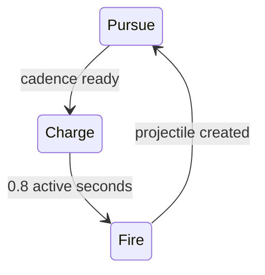

# Encounter Director and Enemy Runtime

## Purpose

This document specifies the authored minute schedule, population accounting, spawning, recycling, enemy behaviors, resonance, bosses, loot, and capacity rules. The director reproduces the gameplay schedule; it does not adapt difficulty to the player.

## Director inputs and outputs

The director receives:

- active simulation tick and standard-mode schedule;
- current ordinary populations by source tag and enemy definition;
- queued authored spawns;
- camera ground footprint and valid entry sectors;
- immutable generated-map geometry;
- run content registry and director random stream; and
- currently active Hyper Gold sites and their response histories.

It produces spawn requests, recycle requests, warnings, formation records, population metrics, and boss boundary events. It never reads player Hull, weapon damage, account power, mining success, deaths-per-minute, or inferred skill to change authored pressure.

## Population classes

Every enemy carries one source tag:

| Source | Counts toward | Recycling | Persistence |
| --- | --- | --- | --- |
| Baseline | 450 baseline ceiling and current desired minimum | eligible offscreen | until death/recycle/run end |
| Scheduled event | 100 event-overflow ceiling | eligible after formation has entered pressure area | until death/recycle/run end |
| Boss minion | event-overflow ceiling | ordinary eligible rule | until death/recycle/run end |
| Beacon response | 150 beacon ceiling, per-site history | never merely for distance | until death/run end |
| Scheduled elite | its underlying baseline/event source plus elite count metrics | only if its source permits and schedule does not protect it | until death/recycle/run end |
| Boss | separate maximum four | boss re-entry, never ordinary recycle | until death/run end |

An entity has one source tag even when elite. Changing source tags after spawn is forbidden.

## Minute schedule execution

The authored schedule is compiled into tick-indexed boundaries:

- one row becomes active at each whole active minute;
- composition weights, desired minimum, pulse size, and pulse interval come from that row;
- events and warnings become exact scheduled ticks;
- boss warnings begin 15 active seconds before 7:00, 14:00, 21:00, and 28:00;
- mission extraction occurs at the end of the final active interval at 35:00.

The director retains a pulse phase rather than resetting it because the current population temporarily exceeds a minimum. When a pulse becomes due, it spawns up to the lesser of its batch size, current deficit, available ceiling, and valid positions. Any unmaterialized members remain in a FIFO authored queue.

Composition counts use deterministic weighted residual allocation: multiply requested batch by weights, take whole floors, then assign remaining members by greatest fractional remainder with schedule order and enemy ID as ties. This prevents small pulses from permanently omitting low-weight identities.

## Formation materialization

A formation definition contains scheduled tick, formation kind, composition source, requested count, entry sectors, gap/arc requirements, spacing, depth, warning duration if any, and capacity class.

| Formation | Technical placement rule |
| --- | --- |
| Stream | ordered narrow spawn lanes in one valid sector, staggered by configured sub-interval |
| Wall | line parallel to one camera edge with at least the authored traversable gap projected toward the player |
| Swarm | bounded jittered cluster in one quadrant, never one exact point |
| Twin flanks | two separated sector batches with two nonselected escape sectors |
| Encirclement | perimeter arc with the authored 70–90-degree gap and no spawn inside camera safety margin |
| Convergence | four cardinal-sector groups with diagonal escape gaps |
| Rolling ring | two incomplete encirclements with separate entry times and gaps |

Placement first constructs ideal planar slots relative to the camera/player, then projects each through static-ground and spacing validation. It preserves the escape geometry before preserving exact spacing. Invalid slots queue; they never move into the visible field or close the promised gap.

Formation identity affects only initial placement and entry timing. Once spawned, enemies use their fixed individual behavior.

## Spawn-sector selection

The visible ground perimeter is partitioned into eight stable sectors. Each tick the spawn service publishes valid intervals per sector after intersecting navigable ground, solid clearance, mining/site exclusions, player safety, and camera margin.

- Baseline pulses choose sectors through the director stream while avoiding immediate repetition when alternatives exist.
- Authored formations constrain sectors according to their grammar.
- Beacon responses originate generally outward from the site while retaining valid offscreen positions and escape directions.
- Bosses use their warned bearing.
- A spawn candidate must have a navigation route into the pressure area.

Spawn attempts are bounded per tick. Excess queueing is visible in diagnostics and is a map/performance defect if it prevents the authored population from recovering within two pulse intervals.

## Ordinary enemy runtime

Nine ordinary identities are pure contact pursuers. Their update consists of:

1. sample flow-field and direct-path direction;
2. apply hard-control/slow state and conditional speed modifiers;
3. move against static terrain;
4. update spatial registration;
5. test player overlap and same-attacker cooldown;
6. request contact damage when eligible; and
7. update visibility, stuck, and recycle eligibility.

Enemies do not run individual behavior trees, pathfinding agents, separation, perception, or target selection. The player is their only pursuit target.

### Needler

Needler adds one state machine:

- Pursuit cadence is 4.5 active seconds and advances through attack-rate modifiers such as Eidolon Coral.
- Charge movement is one-half current pursuit speed.
- At charge start, presentation receives telegraph events. At charge completion, Needler samples the player's current position and fires along that line without leading.
- Projectile speed, damage, lifetime, terrain collision, and no-homing flags are snapshotted at creation.
- Hard control may pause locomotion but does not erase already-earned cadence; ordinary Needler charge may pause under hard control because it is not a boss ability.

## Resonance evaluation

Geode fields do not overlap on a valid standard map, so each enemy has at most one active material resonance. The spatial service resolves membership after movement.

| Resonance | Evaluation point |
| --- | --- |
| Asterite outgoing damage | when contact, charge, landing, or other damage instance is created |
| Barysteel damage reduction | when incoming player damage resolves |
| Cinderglass projectile damage | when enemy projectile is created; value persists after leaving |
| Driftmetal control reduction | when displacement/control resolves |
| Eidolon Coral attack cadence | each tick adds 1.20× normal cadence progress while inside; telegraph lengths do not change |
| Flux Amber movement | current movement integration while inside |

Field collapse removes membership before subsequent same-tick combat created after the mining completion phase. Because combat precedes mining in the shared tick order, attacks already resolved on the completion tick still see the field; the field is absent starting with the next combat phase. This ordering is covered by a golden fixture and should be communicated only if playtesting exposes it.

Claim-Jumper enemy speed is a separate conditional multiplier active only during forward extraction progress. Elite movement multiplies base, elite, resonance, then Claim-Jumper factors.

## Elite construction

An elite snapshots the base enemy definition plus the shared elite modifiers at spawn. It does not create a second duplicated enemy catalog row.

- Hull ×4, movement ×1.10, contact damage ×1.50, contact diameter ×1.25.
- Add 25 resistance percentage points with the accepted 90% elite cap.
- Needler is excluded by content validation.
- The elite marker, crown, audio, and minimap state are presentation flags on the same authoritative entity.

## Boss scheduling and lifecycle

At a boss boundary, the director creates exactly the named boss if no instance with that scheduled identity exists. A warning record created 15 seconds earlier fixes its general bearing but not an invalid exact point.

Bosses:

- do not count toward ordinary or beacon ceilings;
- use their fixed content profile without elapsed-time scaling;
- maintain independent contact cooldown and behavior state;
- remain active through later boss boundaries;
- are not required for extraction; and
- are disposed without death rewards if the run extracts while they live.

### Boss re-entry

If a boss remains beyond the configured pressure radius and offscreen long enough that its path cannot rejoin promptly, it enters `ReentryPending`:

1. become non-damaging and suppress the special ability;
2. select a valid warned offscreen approach point on reachable ground;
3. emit a readable directional re-entry cue;
4. move presentation offscreen and commit the new position only after the cue window; and
5. return to pursuit with the special-ability cooldown reset.

Re-entry never grants damage, removes Hull/status, or counts as spawn/defeat. The exact distance and delay are tuning data validated against camera scale.

## Boss behavior state machines

### Riftjaw

- Pursues until its eight-second ability cadence is ready.
- Locks the player's current position, validates a lane covering at least one body length, stops, and warns for one second.
- Charges without turning for 1.5 seconds at 5.40M/s using swept terrain/player collision.
- Charge contact uses 27 damage and a dedicated per-ability hit rule rather than ordinary 18 contact.
- Terrain ends the charge; ordinary pursuit resumes without stun or self-damage.

### Brood Titan

- Every ten seconds enters a 0.8-second release warning/pause.
- Creates 16 ordinary Skitterlings as event overflow in an incomplete ring outside its footprint.
- The ring preserves a 90-degree opening generally away from approach and queues invalid/capacity-blocked members.
- Spawned minions have no loot or special link to the boss after creation.

### Prism Crown

- Every seven seconds stops and charges for 1.2 seconds.
- Creates 12 evenly spaced straight projectiles at 2.25M/s and 18 base damage.
- Alternates radial phase by 15 degrees each burst.
- Cinderglass and Eidolon Coral apply through the ordinary projectile/cadence rules.

### Skybreaker Apex

- Every nine seconds samples the player position and resolves the nearest valid landing center that never moves the marker closer to the player.
- Publishes a fixed circular marker and 1.5-second warning.
- Becomes airborne and non-contact-damaging but remains targetable; targeting and damage use its authoritative airborne position/footprint. Making it untargetable would be a player-visible gameplay change, not a visual implementation choice.
- Lands at the fixed center, resolves one 35-damage circle event, then resumes pursuit immediately.

Boss ability timelines advance during hard control as required. Presentation animation follows the state machine; animation events do not drive authoritative timing.

## Boss death and physical loot

Boss death creates an atomic loot manifest before removing the boss:

- 300 common ore as contact-collected pickup pieces;
- 25 unsecured Hyper Gold;
- one material unit for bosses one/two or two units for bosses three/four, selected independently from the four present materials with duplicates allowed.

Loot scatter uses the loot stream and projects pieces onto valid nearby traversable ground. The manifest is fixed before presentation. If individual visual pieces are combined for performance, collection still grants exactly the manifest totals. Each uncollected loot group receives an immediate minimap marker and persists until collection or run end.

Boss death does not pause the timer, open UI, or directly bank rewards.

## Recycling policy

Baseline/event enemies become eligible when offscreen beyond the pressure radius and not recently damaged, controlling a visible persistent attack, or protected by source rules. Choose the farthest/least-relevant candidate deterministically, relocate using a fresh valid entry, reset contact cooldown and transient control, and retain identity, elite/source tag, and current Hull. Recycling is relocation of the same enemy; full replacement would be a separate player-visible gameplay rule.

The diagnostic record distinguishes spawned, recycled-out, recycled-in, and defeated counts. Recycling never inflates kills or cancels beacon persistence.

## Metrics

Per tick/minute capture:

- population and high-water mark by source, identity, elite, and boss;
- requested, queued, spawned, invalid-position, and recycled counts;
- pulse deficit recovery time and queue age;
- formation entry completion and promised-gap validation;
- boss warning, arrival, re-entry, death, overlap, and time-to-kill;
- Needler charges/shots/hits and boss ability starts/completions/hits;
- resonance population-seconds by material; and
- CPU time for director, AI, navigation sampling, spawn validation, and boss behaviors.

## Performance budgets

At the accepted normal ceiling of 450 baseline, 100 event overflow, 150 beacon enemies, four bosses, and legal projectiles:

- director scheduling and population accounting: 0.25 ms p95;
- enemy steering/state/contact requests excluding shared navigation rebuild: 1.0 ms p95;
- boss behaviors and spawn validation: 0.5 ms p95;
- no per-enemy managed allocation after store warm-up; and
- ordinary enemy state target below 256 bytes per entity excluding presentation.

## Verification

- Compile the 35-row schedule and assert every minute boundary, event, warning, composition, pulse, and ceiling against the gameplay document.
- Headless full-run fixtures cover no kills, extreme kills, queued populations, all four boss overlap, multiple active beacons, and extraction with living bosses.
- Formation tests validate offscreen placement and escape gaps across all camera-edge/map-boundary orientations.
- Boss fixtures step every ability across terrain collision, control, resonance, pause, death, re-entry, and final extraction.
- Fixed-profile tests prove enemy values never read player strength or elapsed scaling.
- Steam Deck stress capture uses the exact TDR-003 scenario and reports all queue/capacity degradation.

## Related documents

- [Simulation Core](./20-simulation-core.md)
- [World Geometry, Navigation, and Spatial Queries](./21-world-geometry-navigation-and-spatial-queries.md)
- [Combat and Weapon Runtime](./22-combat-and-weapon-runtime.md)
- [Standard Wave and Beacon Schedule](../32-standard-wave-and-beacon-schedule.md)
- [Initial Alien and Boss Roster](../31-initial-alien-roster.md)
