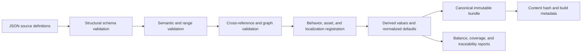

# Content Data and Validation

## Purpose

This document defines content authoring, schemas, stable IDs, compilation, cross-reference validation, derived data, localization, compatibility versions, and the workflow AI agents use to change content safely.

## Source-of-truth boundary

- Gameplay Markdown remains authoritative for accepted player-visible rules and design intent.
- Strict JSON is the authoritative machine-consumed representation used by builds.
- C# behavior implementations are authoritative for runtime mechanics that cannot be represented as parameters.
- Generated bundles, reports, CSVs, balance summaries, and imported Godot resources are derived artifacts.

A gameplay value change is incomplete until the gameplay document, JSON definition, generated reports, dependent estimates, and verification fixtures agree. CI detects mechanical disagreement where a comparison can be automated.

## JSON codec and schema baseline

- Use the built-in `System.Text.Json` reader/writer with explicit typed DTOs and source-generated serialization metadata; do not add Newtonsoft.Json, runtime contract reflection, or dynamic JSON objects to production paths.
- Source files and persisted JSON are UTF-8. Comments, trailing commas, duplicate object properties, nonfinite numbers, and unknown fields are errors. Property names use `snake_case`; stable enum/kind/ID tokens remain exact case-sensitive ASCII.
- JSON Schemas use draft 2020-12 for editor/tool interoperability. The project-owned typed structural/semantic validators remain authoritative; a fixture corpus proves the schema and typed validator accept/reject the same structural cases.
- The canonical writer emits fields in schema-declared order, dictionaries as lexically sorted key entries, stable-ID sets in canonical ID order, and semantically ordered arrays in their authored/explicit order. It writes integers without padding and finite floating-point values with invariant round-trip representation, normalizing negative zero to zero.
- File order, operating-system path order, locale, indentation, and original property order do not affect compiled bundle or payload hashes.
- SHA-256 from the .NET base class library hashes canonical UTF-8 payload bytes. Human-readable pretty JSON is a separate derived view and is never hashed or loaded as canonical state.

The same codec policy is reused by content, saves, recovery, manifests, diagnostics, and task evidence unless a schema explicitly requires a compact binary derived asset. Each domain owns its DTOs and validation; codec reuse does not merge domain ownership.

## Accepted content repository layout

```text
content/
  schemas/
  resources/
  mechs/
  enemies/
  bosses/
  weapons/
  branches/
  utilities/
  relics/
  powerups/
  unlocks/
  mining-sites/
  encounters/
  maps/
  presentation/
  localization/
assets-manifest/
  assets/
  licenses/
generated/
  content.bundle.json
  content.bundle.sha256
  reports/
```

Catalog directories are the authoring boundary. Definitions are grouped by stable item or the smallest cohesive aggregate such as the standard encounter schedule; generated/source separation is mandatory. A layout change must update build tooling, schemas, importers, documentation, and clean-checkout tests atomically rather than adding a second search path.

## Stable ID policy

- Reuse accepted gameplay IDs exactly for defined content: `MCH-01`, `EN-01`, `BOSS-01`, `W-AB`, `REL-01`, and equivalent utility/PowerUp/unlock IDs.
- Generated map instances append or separately store run-local generated IDs; they do not modify content IDs.
- IDs are case-sensitive ASCII tokens matching a schema pattern and never localized.
- Display names and localization keys may change without changing IDs.
- Removing shipped content retires its ID and leaves a migration/tombstone entry; IDs are never reassigned.
- Cross-references contain IDs plus schema-validated expected category where ambiguity is possible.

### Minted content-ID grammars

Several of the prefixes below were agreed between working sessions in conversation before any document authorized them, and this section is what makes them real rather than a record that they already were: a prefix that has only ever appeared in a chat log, a code comment, or a schema `pattern` carries no authority here. That is the standard this project already applied to `common-ore` and `hyper-gold`, which still carry slug IDs because no accepted document ever assigned them an ID token, and being obvious was never a substitute for one. The standard applies to us on the same terms.

Every prefix in the table below is minted by this document. No accepted gameplay document minted an identifier for any of them, and each needs one because every schema in this document references other definitions by stable ID. They follow [Stable ID policy](#stable-id-policy) above: case-sensitive ASCII, never localized, never reassigned. Each numbers from `-01`. Prefixes reused from the accepted gameplay register are governed by the reuse bullet above and are deliberately absent here.

Eleven of them — `FAB-`, `STACK-`, `CACHE-`, `EXCL-`, `HOOK-`, `RESPEC-`, `DEED-`, `HORDE-`, `FOOTPRINT-`, `SIEGE-`, and `BOUNTY-` — name **aggregates** on the same terms as `WAV-01` and `MGC-01`: not embodied in the world and never read by players, so they omit `presentation_id` and `name_key` under [Declared-optional envelope fields](#declared-optional-envelope-fields). `FAB-01` is the utility fabrication and rank contract. `STACK-01` states how modifiers compose and when a new value takes effect. `CACHE-01` is the relic-cache economy: placement, draw, and install-or-sell. `EXCL-01` states that one installed mech-level effect applies at a time, run-local, after additive modifiers. `HOOK-01` is the relic runtime registration model. `RESPEC-01` is the refundable account-rank purchase policy and `DEED-01` the permanent nonrefundable entitlement policy. `HORDE-01` states what every ordinary alien identity is. `FOOTPRINT-01` is the reference geometry every contact circle derives from. `SIEGE-01` states how a boss occupies the field, and `BOUNTY-01` the loot burst every boss death produces.

The remaining two are not aggregates on those terms. `RSC-` identifies ordinary embodied content and omits neither field. `FORMULA-01` is a shared definition players read the effect of, so it carries a `name_key` and omits only `presentation_id`.

| Prefix | Grammar | Category | Instances live in | Minted in |
| --- | --- | --- | --- | --- |
| `RSC-` | `^RSC-[0-9]{2}$` | resource | `content/resources/` | this section |
| `UTL-` | `^UTL-[A-FR][1-9]$` | utility | `content/utilities/` | [Utilities](#utilities) |
| `WAV-` | `^WAV-[0-9]{2}$` | encounter schedule | `content/encounters/` | [Encounter schedule](#encounter-schedule) |
| `MGC-` | `^MGC-[0-9]{2}$` | map generation contract | `content/maps/` | [Map generation](#map-generation) |
| `FORMULA-` | `^FORMULA-[0-9]{2}$` | player-facing formula | `content/weapons/` | this section |
| `FAB-` | `^FAB-[0-9]{2}$` | fabrication and rank contract | `content/utilities/` | this section |
| `STACK-` | `^STACK-[0-9]{2}$` | modifier composition contract | `content/utilities/` | this section |
| `CACHE-` | `^CACHE-[0-9]{2}$` | relic-cache economy | `content/relics/` | this section |
| `EXCL-` | `^EXCL-[0-9]{2}$` | mech-level effect exclusion | `content/relics/` | this section |
| `HOOK-` | `^HOOK-[0-9]{2}$` | relic runtime registration model | `content/relics/` | this section |
| `RESPEC-` | `^RESPEC-[0-9]{2}$` | refundable purchase policy | `content/powerups/` | this section |
| `DEED-` | `^DEED-[0-9]{2}$` | nonrefundable entitlement policy | `content/unlocks/` | this section |
| `HORDE-` | `^HORDE-[0-9]{2}$` | ordinary alien identity contract | `content/enemies/` | this section |
| `FOOTPRINT-` | `^FOOTPRINT-[0-9]{2}$` | reference contact geometry | `content/enemies/` | this section |
| `SIEGE-` | `^SIEGE-[0-9]{2}$` | boss field occupation | `content/bosses/` | this section |
| `BOUNTY-` | `^BOUNTY-[0-9]{2}$` | boss death loot burst | `content/bosses/` | this section |

Three further prefixes — `SITE-`, `ELT-` and `PLAYER-` — are minted not in another document but in this document's own FND-004 revision, under [Map generation](#map-generation), and are deliberately not restated here. This table is therefore complete only once that work package has merged. Until then a reader on a branch without FND-004 should treat those three as minted there rather than as unminted, and any check that reads this table must assert them by name, so that the mint's arrival breaks the build rather than passing silently.

The table is the **machine-readable** form of what the prose in this section and in the sections it cites states in sentences, and the two **must agree**. The prose is what a reader needs in order to know why an ID exists and what it identifies; the row is what a check reads to detect that a schema `pattern` or an implementation category table has drifted from this document. Neither is redundant with the other and neither may be deleted in favor of the other: a check that scraped English would break on the first editorial rewrite, and a table with no prose would leave the next author guessing what an ID means. Every prefix this document mints anywhere owes a row here, including any minted in a catalog subsection below, and the row's **Minted in** cell must name the one section that mints it: no other section may claim to mint the same prefix. Two claimed authorities for one prefix leave a reader no way to tell which section governs it, and leave a check that reads only the row set unable to see the disagreement at all.

Every prefix above was checked against the work-package prefix registry in [Implementation Plan for AI Agents](./110-implementation-plan-for-ai-agents.md#work-package-authority-routing) before it was minted, and none of them collides with a registered work-package prefix. That check is a precondition of minting rather than a courtesy: a content prefix equal to a work-package prefix makes a reference ambiguous between a content definition and a work package in exactly the places both appear — commit messages, task briefs, and the identifier validator — and no downstream reader can resolve it from context. The next person minting a content prefix runs the same check first.

`RSC-01` through `RSC-08` cover the eight resources: the six specialized materials plus common ore and Hyper Gold. The `A`–`F` letters remain what [Specialized Resource Identities](../61-specialized-resource-identities.md) makes them — stable authoring shorthand that preserves the accepted weapon-graph IDs, and a rule about what interfaces may display — and they become a separate `canonical_letter` field. [Resources](#resources) below already lists a canonical letter alongside ID among resource definition fields; it names the concept in prose, and this section is what gives the field its `snake_case` name. The ID and the letter are two fields; neither is derived from the other, and the letter never appears in a cross-reference.

Which number goes to which resource is fixed here: `RSC-01` through `RSC-06` take `A` through `F` in letter order, `RSC-07` is `common-ore`, and `RSC-08` is `hyper-gold`. Both halves are **assigned here** and neither is transcribed. [Specialized Resource Identities](../61-specialized-resource-identities.md) establishes the accepted set of six codes at `docs/61:22`–`docs/61:27`, but no document states that their sequence carries meaning: that table lists them in letter order as layout rather than as a claim, and outside this section a search across `docs/` for a stated ordering of the codes returns nothing, the nearest hit being `docs/66:16`, "Stable graph codes `A`, `B`, `C`, `D`, `E`, and `F` correspond to Asterite, Barysteel, Cinderglass, Driftmetal, Eidolon Coral, and Flux Amber", which fixes which letter names which material and says nothing about how they number. Letter order is assigned because the codes are single letters whose sequence is unambiguous, and any other assignment would be arbitrary. `RSC-07` and `RSC-08` are stated here rather than left to the parallel construction with the order the two resources appear in below, because no assertion can catch a wrong choice of mapping — only a wrong implementation of one — so the choice closes in this section or nowhere.

Adopting `RSC-` is therefore **not** a pure rename, though the reason is no longer the one this paragraph first gave. The six material files **do** now carry `canonical_letter`: `content/resources/A.json` through `F.json` each hold their letter in that field as well as in `id`, added to `master` by commit `2691139`. The migration therefore adds no field, and the remaining distance is the eight `id` values alone. A value-preservation proof over it still must not expect leaf-for-leaf equality, but the inequality now runs the other way: each of the six letters currently appears **twice** in `content/resources/`, once as `id` and once as `canonical_letter`, and the migration drops the `id` copy. So the proof must expect six values to **lose one occurrence each**, the two slugs `common-ore` and `hyper-gold` to disappear, and eight `RSC-0n` tokens to appear — and a proof written for a pure rename fails, correctly, on those six lost occurrences rather than on the six additions this paragraph used to predict. Minting an ID does not rename a file, so the file stems are unaffected either way.

The eight outgoing `id` values owe no migration/tombstone entry. Six of them are not outgoing at all: `A` through `F` already occupy `canonical_letter`, as the paragraph above states, and lose only their duplicate copy in `id`. `common-ore` and `hyper-gold` do stop being `id` values, but no accepted document ever minted them — this section's opening paragraph says exactly that of both — so an unminted slug is not a retired ID and no tombstone is owed; the entry [Stable ID policy](#stable-id-policy) above prescribes is for removing shipped content, and both resources stay. That is stated rather than left to inference, because a reader arriving from that bullet would otherwise expect eight tombstones this migration does not produce; what the bullet does reach is reuse, and none of the eight tokens may ever identify different content afterward — neither slug is reattached to anything else, and the six letters keep meaning the six materials they mean today.

An aggregate lives in the catalog directory it serves, which is why `WAV-01` sits in `encounters/` and `MGC-01` in `maps/`, and why the directory column above names an existing catalog directory rather than a new one. Placement follows the definition the aggregate governs; if extraction shows an aggregate serves a catalog other than the one named above, the file moves and its ID does not change.

Exclusion from a population assertion is a **separate** rule, and stating it separately is the point. A catalog directory that asserts an exact population excludes the aggregates it hosts *by name*, never by a prefix rule: `content/weapons/` asserts exactly 15 material-pair recipes and excludes `FORMULA-01` by naming it, because a validator that instead excluded "anything not matching the weapon grammar" would silently accept the next unauthorized ID dropped into that directory. Placement decides where a file lives; exclusion decides what a population assertion counts. Changing one is not changing the other.

Minting an ID for an aggregate that extraction may not preserve is deliberate. If one does not survive, [Stable ID policy](#stable-id-policy) above already prescribes the outcome — the ID retires, leaves a migration/tombstone entry, and is never reassigned — and a retired ID with a tombstone costs less than migrating a tree against a pattern no document authorizes.

## Minted value vocabularies

Four closed value vocabularies — `resource_class`, `persistence_class`, and `modifier_direction` on the resource definition, and `timestamp_provenance` on the encounter schedule — exist in `content/schemas/resource.schema.json` and `content/schemas/encounter-schedule.schema.json`, and in the implementation's category tables, and no accepted document has ever granted any of them. This section grants them, on the same standard that [Minted content-ID grammars](#minted-content-id-grammars) above applies to prefixes: a token that has only ever appeared in a schema `enum`, a code comment, or a chat log carries no authority here, and being obvious was never a substitute for a grant. [Resources](#resources) below names exactly one of them in prose — `persistence_class` — without stating its set, which is why naming a field there is not the same act as granting its vocabulary here. That section also names `inventory_scope`, and its absence from this section is deliberate rather than an oversight: [Resources, Crafting, and Progression](../60-resources-crafting-progression.md) states that field's members with an explicit cardinality sentence at `docs/60:16`, "The game has two resource scopes", so it is already grounded under the rule below and needs no grant here. The asymmetry is recorded because a reader who finds `inventory_scope` named beside a granted field, and then absent from the table at the end of this section, would otherwise read it as something this section forgot.

A vocabulary is **grounded** only when the document it cites **states the set**. A resolving citation is necessary and not sufficient. That rule is written out rather than assumed because this project already breaks it in both available ways: nine of the twenty-eight closed vocabularies the implementation declares cite a `doc_id` that no document in `docs/` carries, and `resource_class` cites `TDD-CONTENT-DATA`, which is this document, which until this section did not mention the field at all. A reader who checked only that the citation resolved would have called that second case grounded. This section applies the rule to itself: every token below is either **transcribed** from prose quoted here by line, or **assigned here** and said to be, and wherever a token is assigned the search that failed to find a source is recorded, because "no source exists" and "no one looked" are indistinguishable on the page otherwise. Recording a failed search has one side effect worth naming once here rather than four times below: quoting the string that was not found puts that string into `docs/`, inside the very document reporting its absence. Every negative search below is therefore scoped to exclude this section's own record of it, so that an auditor who repeats the search finds exactly the hits named here and nothing the record manufactured for itself.

**`resource_class` divides the eight resources by material role**, and the classification is the load-bearing half of this grant rather than the token list. The three-member partition is itself **transcribed**: [Game Vision](../00-game-vision.md) states it at `docs/00:20` — "Mining remains the primary source of common ore, specialized ordinary resources, and Hyper Gold. Relic sales provide common ore, while bosses explode into limited physical piles of all three resource categories" — and [Combat, Weapons, Movement, and Camera](../30-combat-weapons-movement-camera.md) corroborates at `docs/30:102`, saying "all three categories" of the same three names. What this section grants is the field name, the token spellings, and the ruling below on how this classification stands beside the one in [Resources, Crafting, and Progression](../60-resources-crafting-progression.md).

`specialized-material` is **transcribed**: `docs/65:19` names the class in a class-naming table cell, "| Weapon-specific branch | Specialized ordinary resource | Choose one of three mutually exclusive branches | Amplification, functional variation, or playstyle conversion |", and `docs/60:120` heads a section "Specialized material identities". `common-ore` is **transcribed** from the three-name enumeration at `docs/60:212`, "Mining remains the primary source of common ore, specialized ordinary resources, and Hyper Gold". `docs/60:20` is **not** its source and is deliberately not cited as one: the phrase "common ore" occurs there inside the Availability cell, while that row's class name is "Ordinary crafting resources" — the broader scope, not this token.

`hyper-gold` is **assigned here**. The implementation's comment claims it was retokenized from an authored prose class "cross-run progression resource"; outside this section that phrase returns **zero verbatim hits in `docs/` on any ref of this repository**, and its only occurrences elsewhere in the tree are the field value in `content/resources/hyper-gold.json` that the token replaces, plus the comment quoting that value, which is circular. The nearest hit in `docs/` is the heading "Cross-run progression loop" at `docs/60:53`, which names a **loop** rather than a class. The category name "Hyper Gold" is transcribed from `docs/00:20`; the token spelling is assigned, and that search is recorded because the failed search is the licence for assigning.

**Doc 60 states two progression scopes, and this section does not change that.** `docs/60:16` says "The game has two resource scopes", and its table names them Ordinary crafting resources and Hyper Gold. Those two scopes are distinguished by persistence and purpose: ordinary resources are "Retained after collection for the rest of the run; discarded when the run ends" and craft run-local things, while Hyper Gold is "Banked at timed mission extraction; forfeited on death beforehand" and buys permanent power. That is a progression-lifetime axis, and `docs/60:106` makes *ordinary* a superset of the specialized families with "six specialized ordinary-resource families".

`resource_class` and those two scopes are **different classifications sharing a top cut**, not one axis counted twice. `resource_class` refines material role: `specialized-material` and `common-ore` have identical persistence and identical run-locality, and `docs/60:23` places both under "strictly run-local under the standard rules". Therefore **`resource_class` does not determine persistence or run-locality** — `inventory_scope` does — and any validator or consumer that infers either from `resource_class` has a bug. That is stated as a rule with teeth rather than left to a reader who finds two classifications of the same eight files and uses whichever they met first. `hyper-gold` being a class of one is a consequence and not a coincidence: Hyper Gold is the sole member of doc 60's second progression scope *and* a distinct material role, which is exactly why the two classifications agree on it and diverge below it.

Two of `resource_class`'s three tokens are spelled identically to the `id` slug of their sole member today, and that is deliberate rather than an untidiness to be cleaned up. `resource_class == "hyper-gold"` is a **class predicate, not an identity check**: it asks what kind of resource this is, and it would remain the right question if a second cross-run currency were ever authored. [Minted content-ID grammars](#minted-content-id-grammars) above retires both slugs as `id` values in favour of `RSC-07` and `RSC-08`, which removes the coincidence from the `id` side and leaves the class tokens spelled the way the prose spells them. A test on another stream's branch asserts that distinction, and this document carries the reason the test exists, because a test whose reason lives nowhere is the one a later reader deletes as redundant. Renaming the two slug-shaped tokens was considered and **decided against**: replacing a prose-sourced token with an invented one trades authority for tidiness.

**`persistence_class` has three tokens, and doc 60 supplies two sentences.** `banked-at-extraction` is **transcribed** from the Hyper Gold row's Persistence cell at `docs/60:21`, "Banked at timed mission extraction; forfeited on death beforehand". `run-local-currency` is **transcribed** from the ordinary row's Persistence cell at `docs/60:20`, "Retained after collection for the rest of the run; discarded when the run ends". Because that cell covers the whole ordinary scope rather than common ore alone, attaching it to `common-ore` exclusively is itself part of what this section assigns, and is recorded here as such rather than left to inference.

`run-local-consumable` is **assigned here**. No document states it: outside this section, "consumable" occurs in `docs/` only in the rule that enemies drop no consumables, never as the name of a resource class, and the sentence the six material files carry — "Run-local; unspent units are lost when the run ends" — is authored content data rather than a design statement, and says what `docs/60:20` says in different words. The assignment rests on a difference the documents do state: a material is spent one indivisible unit at a time, since `docs/60:108` fixes fabrication at "exactly one unit of each material in its recipe pair", whereas ore is spent in arbitrary quantities, with `docs/60:145` pricing utility ranks at "Rank 1 costs 50 ore, rank 2 costs 100, and rank 3 costs 150". A token that could be neither found nor justified would be reported and left out instead of minted.

`docs/60:23` requires that "Any future persistence exception requires an explicit decision", so all three tokens were checked against that sentence before minting and none of them is such an exception: both run-local tokens leave their resources strictly run-local and differ only in spend granularity, and `banked-at-extraction` restates banking that `docs/60:21` and `docs/60:216` already state for Hyper Gold. That check is a precondition of minting rather than a courtesy. It also establishes that `persistence_class` does not partition on persistence alone below its top cut, since its two run-local tokens agree on persistence, so the field name is broader than its discriminating power and a consumer needing persistence alone reads `inventory_scope`.

**`modifier_direction` cites a document ID that does not resolve.** Its declaration names `GDD-SPECIALIZED-RESOURCES`, and **no document carries that `doc_id`** on any ref of this repository; the nearest real one is `GDD-SPECIALIZED-RESOURCE-IDENTITIES`, which is [Specialized Resource Identities](../61-specialized-resource-identities.md), and that document does not state the set either. This is one of the nine unresolvable citations counted above, and it is the clearest case for why a resolving citation is the wrong test — this one does not even resolve, and nothing downstream noticed.

Both tokens are **assigned here**. Outside this section, `decrease` occurs nowhere in `docs/` at all, and `increase` occurs only as ordinary English, as in `docs/65:18`'s "A fixed linear increase to the displayed stat per rank", never as one of a closed pair. The assignment rests on the distinction being stated in substance as arithmetic rather than as words: [Player Survivability and Damage Baseline](../72-player-survivability-and-damage-baseline.md) multiplies by a factor above one in one direction at `docs/72:80`, "Flux Amber resonance then multiplies current enemy movement by 1.20", and below one in the other at `docs/72:236`, "multiply the already resisted displacement magnitude or timed-control duration by 0.80", expressing that same downward direction as division at `docs/72:144`. A schema cannot record a direction without naming both directions, which is what these two tokens do; the stored magnitude stays positive and the token carries the sign.

`persistence_class` and `modifier_direction` are the field names this section **grants**, and the authored tree carries neither of them. `content/resources/` holds `persistence`, which carries prose rather than a token — `A.json` has "Run-local; unspent units are lost when the run ends" — and the direction sits at `resonance_behavior.modifier.direction`. Outside this section neither granted name occurs anywhere in this tree. Adopting them is therefore a rename that has not happened, and this grant is not a description of the authored files: a reader who takes it as one goes looking for two fields that are not there.

**`timestamp_provenance` records whether a formation event's timestamps were read or rebuilt**, and it is granted last here because it belongs to the encounter schedule rather than the resource definition. Its two tokens are `authored` and `reconstructed`, and the field exists because one minute row's timestamps were reconstructed rather than transcribed: minute 33's authored cell states a repeating interval instead of four times, and the four times the definition now carries were derived from that interval rather than read out of it. A consumer that reads those timestamps without reading this field is reading provisional numbers as accepted ones, and a bundle hash over that row is not evidence the times were authored. That reason is recorded here because until now it has lived only in `content/transcription-notes.md`, which is working notes rather than an accepted document — the notes keep the fuller history, the reconstruction's reasoning and the two ways it can later be discharged, and this document keeps the reason the field exists at all. A vocabulary whose rationale lives only in working notes is a vocabulary whose rationale is lost the first time those notes are archived. [Encounter schedule](#encounter-schedule) below lists the fields the schedule aggregate contains without reaching provenance, so naming the schedule's fields there is not the same act as granting this vocabulary here.

Both tokens are **assigned here**. A pass over all **201** `.md` files under `docs/` found no document other than this section stating the set, and outside this section neither token appears in `docs/` as one of a closed pair: `reconstructed` occurs once, at `docs/technical/10-runtime-architecture.md:78`, of presentation state that "may be discarded and reconstructed without changing the run result", and `authored` occurs throughout as ordinary English. The declaration's authority string is `TDD-CONTENT-DATA`, which is this document — so it **resolves**, and until this paragraph it did not mention the field. That is exactly the shape `resource_class` was in above, and the reason the rule at the top of this section is written as it is: the citation clears the first test and fails the one that matters, and nothing downstream could tell.

**No accepted document has an opinion about how a schedule records its own provenance, and that is why this is an assignment rather than a gap.** The silence here is not the documents failing to say something they should. A gameplay document states what the schedule *is* — the minute rows, the compositions, the boss cadence — and whether one row of this corpus was transcribed or rebuilt is a fact about this repository's bookkeeping, not about the game. So `timestamp_provenance` is not documentation debt anyone owes, and it should not be filed as such: there is no pending gameplay decision behind it, and no accepted document would be the right place to put one. That distinguishes it from `modifier_direction` above, whose citation does not resolve at all and where the silence *is* the defect. Both are assigned, and they are assigned for opposite reasons.

| Vocabulary | Tokens | Classifies | Partition | Token provenance |
| --- | --- | --- | --- | --- |
| `resource_class` | `specialized-material`, `common-ore`, `hyper-gold` | resource material role | transcribed from `docs/00:20` | `specialized-material` and `common-ore` transcribed; `hyper-gold` assigned here |
| `persistence_class` | `run-local-consumable`, `run-local-currency`, `banked-at-extraction` | resource persistence and spend granularity | this section | `run-local-currency` and `banked-at-extraction` transcribed; `run-local-consumable` assigned here |
| `modifier_direction` | `increase`, `decrease` | a resonance modifier's direction | this section | both assigned here |
| `timestamp_provenance` | `authored`, `reconstructed` | a formation event's timestamp provenance | this section | both assigned here |

The table is the **machine-readable** form of what the prose above states in sentences, and the two **must agree**, on the same terms [Minted content-ID grammars](#minted-content-id-grammars) sets for its own: the prose is what a reader needs in order to know why a token exists and what it classifies, and the row is what a check reads to detect that a schema `enum` or an implementation vocabulary has drifted from this document. Neither may be deleted in favour of the other. Tokens here are exact case-sensitive ASCII under [JSON codec and schema baseline](#json-codec-and-schema-baseline), so a near-miss such as `specialized_material` is a rejection rather than an unknown future class, and [Structural](#structural) validation is where that rejection happens.

## Common definition envelope

Every independently addressable definition contains:

| Field | Requirement |
| --- | --- |
| `id` | stable category-valid ID |
| `schema_version` | integer version of its definition schema |
| `content_version` | monotonic revision used for diagnostics and migrations |
| `status` | development, enabled, disabled, or retired; release bundles exclude development/disabled unless configured |
| `name_key` | localization key; never literal player-facing text |
| `summary_key` | concise player-facing summary key where relevant |
| `tags` | closed or validated vocabulary for queries and tooling, never hidden behavior |
| `source_refs` | gameplay document IDs/anchors and decision IDs implemented |
| `presentation_id` | logical presentation entry where the content appears in-world |

Unknown fields are errors rather than silently ignored. Optional fields have explicit defaults materialized into the canonical bundle so runtime never guesses.

### Declared-optional envelope fields

Two envelope fields are declared optional, and authors express absence the same way for both: **omit the key**. A JSON `null` is never legal anywhere in a source definition, because the codec rejects it as a type error rather than reading it as absence. The compiler materializes the documented default into the canonical bundle, so runtime always reads a value.

- `presentation_id` is omitted when a definition never appears in-world. Aggregates, schedules, and other non-embodied definitions omit it.
- `name_key` is required only where a definition has a player-facing name. A definition players never see named — an aggregate schedule or a generation contract — omits it. The localization catalog holds strings players read; internal aggregate titles do not belong in it.

`summary_key` follows the same rule its row already states: present where a concise player-facing summary is relevant, omitted otherwise.

### Initial versions

The initial `schema_version` is `1` and the initial `content_version` is `1` for every first-authored definition. `schema_version` then increments when its schema changes field meaning, and `content_version` increments on each subsequent revision of that definition, both as [Content compatibility](#content-compatibility) below describes. The [Component, Contract, and Schema Registry](./115-component-contract-and-schema-registry.md#schema-registry) delegates version assignment to the implementation; this records the assignment.

### `tags` vocabulary

`tags` accepts an empty array, and an empty array is the expected value for most definitions. The closed vocabulary starts **empty** and gains a term only when a concrete query or tooling need requires it; the term is added to the vocabulary in the same change that first uses it. A tag never carries behavior, never selects an implementation, and never gates a rule: a definition's behavior comes from its registered `behavior_kind` and parameters, never from the presence of a tag.

### `source_refs` element grammar

`source_refs` is an array of stable-ID strings. Each element is one of:

- a gameplay document ID with an optional anchor, for example `GDD-COMBAT` or `GDD-COMBAT#contact-damage`;
- a gameplay decision ID, `DEC-###`;
- a technical decision ID, `TDR-###`; or
- a technical requirement ID, `TR-<DOMAIN>-###`.

The grammar for each is the one declared in [Documentation Conventions](../conventions.md#stable-identifiers) and [Technical Documentation Conventions](./conventions.md#stable-identifiers).

A file path, a line number, or any `path:line` pair is **not** a legal element. Paths and line numbers move whenever a document is edited, so a reference built from them decays silently; [Stable ID policy](#stable-id-policy) above and [TDR-006](./decisions/TDR-006-author-validated-content-as-strict-json.md) establish that IDs, not filenames, connect definitions to their sources. A source that has no stable ID gets one before it can be referenced.

## Unit and numeric policy

- Ambiguous numeric names carry suffixes such as `_m`, `_m_per_s`, `_seconds`, `_per_second`, `_hull`, `_degrees`, `_fraction`, or `_count`.
- Percentages in authoring use human-readable percentage points only when the property name says `_percent`; the compiler writes normalized factors into the runtime bundle as a separate derived field.
- Durations are nonnegative and bounded by schema; rates cannot be negative.
- Integer currency and rank values are integral in source and checked for formula overflow.
- Geometry dimensions distinguish radius, diameter, width, range, and area; `area` is never used as a vague scalar name.
- A multiplicative scale carries the `_multiplier` suffix and keeps one name in every scope it appears in: an enemy's authored body scale is `body_scale_multiplier` in the source definition, in the canonical bundle, in generated reports, and in any code or schema that reads it. `_multiplier` says the value multiplies a reference dimension, which `_factor`, `_scale`, and a bare `scale` do not; and a single spelling everywhere is what lets a derived-value report be traced back to its operand by name.
- Formulas allowed to players, such as weapon upgrade price, are represented by a registered formula kind plus parameters, not arbitrary script strings.
- Derived values include source operands and calculation version in reports for auditability.

## Content catalogs

### Resources

Resource definition fields include ID, canonical letter, localization keys, icon/pattern/audio identity, inventory scope, persistence class, maximum safe count, and resonance behavior registration if applicable. The six-material set and common ore/Hyper Gold pass graph-specific validators.

### Mechs

Fields include signature weapon ID, trait behavior kind/parameters, base Hull/Armor/Recovery/movement/footprint overrides, availability, presentation, selection order, and comparison text. Validation ensures every signature is an initial weapon, every trait behavior is registered, and every mech remains compatible with profile generation.

### Enemies and bosses

The fields an enemy definition **authors** are Hull, the movement percentage, contact damage, contact cadence, `body_scale_multiplier`, control resistance, behavior registration, projectile or boss-ability parameters, elite eligibility, presentation, spawn classification, and telemetry tags. Contact diameter and contact-begin center distance are deliberately absent from that list, because they are derived rather than authored; the next paragraph is the same rule stated in full, not an additional one. Validation derives world speeds and contact footprints from the authored operands above and compares them with the survivability report.

Derived geometry is never authored, which is why the authored-field list above stops at the multiplier. An enemy definition stores its authored `body_scale_multiplier`; the compiler derives the contact diameter from that multiplier and the reference diameter, and derives the contact-begin center distance from the result. This is not a second rule. It is the rule [Unit and numeric policy](#unit-and-numeric-policy) already states, applied to geometry: a `_multiplier` "says the value multiplies a reference dimension", and the compiler is what performs that multiplication and writes the product into the runtime bundle. Authored movement is the same shape in the same policy — a percentage is authored as percentage points because its name says `_percent`, and the compiler "writes normalized factors into the runtime bundle as a separate derived field", which is where world speed comes from. One rule, two operands: the author supplies the multiplier or the percentage, and the compiler supplies every value computed from it.

An author who types a derived value into a definition creates a second source of truth that silently disagrees with the first the moment either operand changes, which is exactly how a gameplay table and a technical table came to disagree by 0.004 M on one enemy. Derived values appear in generated reports with their source operands and calculation version, as [Unit and numeric policy](#unit-and-numeric-policy) requires; they do not appear in source JSON.

Everything above states the rule for **ordinary enemy identities** — the ones the accepted roster gives a body scale, and therefore the ones that have an authored operand to derive geometry from. Boss contact geometry is governed separately and is deliberately not decided here; the paragraphs above must not be read as settling it in either direction, and the boss definition schema that `DAT-002` owns must not be written against an inference drawn from them.

**No gate enforces any of this today, and the correction that produced the wording above
was verified by reading rather than by running anything.** The content compiler and its
validator are `DAT-001`/`DAT-002` deliverables; nothing in `build/`, `src/`, or `tests/`
reads `body_scale_multiplier`, and no content definition exists to check. So the
authored/derived split is a rule a reader applies, not one a runner can catch, and until
`DAT-001` lands a validator that can fail on an authored derived value the only
protection is that this section does not contradict itself. It used to: the authored-field
list said "contact damage/diameter/cadence" while the paragraph below it said derived
geometry is never authored, which is a self-contradiction a schema author could resolve
either way. That correction is recorded in commit `a494f09` as "item 4" of a list whose
numbering resolves to nothing — the non-normative
`docs/technical/delivery-waves.md` § Decision 12 records that separately — and it carries
no exit-class evidence because there is no gate to produce one.

### Weapons

Fields include recipe material pair, behavior kind, targeting policy, fixed properties, three stat-track definitions, rank-zero values, increments, snapshot/live classifications, all branch IDs, analytical-model registration, presentation/audio references, and rock-targeting behavior.

The compiler verifies exactly 15 unordered material-pair recipes, no duplicate pair, exactly three stats, one amplification/functional/conversion branch, unique branch materials according to the graph, and behavior registration.

### Branches

Fields include parent weapon, transformation class, two-unit material cost, behavior modifier kind/parameters, affected snapshot/live properties, exclusions/recursion flags, summary/detail keys, and compatibility notes. A branch cannot register against multiple weapons or add an unrecognized fourth stat.

### Utilities

Fields include assigned material or ore-only radar exception, unlock ownership, one-unit fabrication cost, slot behavior, behavior kind, base value, three rank values/prices where applicable, affected named stats, stacking classification, and presentation. Validators enforce no duplicate installed identity, allowed rank count, and exactly the accepted fresh/unlocked distribution.

The resource radar is a utility definition with the stable ID `UTL-R1`, and it is the one definition that uses the ore-only exception field named above rather than an assigned material. No accepted gameplay document minted an ID for it, because the accepted catalog identifies material utilities by their material letter; `UTL-R1` is minted here so cross-references to the radar are stable IDs like every other utility reference.

### Relics

Fields include pool availability/unlock, discovery sentence key, sale value, behavior registration, benefit/tradeoff parameters, hook points, affected weapon categories, live-state meter, and presentation. Validation requires one sentence summary, explicit tradeoff, compatibility results for all weapons, and no hidden unsupported behavior.

### PowerUps and option unlocks

PowerUps include rank cap, fixed costs/values by rank, active-rank policy, refundable flag, named-stat contribution, and UI grouping. Unlocks include exact Hyper Gold cost, nonrefundable flag, owned content additions, and whether ownership may be disabled. Validators recompute total catalog costs and maximum-account envelope.

### Mining sites

Fields include site class, count rule, zone/field dimensions, base work seconds, installment thresholds/payouts, decay/grace, resource result, beacon thresholds, presentation, map marker, and spawn exclusions. Standard mode validates exactly four accepted classes and their totals.

### Encounter schedule

One aggregate standard schedule file contains mode ID, duration, minute rows, composition weights, minimums, pulses, formations, boss warnings/arrivals, beacon response table, and population ceilings. Aggregate validation compares 35 contiguous rows, totals, earliest appearance, boss cadence, formation grammar, and accepted enemy IDs.

The standard encounter schedule has the stable ID `WAV-01`, and that ID is minted here. No accepted document previously granted a content-ID grammar for the schedule, and it needs one because every schema in this document references other definitions by stable ID. It follows [Stable ID policy](#stable-id-policy) above: case-sensitive ASCII, never localized, never reassigned. It is an aggregate: it is not embodied in the world and players never read its name, so it omits `presentation_id` and `name_key` under [Declared-optional envelope fields](#declared-optional-envelope-fields).

### Map generation

The fields a map generation contract **authors** are mode/map ID, region/topology/scale ranges, static obstacle targets, distance bands, site counts, distribution constraints, candidate clearances, retry budgets, discovery settings, rock rules, and landmark pools. Semantic validation checks internal feasibility before sampling maps.

The map-generation version is deliberately absent from that list. [Content compatibility](#content-compatibility) below makes it part of build identity, which the build records and increments when generation semantics change; a contract that also declared it would be a second source of truth for the same value, disagreeing with build identity the moment either side moved. This is not an additional rule. It is the rule [Enemies and bosses](#enemies-and-bosses) above states for a derived field — derived values "do not appear in source JSON" — applied one layer up, to a whole contract rather than to one field: authoring is where operands live, and a version the build owns is not one of them.

The standard map generation contract has the stable ID `MGC-01`, and it is an aggregate on the same terms as `WAV-01`.

`MGC-01` is minted here; `WAV-01` is minted under [Encounter schedule](#encounter-schedule) above, which is the section its row in [Minted content-ID grammars](#minted-content-id-grammars) names. No accepted document previously granted a content-ID grammar for the map generation contract, and it needs one because every schema in this document references other definitions by stable ID. It follows [Stable ID policy](#stable-id-policy) above: case-sensitive ASCII, never localized, never reassigned.

### Presentation and audio

Presentation definitions map logical IDs to models, materials, animation sets, VFX recipes, UI icons, map markers, and fallback proxies. Audio definitions follow the event contract. These definitions never contain damage or other authoritative outcomes.

## Behavior registries

Each owning pure project exposes a manually composed immutable registration table through a narrow contract. `MechaMiner.Tools` combines the pure tables and presentation-recipe descriptors owned by Content, then emits the canonical registry manifest. `MechaMiner.Game` owns a separate explicit implementation table for those presentation recipe IDs; a Godot integration test requires exact descriptor/implementation set equality and compatible parameters without making Tools depend on Game. The manifest is derived and checked for staleness; runtime assembly scanning, reflection discovery, source-generator magic, and a separately hand-edited manifest are forbidden. The content compiler verifies every content `behavior_kind`, targeting policy, formula, modifier hook, formation, effect, and presentation recipe has exactly one registered descriptor with a compatible parameter schema.

An implementation agent adding a new kind must provide:

- stable kind ID and parameter schema;
- domain ownership and lifecycle;
- content validation;
- unit and integration fixtures;
- debug visualization/metrics where applicable; and
- at least one definition using it or an explicit infrastructure-only rationale.

Do not accept a raw type name from JSON and instantiate it through reflection.

## Compilation pipeline



Every stage emits stable diagnostic codes, exact source path/field, content ID, expected constraint, and relevant related IDs. CI fails on errors. Warnings have an owner and expiration; release builds treat unresolved content warnings as errors unless allowlisted with rationale.

The canonical bundle is ordered by category and stable ID, uses normalized numeric formatting, includes schema/generation versions, and hashes identically for identical semantic input regardless of source file enumeration order.

## Validation layers

### Structural

Required fields, types, allowed properties, enum vocabulary, ID syntax, numeric bounds, and array cardinality.

### Semantic

Rules within a definition: positive cadence, branch class, three stats, increasing rank costs, valid geometry, exact reward totals, compatible behavior parameters.

### Relational

References, uniqueness, graph coverage, signature/profile feasibility, unlock ownership, material distribution, schedule availability, asset and localization existence.

### Analytical

Recalculate DPS estimates, price curves, total costs, enemy derived speeds/footprints, boss feasibility reference builds, and resource totals. Reports compare with accepted gameplay tables and fail on unexplained divergence beyond documented rounding.

### Runtime smoke

Instantiate every behavior in a tiny headless fixture, execute at least one activation/state transition, serialize its presentation view, and dispose it without error.

## Localization contract

- Source language is English stored in a dedicated string catalog, not definition files.
- Keys are stable semantic paths tied to content IDs and UI roles.
- Parameterized text uses named placeholders validated against each locale.
- UI definitions declare expected expansion class; pseudo-localization expands text and adds accented/directional stress characters.
- Player-facing numbers use locale-aware formatting while content formulas and saves remain invariant culture.
- Missing release strings are build errors; development builds show the key visibly.
- Final release locale list is product scope; infrastructure supports adding locales without content-schema changes.

### Source catalog format and key pattern

- Source catalogs are strict JSON under the same codec policy as every other source file: UTF-8, no comments, no trailing commas, no duplicate properties, unknown fields rejected.
- There is one file per locale at `content/localization/<locale>.json`.
- Each file is a flat object of key to string. There is no nesting, no metadata wrapper, and no array.
- Keys are lexically sorted, so a diff shows only the strings that changed and two authors adding different keys do not conflict on ordering.
- The key pattern is `<category>.<stable_id>.<role>`. The category is `snake_case`. The stable ID appears **verbatim**, in its own case, so `weapon.W-AB.name` and not `weapon.w_ab.name`: a localization key that transforms an ID is no longer traceable to it, and [Stable ID policy](#stable-id-policy) makes IDs case-sensitive.
- The role comes from a small set, beginning with `name` and `summary`, matching the `name_key` and `summary_key` envelope fields. The set grows with the same discipline as the `tags` vocabulary: a role is added when a definition or a UI surface needs it, not in advance.

## Asset manifest contract

Logical asset entries contain ID, type, source provenance/license record, source file, imported resource path, expected import settings, variants/LODs/animations, budget metadata, and fallback. Content definitions refer only to the logical ID.

The compiler verifies type compatibility and asset budget metadata; the Godot import audit verifies the actual imported resource matches the manifest.

## Content compatibility

Build identity records:

- product version;
- Godot and .NET versions;
- content bundle hash;
- per-schema versions;
- map-generation version;
- random-stream derivation version; and
- save-format version.

Changing numbers without changing behavior increments content revision/hash but not necessarily schema. Changing field meaning increments schema. Changing generation semantics increments map-generation version. Run recovery requires compatible versions declared by migrations; diagnostic seeds require the original version identities.

## Agent content-change workflow

1. Read the authoritative gameplay section, relevant technical behavior contract, and current definition.
2. Change the smallest source JSON set and any approved gameplay Markdown in the same work item.
3. Run structural, semantic, relational, analytical, asset, localization, and behavior-registration validation.
4. Regenerate canonical reports and CSV mirrors using the repository tool; never edit generated files to fix source errors.
5. Run affected headless benchmarks and golden fixtures.
6. Review diffs for unrelated key reordering or generated churn.
7. Record tuning evidence when values change materially.

An agent must not infer a new behavior from a field name, add an unvalidated optional field, encode logic in localization text, or bypass a validator to make a build pass.

## Verification

- Invalid-fixture suites cover every diagnostic code and schema boundary.
- Canonicalization tests permute source order and require identical bundle/hash.
- All cross-reference graphs have reachability/orphan reports.
- Gameplay catalog totals and pair mappings are asserted.
- A clean checkout can compile content without launching the Godot editor.
- Release packaging proves no development/disabled definitions or unlicensed assets enter the bundle.

## Related documents

- [Technical Documentation Conventions](./conventions.md)
- [Simulation Core](./20-simulation-core.md)
- [Combat and Weapon Runtime](./22-combat-and-weapon-runtime.md)
- [Procedural Map Generation](./50-procedural-map-generation.md)
- [Asset Pipeline and Budgets](./80-asset-pipeline-and-budgets.md)
- [Machine-Readable Gameplay Data Index](../data/README.md)
