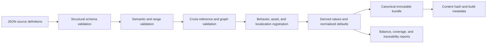

# Content Data and Validation

## Purpose

This document defines content authoring, schemas, stable IDs, compilation, cross-reference validation, derived data, localization, compatibility versions, and the workflow AI agents use to change content safely.

## Source-of-truth boundary

- Gameplay Markdown remains authoritative for accepted player-visible rules and design intent.
- Strict JSON is the authoritative machine-consumed representation used by builds.
- C# behavior implementations are authoritative for runtime mechanics that cannot be represented as parameters.
- Generated bundles, reports, CSVs, balance summaries, and imported Godot resources are derived artifacts.

A gameplay value change is incomplete until the gameplay document, JSON definition, generated reports, dependent estimates, and verification fixtures agree. CI detects mechanical disagreement where a comparison can be automated.

## JSON codec and schema baseline

- Use the built-in `System.Text.Json` reader/writer with explicit typed DTOs and source-generated serialization metadata; do not add Newtonsoft.Json, runtime contract reflection, or dynamic JSON objects to production paths.
- Source files and persisted JSON are UTF-8. Comments, trailing commas, duplicate object properties, nonfinite numbers, and unknown fields are errors. Property names use `snake_case`; stable enum/kind/ID tokens remain exact case-sensitive ASCII.
- JSON Schemas use draft 2020-12 for editor/tool interoperability. The project-owned typed structural/semantic validators remain authoritative; a fixture corpus proves the schema and typed validator accept/reject the same structural cases.
- The canonical writer emits fields in schema-declared order, dictionaries as lexically sorted key entries, stable-ID sets in canonical ID order, and semantically ordered arrays in their authored/explicit order. It writes integers without padding and finite floating-point values with invariant round-trip representation, normalizing negative zero to zero.
- File order, operating-system path order, locale, indentation, and original property order do not affect compiled bundle or payload hashes.
- SHA-256 from the .NET base class library hashes canonical UTF-8 payload bytes. Human-readable pretty JSON is a separate derived view and is never hashed or loaded as canonical state.

The same codec policy is reused by content, saves, recovery, manifests, diagnostics, and task evidence unless a schema explicitly requires a compact binary derived asset. Each domain owns its DTOs and validation; codec reuse does not merge domain ownership.

## Accepted content repository layout

```text
content/
  schemas/
  resources/
  mechs/
  enemies/
  bosses/
  weapons/
  branches/
  utilities/
  relics/
  powerups/
  unlocks/
  mining-sites/
  encounters/
  maps/
  presentation/
  localization/
assets-manifest/
  assets/
  licenses/
generated/
  content.bundle.json
  content.bundle.sha256
  reports/
```

Catalog directories are the authoring boundary. Definitions are grouped by stable item or the smallest cohesive aggregate such as the standard encounter schedule; generated/source separation is mandatory. A layout change must update build tooling, schemas, importers, documentation, and clean-checkout tests atomically rather than adding a second search path.

## Stable ID policy

- Reuse accepted gameplay IDs exactly for defined content: `MCH-01`, `EN-01`, `BOSS-01`, `W-AB`, `REL-01`, and equivalent utility/PowerUp/unlock IDs.
- Generated map instances append or separately store run-local generated IDs; they do not modify content IDs.
- IDs are case-sensitive ASCII tokens matching a schema pattern and never localized.
- Display names and localization keys may change without changing IDs.
- Removing shipped content retires its ID and leaves a migration/tombstone entry; IDs are never reassigned.
- Cross-references contain IDs plus schema-validated expected category where ambiguity is possible.

### Minted content-ID grammars

Several of the prefixes below were agreed between working sessions in conversation before any document authorized them, and this section is what makes them real rather than a record that they already were: a prefix that has only ever appeared in a chat log, a code comment, or a schema `pattern` carries no authority here. That is the standard this project already applied to `common-ore` and `hyper-gold`, which still carry slug IDs because no accepted document ever assigned them an ID token, and being obvious was never a substitute for one. The standard applies to us on the same terms.

Every prefix in the table below is minted by this document. No accepted gameplay document minted an identifier for any of them, and each needs one because every schema in this document references other definitions by stable ID. They follow [Stable ID policy](#stable-id-policy) above: case-sensitive ASCII, never localized, never reassigned. Each numbers from `-01`. Prefixes reused from the accepted gameplay register are governed by the reuse bullet above and are deliberately absent here.

Eleven of them — `FAB-`, `STACK-`, `CACHE-`, `EXCL-`, `HOOK-`, `RESPEC-`, `DEED-`, `HORDE-`, `FOOTPRINT-`, `SIEGE-`, and `BOUNTY-` — name **aggregates** on the same terms as `WAV-01` and `MGC-01`: not embodied in the world and never read by players, so they omit `presentation_id` and `name_key` under [Declared-optional envelope fields](#declared-optional-envelope-fields). `FAB-01` is the utility fabrication and rank contract. `STACK-01` states how modifiers compose and when a new value takes effect. `CACHE-01` is the relic-cache economy: placement, draw, and install-or-sell. `EXCL-01` states that one installed mech-level effect applies at a time, run-local, after additive modifiers. `HOOK-01` is the relic runtime registration model. `RESPEC-01` is the refundable account-rank purchase policy and `DEED-01` the permanent nonrefundable entitlement policy. `HORDE-01` states what every ordinary alien identity is. `FOOTPRINT-01` is the reference geometry every contact circle derives from. `SIEGE-01` states how a boss occupies the field, and `BOUNTY-01` the loot burst every boss death produces.

The remaining two are not aggregates on those terms. `RSC-` identifies ordinary embodied content and omits neither field. `FORMULA-01` is a shared definition players read the effect of, so it carries a `name_key` and omits only `presentation_id`.

| Prefix | Grammar | Category | Instances live in | Minted in |
| --- | --- | --- | --- | --- |
| `RSC-` | `^RSC-[0-9]{2}$` | resource | `content/resources/` | this section |
| `UTL-` | `^UTL-[A-FR][1-9]$` | utility | `content/utilities/` | [Utilities](#utilities) |
| `WAV-` | `^WAV-[0-9]{2}$` | encounter schedule | `content/encounters/` | [Encounter schedule](#encounter-schedule) |
| `MGC-` | `^MGC-[0-9]{2}$` | map generation contract | `content/maps/` | [Map generation](#map-generation) |
| `FORMULA-` | `^FORMULA-[0-9]{2}$` | player-facing formula | `content/weapons/` | this section |
| `FAB-` | `^FAB-[0-9]{2}$` | fabrication and rank contract | `content/utilities/` | this section |
| `STACK-` | `^STACK-[0-9]{2}$` | modifier composition contract | `content/utilities/` | this section |
| `CACHE-` | `^CACHE-[0-9]{2}$` | relic-cache economy | `content/relics/` | this section |
| `EXCL-` | `^EXCL-[0-9]{2}$` | mech-level effect exclusion | `content/relics/` | this section |
| `HOOK-` | `^HOOK-[0-9]{2}$` | relic runtime registration model | `content/relics/` | this section |
| `RESPEC-` | `^RESPEC-[0-9]{2}$` | refundable purchase policy | `content/powerups/` | this section |
| `DEED-` | `^DEED-[0-9]{2}$` | nonrefundable entitlement policy | `content/unlocks/` | this section |
| `HORDE-` | `^HORDE-[0-9]{2}$` | ordinary alien identity contract | `content/enemies/` | this section |
| `FOOTPRINT-` | `^FOOTPRINT-[0-9]{2}$` | reference contact geometry | `content/enemies/` | this section |
| `SIEGE-` | `^SIEGE-[0-9]{2}$` | boss field occupation | `content/bosses/` | this section |
| `BOUNTY-` | `^BOUNTY-[0-9]{2}$` | boss death loot burst | `content/bosses/` | this section |

Three further prefixes — `SITE-`, `ELT-` and `PLAYER-` — are minted not in another document but in this document's own FND-004 revision, under [Map generation](#map-generation), and are deliberately not restated here. This table is therefore complete only once that work package has merged. Until then a reader on a branch without FND-004 should treat those three as minted there rather than as unminted, and any check that reads this table must assert them by name, so that the mint's arrival breaks the build rather than passing silently.

The table is the **machine-readable** form of what the prose in this section and in the sections it cites states in sentences, and the two **must agree**. The prose is what a reader needs in order to know why an ID exists and what it identifies; the row is what a check reads to detect that a schema `pattern` or an implementation category table has drifted from this document. Neither is redundant with the other and neither may be deleted in favor of the other: a check that scraped English would break on the first editorial rewrite, and a table with no prose would leave the next author guessing what an ID means. Every prefix this document mints anywhere owes a row here, including any minted in a catalog subsection below, and the row's **Minted in** cell must name the one section that mints it: no other section may claim to mint the same prefix. Two claimed authorities for one prefix leave a reader no way to tell which section governs it, and leave a check that reads only the row set unable to see the disagreement at all.

Every prefix above was checked against the work-package prefix registry in [Implementation Plan for AI Agents](./110-implementation-plan-for-ai-agents.md#work-package-authority-routing) before it was minted, and none of them collides with a registered work-package prefix. That check is a precondition of minting rather than a courtesy: a content prefix equal to a work-package prefix makes a reference ambiguous between a content definition and a work package in exactly the places both appear — commit messages, task briefs, and the identifier validator — and no downstream reader can resolve it from context. The next person minting a content prefix runs the same check first.

`RSC-01` through `RSC-08` cover the eight resources: the six specialized materials plus common ore and Hyper Gold. The `A`–`F` letters remain what [Specialized Resource Identities](../61-specialized-resource-identities.md) makes them — stable authoring shorthand that preserves the accepted weapon-graph IDs, and a rule about what interfaces may display — and they become a separate `canonical_letter` field. [Resources](#resources) below already lists a canonical letter alongside ID among resource definition fields; it names the concept in prose, and this section is what gives the field its `snake_case` name. The ID and the letter are two fields; neither is derived from the other, and the letter never appears in a cross-reference.

Which number goes to which resource is fixed here: `RSC-01` through `RSC-06` take `A` through `F` in letter order, `RSC-07` is `common-ore`, and `RSC-08` is `hyper-gold`. Both halves are **assigned here** and neither is transcribed. [Specialized Resource Identities](../61-specialized-resource-identities.md) establishes the accepted set of six codes at `docs/61:22`–`docs/61:27`, but no document states that their sequence carries meaning: that table lists them in letter order as layout rather than as a claim, and outside this section a search across `docs/` for a stated ordering of the codes returns nothing, the nearest hits being the three parallel constructions at `docs/66:16`, `docs/weapons/README.md:16`, and `docs/open-questions.md:62`, the fullest being `docs/66:16`, "Stable graph codes `A`, `B`, `C`, `D`, `E`, and `F` correspond to Asterite, Barysteel, Cinderglass, Driftmetal, Eidolon Coral, and Flux Amber", each of which fixes which letter names which material and says nothing about how they number. Letter order is assigned because the codes are single letters whose sequence is unambiguous, and any other assignment would be arbitrary. `RSC-07` and `RSC-08` are stated here rather than left to the parallel construction with the order the two resources appear in below, because no assertion can catch a wrong choice of mapping — only a wrong implementation of one — so the choice closes in this section or nowhere.

Adopting `RSC-` is therefore **not** a pure rename, though the reason is no longer the one this paragraph first gave. The six material files **do** now carry `canonical_letter`: `content/resources/A.json` through `F.json` each hold their letter in that field as well as in `id`, added to `master` by commit `2691139`. The migration therefore adds no field, and the remaining distance is the eight `id` values alone. A value-preservation proof over it still must not expect leaf-for-leaf equality, but the inequality now runs the other way: each of the six letters currently appears **twice** in `content/resources/`, once as `id` and once as `canonical_letter`, and the migration drops the `id` copy. So the proof must expect six values to **lose one occurrence each**, the two slugs `common-ore` and `hyper-gold` to disappear, and eight `RSC-0n` tokens to appear — and a proof written for a pure rename fails, correctly, on those six lost occurrences rather than on the six additions this paragraph used to predict. Minting an ID does not rename a file, so the file stems are unaffected either way.

The eight outgoing `id` values owe no migration/tombstone entry. Six of them are not outgoing at all: `A` through `F` already occupy `canonical_letter`, as the paragraph above states, and lose only their duplicate copy in `id`. `common-ore` and `hyper-gold` do stop being `id` values, but no accepted document ever minted them — this section's opening paragraph says exactly that of both — so an unminted slug is not a retired ID and no tombstone is owed; the entry [Stable ID policy](#stable-id-policy) above prescribes is for removing shipped content, and both resources stay. That is stated rather than left to inference, because a reader arriving from that bullet would otherwise expect eight tombstones this migration does not produce; what the bullet does reach is reuse, and none of the eight tokens may ever identify different content afterward — neither slug is reattached to anything else, and the six letters keep meaning the six materials they mean today.

An aggregate lives in the catalog directory it serves, which is why `WAV-01` sits in `encounters/` and `MGC-01` in `maps/`, and why the directory column above names an existing catalog directory rather than a new one. Placement follows the definition the aggregate governs; if extraction shows an aggregate serves a catalog other than the one named above, the file moves and its ID does not change.

Exclusion from a population assertion is a **separate** rule, and stating it separately is the point. A catalog directory that asserts an exact population excludes the aggregates it hosts *by name*, never by a prefix rule: `content/weapons/` asserts exactly 15 material-pair recipes and excludes `FORMULA-01` by naming it, because a validator that instead excluded "anything not matching the weapon grammar" would silently accept the next unauthorized ID dropped into that directory. Placement decides where a file lives; exclusion decides what a population assertion counts. Changing one is not changing the other.

Minting an ID for an aggregate that extraction may not preserve is deliberate. If one does not survive, [Stable ID policy](#stable-id-policy) above already prescribes the outcome — the ID retires, leaves a migration/tombstone entry, and is never reassigned — and a retired ID with a tombstone costs less than migrating a tree against a pattern no document authorizes.

## Minted value vocabularies

Four closed value vocabularies — `resource_class`, `persistence_class`, and `modifier_direction` on the resource definition, and `timestamp_provenance` on the encounter schedule — are declared in `content/schemas/resource.schema.json` and `content/schemas/encounter-schedule.schema.json`, and in the implementation's category tables under `src/MechaMiner.Content/Categories/`, on the unmerged branch `claude/hearth-thread-hrufl9`; none of those files exist on this ref or on `master`, where `content/schemas/` is absent entirely and `src/MechaMiner.Content/` holds only its project files. No accepted document has ever granted any of them. This section grants them, on the same standard that [Minted content-ID grammars](#minted-content-id-grammars) above applies to prefixes: a token that has only ever appeared in a schema `enum`, a code comment, or a chat log carries no authority here, and being obvious was never a substitute for a grant. [Resources](#resources) below names exactly one of them in prose — `persistence_class` — without stating its set, which is why naming a field there is not the same act as granting its vocabulary here. That section also names `inventory_scope`, and its absence from this section is deliberate rather than an oversight: [Resources, Crafting, and Progression](../60-resources-crafting-progression.md) states that field's members with an explicit cardinality sentence at `docs/60:16`, "The game has two resource scopes", so it is already grounded under the rule below and needs no grant here. The asymmetry is recorded because a reader who finds `inventory_scope` named beside a granted field, and then absent from the table at the end of this section, would otherwise read it as something this section forgot.

A vocabulary is **grounded** only when the document it cites **states the set**. A resolving citation is necessary and not sufficient. That rule is written out rather than assumed because this project already breaks it in both available ways: nine of the twenty-eight closed vocabularies the implementation declares cite a `doc_id` that no document in `docs/` carries, and `resource_class` cites `TDD-CONTENT-DATA`, which is this document, which until this section did not mention the field at all. A reader who checked only that the citation resolved would have called that second case grounded. This section applies the rule to itself: every token below is either **transcribed** from prose quoted here by line, or **assigned here** and said to be, and wherever a token is assigned the search that failed to find a source is recorded, because "no source exists" and "no one looked" are indistinguishable on the page otherwise. Recording a failed search has one side effect worth naming once here rather than four times below: quoting the string that was not found puts that string into `docs/`, inside the very document reporting its absence. Every negative search below is therefore scoped to exclude this section's own record of it, so that an auditor who repeats the search finds exactly the hits named here and nothing the record manufactured for itself.

**`resource_class` divides the eight resources by material role**, and the classification is the load-bearing half of this grant rather than the token list. The three-member partition is itself **transcribed**: [Game Vision](../00-game-vision.md) states it at `docs/00:20` — "Mining remains the primary source of common ore, specialized ordinary resources, and Hyper Gold. Relic sales provide common ore, while bosses explode into limited physical piles of all three resource categories" — and [Combat, Weapons, Movement, and Camera](../30-combat-weapons-movement-camera.md) corroborates at `docs/30:102`, saying "all three categories" of the same three names. What this section grants is the field name, the token spellings, and the ruling below on how this classification stands beside the one in [Resources, Crafting, and Progression](../60-resources-crafting-progression.md).

`specialized-material` is **transcribed**: `docs/65:19` names the class in a class-naming table cell, "| Weapon-specific branch | Specialized ordinary resource | Choose one of three mutually exclusive branches | Amplification, functional variation, or playstyle conversion |", and `docs/60:120` heads a section "Specialized material identities". `common-ore` is **transcribed** from the three-name enumeration at `docs/60:212`, "Mining remains the primary source of common ore, specialized ordinary resources, and Hyper Gold". `docs/60:20` is **not** its source and is deliberately not cited as one: the phrase "common ore" occurs there inside the Availability cell, while that row's class name is "Ordinary crafting resources" — the broader scope, not this token.

`hyper-gold` is **assigned here**. The implementation's comment claims it was retokenized from an authored prose class "cross-run progression resource"; outside this section that phrase returns **zero verbatim hits in `docs/` on any ref of this repository**, and its only occurrences elsewhere in the tree are the field value in `content/resources/hyper-gold.json` that the token replaces, plus the comment quoting that value, which is circular. The nearest hit in `docs/` is the heading "Cross-run progression loop" at `docs/60:53`, which names a **loop** rather than a class. The category name "Hyper Gold" is transcribed from `docs/00:20`; the token spelling is assigned, and that search is recorded because the failed search is the licence for assigning.

**Doc 60 states two progression scopes, and this section does not change that.** `docs/60:16` says "The game has two resource scopes", and its table names them Ordinary crafting resources and Hyper Gold. Those two scopes are distinguished by persistence and purpose: ordinary resources are "Retained after collection for the rest of the run; discarded when the run ends" and craft run-local things, while Hyper Gold is "Banked at timed mission extraction; forfeited on death beforehand" and buys permanent power. That is a progression-lifetime axis, and `docs/60:106` makes *ordinary* a superset of the specialized families with "six specialized ordinary-resource families".

`resource_class` and those two scopes are **different classifications sharing a top cut**, not one axis counted twice. `resource_class` refines material role: `specialized-material` and `common-ore` have identical persistence and identical run-locality, and `docs/60:23` places both under "strictly run-local under the standard rules". Therefore **`resource_class` does not determine persistence or run-locality** — `inventory_scope` does — and any validator or consumer that infers either from `resource_class` has a bug. That is stated as a rule with teeth rather than left to a reader who finds two classifications of the same eight files and uses whichever they met first. `hyper-gold` being a class of one is a consequence and not a coincidence: Hyper Gold is the sole member of doc 60's second progression scope *and* a distinct material role, which is exactly why the two classifications agree on it and diverge below it.

Two of `resource_class`'s three tokens are spelled identically to the `id` slug of their sole member today, and that is deliberate rather than an untidiness to be cleaned up. `resource_class == "hyper-gold"` is a **class predicate, not an identity check**: it asks what kind of resource this is, and it would remain the right question if a second cross-run currency were ever authored. [Minted content-ID grammars](#minted-content-id-grammars) above retires both slugs as `id` values in favour of `RSC-07` and `RSC-08`, which removes the coincidence from the `id` side and leaves the class tokens spelled the way the prose spells them. A test on another stream's branch asserts that distinction, and this document carries the reason the test exists, because a test whose reason lives nowhere is the one a later reader deletes as redundant. Renaming the two slug-shaped tokens was considered and **decided against**: replacing a prose-sourced token with an invented one trades authority for tidiness.

**`persistence_class` has three tokens, and doc 60 supplies two sentences.** `banked-at-extraction` is **transcribed** from the Hyper Gold row's Persistence cell at `docs/60:21`, "Banked at timed mission extraction; forfeited on death beforehand". `run-local-currency` is **transcribed** from the ordinary row's Persistence cell at `docs/60:20`, "Retained after collection for the rest of the run; discarded when the run ends". Because that cell covers the whole ordinary scope rather than common ore alone, attaching it to `common-ore` exclusively is itself part of what this section assigns, and is recorded here as such rather than left to inference.

`run-local-consumable` is **assigned here**. No document states it: outside this section, "consumable" occurs in `docs/` only in the rule that enemies drop no consumables, never as the name of a resource class, and the sentence the six material files carry — "Run-local; unspent units are lost when the run ends" — is authored content data rather than a design statement, and says what `docs/60:20` says in different words. The assignment rests on a difference the documents do state: a material is spent one indivisible unit at a time, since `docs/60:108` fixes fabrication at "exactly one unit of each material in its recipe pair", whereas ore is spent in arbitrary quantities, with `docs/60:145` pricing utility ranks at "Rank 1 costs 50 ore, rank 2 costs 100, and rank 3 costs 150". A token that could be neither found nor justified would be reported and left out instead of minted.

`docs/60:23` requires that "Any future persistence exception requires an explicit decision", so all three tokens were checked against that sentence before minting and none of them is such an exception: both run-local tokens leave their resources strictly run-local and differ only in spend granularity, and `banked-at-extraction` restates banking that `docs/60:21` and `docs/60:216` already state for Hyper Gold. That check is a precondition of minting rather than a courtesy. It also establishes that `persistence_class` does not partition on persistence alone below its top cut, since its two run-local tokens agree on persistence, so the field name is broader than its discriminating power and a consumer needing persistence alone reads `inventory_scope`.

**`modifier_direction` cites a document ID that does not resolve.** Its declaration names `GDD-SPECIALIZED-RESOURCES`, and **no document carries that `doc_id`** on any ref of this repository; the nearest real one is `GDD-SPECIALIZED-RESOURCE-IDENTITIES`, which is [Specialized Resource Identities](../61-specialized-resource-identities.md), and that document does not state the set either. This is one of the nine unresolvable citations counted above, and it is the clearest case for why a resolving citation is the wrong test — this one does not even resolve, and nothing downstream noticed.

Both tokens are **assigned here**. Outside this section, `decrease` occurs nowhere in `docs/` at all, and `increase` occurs only as ordinary English, as in `docs/65:18`'s "A fixed linear increase to the displayed stat per rank", never as one of a closed pair. The assignment rests on the distinction being stated in substance as arithmetic rather than as words: [Player Survivability and Damage Baseline](../72-player-survivability-and-damage-baseline.md) multiplies by a factor above one in one direction at `docs/72:80`, "Flux Amber resonance then multiplies current enemy movement by 1.20", and below one in the other at `docs/72:236`, "multiply the already resisted displacement magnitude or timed-control duration by 0.80", expressing that same downward direction as division at `docs/72:144`. A schema cannot record a direction without naming both directions, which is what these two tokens do; the stored magnitude stays positive and the token carries the sign.

`persistence_class` and `modifier_direction` are the field names this section **grants**, and the authored tree carries neither of them. `content/resources/` holds `persistence`, which carries prose rather than a token — `A.json` has "Run-local; unspent units are lost when the run ends" — and the direction sits at `resonance_behavior.modifier.direction`. Outside this section neither granted name occurs anywhere in this tree, as measured at `105758b`; that stops holding when the unmerged `claude/hearth-thread-hrufl9` merges, which introduces both names in `content/schemas/` and puts `persistence_class` on the mining site as well, at `content/schemas/mining-site.schema.json`, a category this section does not mention. Adopting them is therefore a rename that has not happened, and this grant is not a description of the authored files: a reader who takes it as one goes looking for two fields that are not there.

**`timestamp_provenance` records whether a formation event's timestamps were read or rebuilt**, and it is granted last here because it belongs to the encounter schedule rather than the resource definition. Its two tokens are `authored` and `reconstructed`, and the field exists because one minute row's timestamps were reconstructed rather than transcribed: minute 33's authored cell states a repeating interval instead of four times, and the four times the definition now carries were derived from that interval rather than read out of it. A consumer that reads those timestamps without reading this field is reading provisional numbers as accepted ones, and a bundle hash over that row is not evidence the times were authored. That reason is recorded here because until now it has lived only in `content/transcription-notes.md`, which is working notes rather than an accepted document — the notes keep the fuller history, the reconstruction's reasoning and the two ways it can later be discharged, and this document keeps the reason the field exists at all. A vocabulary whose rationale lives only in working notes is a vocabulary whose rationale is lost the first time those notes are archived. [Encounter schedule](#encounter-schedule) below lists the fields the schedule aggregate contains without reaching provenance, so naming the schedule's fields there is not the same act as granting this vocabulary here.

Both tokens are **assigned here**. A pass over all **201** `.md` files under `docs/` found no document other than this section stating the set, and outside this section neither token appears in `docs/` as one of a closed pair: `reconstructed` occurs once, at `docs/technical/10-runtime-architecture.md:78`, of presentation state that "may be discarded and reconstructed without changing the run result", and `authored` occurs throughout as ordinary English. The declaration's authority string is `TDD-CONTENT-DATA`, which is this document — so it **resolves**, and until this paragraph it did not mention the field. That is exactly the shape `resource_class` was in above, and the reason the rule at the top of this section is written as it is: the citation clears the first test and fails the one that matters, and nothing downstream could tell.

**No accepted document has an opinion about how a schedule records its own provenance, and that is why this is an assignment rather than a gap.** The silence here is not the documents failing to say something they should. A gameplay document states what the schedule *is* — the minute rows, the compositions, the boss cadence — and whether one row of this corpus was transcribed or rebuilt is a fact about this repository's bookkeeping, not about the game. So `timestamp_provenance` is not documentation debt anyone owes, and it should not be filed as such: there is no pending gameplay decision behind it, and no accepted document would be the right place to put one. That distinguishes it from `modifier_direction` above, whose citation does not resolve at all and where the silence *is* the defect. Both are assigned, and they are assigned for opposite reasons.

| Vocabulary | Tokens | Classifies | Partition | Token provenance |
| --- | --- | --- | --- | --- |
| `resource_class` | `specialized-material`, `common-ore`, `hyper-gold` | resource material role | transcribed from `docs/00:20` | `specialized-material` and `common-ore` transcribed; `hyper-gold` assigned here |
| `persistence_class` | `run-local-consumable`, `run-local-currency`, `banked-at-extraction` | resource persistence and spend granularity | this section | `run-local-currency` and `banked-at-extraction` transcribed; `run-local-consumable` assigned here |
| `modifier_direction` | `increase`, `decrease` | a resonance modifier's direction | this section | both assigned here |
| `timestamp_provenance` | `authored`, `reconstructed` | a formation event's timestamp provenance | this section | both assigned here |

The table is the **machine-readable** form of what the prose above states in sentences, and the two **must agree**, on the same terms [Minted content-ID grammars](#minted-content-id-grammars) sets for its own: the prose is what a reader needs in order to know why a token exists and what it classifies, and the row is what a check reads to detect that a schema `enum` or an implementation vocabulary has drifted from this document. Neither may be deleted in favour of the other. Tokens here are exact case-sensitive ASCII under [JSON codec and schema baseline](#json-codec-and-schema-baseline), so a near-miss such as `specialized_material` is a rejection rather than an unknown future class, and [Structural](#structural) validation is where that rejection happens.

## Common definition envelope

Every independently addressable definition contains:

| Field | Requirement |
| --- | --- |
| `id` | stable category-valid ID |
| `schema_version` | integer version of its definition schema |
| `content_version` | monotonic revision used for diagnostics and migrations |
| `status` | development, enabled, disabled, or retired; release bundles exclude development/disabled unless configured |
| `name_key` | localization key; never literal player-facing text |
| `summary_key` | concise player-facing summary key where relevant |
| `tags` | closed or validated vocabulary for queries and tooling, never hidden behavior |
| `source_refs` | gameplay document IDs/anchors and decision IDs implemented |
| `presentation_id` | logical presentation entry where the content appears in-world |

Unknown fields are errors rather than silently ignored. Optional fields have explicit defaults materialized into the canonical bundle so runtime never guesses.

### Declared-optional envelope fields

Two envelope fields are declared optional, and authors express absence the same way for both: **omit the key**. A JSON `null` is never legal anywhere in a source definition, because the codec rejects it as a type error rather than reading it as absence. The compiler materializes the documented default into the canonical bundle, so runtime always reads a value.

- `presentation_id` is omitted when a definition never appears in-world. Aggregates, schedules, and other non-embodied definitions omit it.
- `name_key` is required only where a definition has a player-facing name. A definition players never see named — an aggregate schedule or a generation contract — omits it. The localization catalog holds strings players read; internal aggregate titles do not belong in it.

`summary_key` follows the same rule its row already states: present where a concise player-facing summary is relevant, omitted otherwise.

### Initial versions

The initial `schema_version` is `1` and the initial `content_version` is `1` for every first-authored definition. `schema_version` then increments when its schema changes field meaning, and `content_version` increments on each subsequent revision of that definition, both as [Content compatibility](#content-compatibility) below describes. The [Component, Contract, and Schema Registry](./115-component-contract-and-schema-registry.md#schema-registry) delegates version assignment to the implementation; this records the assignment.

### `tags` vocabulary

`tags` accepts an empty array, and an empty array is the expected value for most definitions. The closed vocabulary starts **empty** and gains a term only when a concrete query or tooling need requires it; the term is added to the vocabulary in the same change that first uses it. A tag never carries behavior, never selects an implementation, and never gates a rule: a definition's behavior comes from its registered `behavior_kind` and parameters, never from the presence of a tag.

### `source_refs` element grammar

`source_refs` is an array of stable-ID strings. Each element is one of:

- a gameplay document ID with an optional anchor, for example `GDD-COMBAT` or `GDD-COMBAT#contact-damage`;
- a gameplay decision ID, `DEC-###`;
- a technical decision ID, `TDR-###`; or
- a technical requirement ID, `TR-<DOMAIN>-###`.

The grammar for each is the one declared in [Documentation Conventions](../conventions.md#stable-identifiers) and [Technical Documentation Conventions](./conventions.md#stable-identifiers).

A file path, a line number, or any `path:line` pair is **not** a legal element. Paths and line numbers move whenever a document is edited, so a reference built from them decays silently; [Stable ID policy](#stable-id-policy) above and [TDR-006](./decisions/TDR-006-author-validated-content-as-strict-json.md) establish that IDs, not filenames, connect definitions to their sources. A source that has no stable ID gets one before it can be referenced.

## Unit and numeric policy

- Ambiguous numeric names carry suffixes such as `_m`, `_m_per_s`, `_seconds`, `_per_second`, `_hull`, `_degrees`, `_fraction`, or `_count`.
- Percentages in authoring use human-readable percentage points only when the property name says `_percent`; the compiler writes normalized factors into the runtime bundle as a separate derived field.
- Durations are nonnegative and bounded by schema; rates cannot be negative.
- Integer currency and rank values are integral in source and checked for formula overflow.
- Geometry dimensions distinguish radius, diameter, width, range, and area; `area` is never used as a vague scalar name.
- A multiplicative scale carries the `_multiplier` suffix and keeps one name in every scope it appears in: an enemy's authored body scale is `body_scale_multiplier` in the source definition, in the canonical bundle, in generated reports, and in any code or schema that reads it. `_multiplier` says the value multiplies a reference dimension, which `_factor`, `_scale`, and a bare `scale` do not; and a single spelling everywhere is what lets a derived-value report be traced back to its operand by name.
- Formulas allowed to players, such as weapon upgrade price, are represented by a registered formula kind plus parameters, not arbitrary script strings.
- Derived values include source operands and calculation version in reports for auditability.

## Content catalogs

### Resources

Resource definition fields include ID, canonical letter, localization keys, icon/pattern/audio identity, inventory scope, persistence class, maximum safe count, and resonance behavior registration if applicable. The six-material set and common ore/Hyper Gold pass graph-specific validators.

### Mechs

Fields include signature weapon ID, trait behavior kind/parameters, base Hull/Armor/Recovery/movement/footprint overrides, availability, presentation, selection order, and comparison text. Validation ensures every signature is an initial weapon, every trait behavior is registered, and every mech remains compatible with profile generation.

### Enemies and bosses

The fields an enemy definition **authors** are Hull, the movement percentage, contact damage, contact cadence, `body_scale_multiplier`, control resistance, behavior registration, projectile or boss-ability parameters, elite eligibility, presentation, spawn classification, and telemetry tags. Contact diameter and contact-begin center distance are deliberately absent from that list, because they are derived rather than authored; the next paragraph is the same rule stated in full, not an additional one. Validation derives world speeds and contact footprints from the authored operands above and compares them with the survivability report.

Derived geometry is never authored, which is why the authored-field list above stops at the multiplier. An enemy definition stores its authored `body_scale_multiplier`; the compiler derives the contact diameter from that multiplier and the reference diameter, and derives the contact-begin center distance from the result. This is not a second rule. It is the rule [Unit and numeric policy](#unit-and-numeric-policy) already states, applied to geometry: a `_multiplier` "says the value multiplies a reference dimension", and the compiler is what performs that multiplication and writes the product into the runtime bundle. Authored movement is the same shape in the same policy — a percentage is authored as percentage points because its name says `_percent`, and the compiler "writes normalized factors into the runtime bundle as a separate derived field", which is where world speed comes from. One rule, two operands: the author supplies the multiplier or the percentage, and the compiler supplies every value computed from it.

An author who types a derived value into a definition creates a second source of truth that silently disagrees with the first the moment either operand changes, which is exactly how a gameplay table and a technical table came to disagree by 0.004 M on one enemy. Derived values appear in generated reports with their source operands and calculation version, as [Unit and numeric policy](#unit-and-numeric-policy) requires; they do not appear in source JSON.

Everything above states the rule for **ordinary enemy identities** — the ones the accepted roster gives a body scale, and therefore the ones that have an authored operand to derive geometry from. Boss contact geometry is governed separately and is deliberately not decided here; the paragraphs above must not be read as settling it in either direction, and the boss definition schema that `DAT-002` owns must not be written against an inference drawn from them.

**No gate enforces any of this today, and the correction that produced the wording above
was verified by reading rather than by running anything.** The content compiler and its
validator are `DAT-001`/`DAT-002` deliverables; nothing in `build/`, `src/`, or `tests/`
reads `body_scale_multiplier`, and no content definition exists to check. So the
authored/derived split is a rule a reader applies, not one a runner can catch, and until
`DAT-001` lands a validator that can fail on an authored derived value the only
protection is that this section does not contradict itself. It used to: the authored-field
list said "contact damage/diameter/cadence" while the paragraph below it said derived
geometry is never authored, which is a self-contradiction a schema author could resolve
either way. That correction is recorded in commit `a494f09` as "item 4" of a list whose
numbering resolves to nothing — the non-normative
`docs/technical/delivery-waves.md` § Decision 12 records that separately — and it carries
no exit-class evidence because there is no gate to produce one.

### Weapons

Fields include recipe material pair, behavior kind, targeting policy, fixed properties, three stat-track definitions, rank-zero values, increments, snapshot/live classifications, all branch IDs, analytical-model registration, presentation/audio references, and rock-targeting behavior.

The compiler verifies exactly 15 unordered material-pair recipes, no duplicate pair, exactly three stats, one amplification/functional/conversion branch, unique branch materials according to the graph, and behavior registration.

### Branches

Fields include parent weapon, transformation class, two-unit material cost, behavior modifier kind/parameters, affected snapshot/live properties, exclusions/recursion flags, summary/detail keys, and compatibility notes. A branch cannot register against multiple weapons or add an unrecognized fourth stat.

### Utilities

Fields include assigned material or ore-only radar exception, unlock ownership, one-unit fabrication cost, slot behavior, behavior kind, base value, three rank values/prices where applicable, affected named stats, stacking classification, and presentation. Validators enforce no duplicate installed identity, allowed rank count, and exactly the accepted fresh/unlocked distribution.

The resource radar is a utility definition with the stable ID `UTL-R1`, and it is the one definition that uses the ore-only exception field named above rather than an assigned material. No accepted gameplay document minted an ID for it, because the accepted catalog identifies material utilities by their material letter; `UTL-R1` is minted here so cross-references to the radar are stable IDs like every other utility reference.

### Relics

Fields include pool availability/unlock, discovery sentence key, sale value, behavior registration, benefit/tradeoff parameters, hook points, affected weapon categories, live-state meter, and presentation. Validation requires one sentence summary, explicit tradeoff, compatibility results for all weapons, and no hidden unsupported behavior.

### PowerUps and option unlocks

PowerUps include rank cap, fixed costs/values by rank, active-rank policy, refundable flag, named-stat contribution, and UI grouping. Unlocks include exact Hyper Gold cost, nonrefundable flag, owned content additions, and whether ownership may be disabled. Validators recompute total catalog costs and maximum-account envelope.

### Mining sites

Fields include site class, count rule, zone/field dimensions, base work seconds, installment thresholds/payouts, decay/grace, resource result, beacon thresholds, presentation, map marker, and spawn exclusions. Standard mode validates exactly four accepted classes and their totals.

### Encounter schedule

One aggregate standard schedule file contains mode ID, duration, minute rows, composition weights, minimums, pulses, formations, boss warnings/arrivals, beacon response table, and population ceilings. Aggregate validation compares 35 contiguous rows, totals, earliest appearance, boss cadence, formation grammar, and accepted enemy IDs.

The standard encounter schedule has the stable ID `WAV-01`, and that ID is minted here. No accepted document previously granted a content-ID grammar for the schedule, and it needs one because every schema in this document references other definitions by stable ID. It follows [Stable ID policy](#stable-id-policy) above: case-sensitive ASCII, never localized, never reassigned. It is an aggregate: it is not embodied in the world and players never read its name, so it omits `presentation_id` and `name_key` under [Declared-optional envelope fields](#declared-optional-envelope-fields).

### Map generation

The fields a map generation contract **authors** are mode/map ID, region/topology/scale ranges, static obstacle targets, distance bands, site counts, distribution constraints, candidate clearances, retry budgets, discovery settings, rock rules, and landmark pools. Semantic validation checks internal feasibility before sampling maps.

The map-generation version is deliberately absent from that list. [Content compatibility](#content-compatibility) below makes it part of build identity, which the build records and increments when generation semantics change; a contract that also declared it would be a second source of truth for the same value, disagreeing with build identity the moment either side moved. This is not an additional rule. It is the rule [Enemies and bosses](#enemies-and-bosses) above states for a derived field — derived values "do not appear in source JSON" — applied one layer up, to a whole contract rather than to one field: authoring is where operands live, and a version the build owns is not one of them.

The standard map generation contract has the stable ID `MGC-01`, and it is an aggregate on the same terms as `WAV-01`.

`MGC-01` is minted here; `WAV-01` is minted under [Encounter schedule](#encounter-schedule) above, which is the section its row in [Minted content-ID grammars](#minted-content-id-grammars) names. No accepted document previously granted a content-ID grammar for the map generation contract, and it needs one because every schema in this document references other definitions by stable ID. It follows [Stable ID policy](#stable-id-policy) above: case-sensitive ASCII, never localized, never reassigned.

### Presentation and audio

Presentation definitions map logical IDs to models, materials, animation sets, VFX recipes, UI icons, map markers, and fallback proxies. Audio definitions follow the event contract. These definitions never contain damage or other authoritative outcomes.

## Behavior registries

Each owning pure project exposes a manually composed immutable registration table through a narrow contract. `MechaMiner.Tools` combines the pure tables and presentation-recipe descriptors owned by Content, then emits the canonical registry manifest. `MechaMiner.Game` owns a separate explicit implementation table for those presentation recipe IDs; a Godot integration test requires exact descriptor/implementation set equality and compatible parameters without making Tools depend on Game. The manifest is derived and checked for staleness; runtime assembly scanning, reflection discovery, source-generator magic, and a separately hand-edited manifest are forbidden. The content compiler verifies every content `behavior_kind`, targeting policy, formula, modifier hook, formation, effect, and presentation recipe has exactly one registered descriptor with a compatible parameter schema.

An implementation agent adding a new kind must provide:

- stable kind ID and parameter schema;
- domain ownership and lifecycle;
- content validation;
- unit and integration fixtures;
- debug visualization/metrics where applicable; and
- at least one definition using it or an explicit infrastructure-only rationale.

Do not accept a raw type name from JSON and instantiate it through reflection.

## Granted behavior-token vocabularies

**The gap this closes.** [Minted value vocabularies](#minted-value-vocabularies) above grants exactly four closed vocabularies — `resource_class`, `persistence_class`, `modifier_direction`, and `timestamp_provenance` — and **not one of them is behavioral**. Meanwhile [Behavior registries](#behavior-registries) above already asserts a check over behavior: at line 311 of this document the content compiler "verifies every content `behavior_kind`, targeting policy, formula, modifier hook, formation, effect, and presentation recipe has exactly one registered descriptor with a compatible parameter schema" — **seven** kinds of thing. **Four granted, seven asserted, zero overlap.** The assertion has been standing over a vocabulary no accepted document ever granted, which is the same defect [Minted value vocabularies](#minted-value-vocabularies) records about its own four and the same standard it applies: being obvious was never a substitute for a grant. This section grants the behavior-token half. Citation shorthand used below: `40:NNN` is this document, `docs/technical/40-content-data-and-validation.md:NNN`; `22:NNN` is `docs/technical/22-combat-and-weapon-runtime.md:NNN`, which is marked `authoritative: true`. The assertion just quoted is `40:311` **on this ref**, and the earlier circulated citation `40:307` is a worked example of why every line number in this section carries quoted sentence text beside it: on this ref `40:307` is about presentation definitions and says nothing about descriptors, while on the divergent branch `claude/hearth-thread-2vmaro-fnd-002` line 307 **is** this same assertion. That citation was not careless — it was measured on another branch, it resolves cleanly, and it names the wrong sentence. A line number that still resolves after the text has moved is the failure mode this section is built to make detectable rather than silent, and it is the reason the doc-22 fragment tables below are keyed by quoted text instead of by line.

**The refs every figure below was measured at, because two of them differ and the difference matters.** Counts of authored values, quoted phrases from `content/`, and every "granted but unused" claim were measured at `origin/master` = `3016fbc9a0df3e7bcf77eaa3a79d78e069f68b2a`. **Schema shapes, definition-reader call sites, and fixture-coverage figures were measured at `origin/claude/hearth-thread-hrufl9` = `551d0ebecedb7e22444d4ccf65342b2553265719`**, because `content/schemas/`, `MechDefinition.cs` and `ResourceDefinition.cs` **do not exist on `master` at all** — the same absence [Minted value vocabularies](#minted-value-vocabularies) records at `40:125` when it cites two `content/schemas/*.json` files. The ref travels with the figure throughout: where a number appears below, the ref it was taken at appears beside it. Neither pin is a claim about today's tip, and neither should be updated to one — the pins are what make the figures reproducible.

**This section carries no resource `id`, in any of its spellings.** A resource `id` is a per-ref fact rather than a property of the vocabulary being granted, so a grant that quotes one goes stale the moment an id migration merges — which is not hypothetical, since the ids changed under this document's own base. Where the grant needs to point at a resource it names that resource's own field instead, and the six resonance rows below are keyed by their `effect_name`. **The one apparent counterexample is not one:** `common-ore-yield-amplifier` (assignment 11) contains `common-ore` because it is a proposed behavior token slugged from that utility's own `effect.stat_names` value `["Mined common ore"]`, which is byte-identical at `3016fbc` and at `c503db1` — across the very id migration that renamed the resources — so it is a behavior token and not a resource reference. Verified more strongly than that sentence claims: the file is the **same blob `c553c351`** at `3016fbc`, at `c503db1`, and at this document's base, so the whole file is unchanged and the field cannot differ.

### The family: twelve fields, and why `boss.ability.kind` is not one of them

The family is **every call site of `SemanticCheck.BehaviorToken`** — **twelve** at `551d0eb`, of which **ten are unconditional and two are guarded**. The two guarded sites are `if (trait.BehaviorKind is not null)` in `MechDefinition.cs` and `if (resonance.BehaviorKind is not null)` in `ResourceDefinition.cs`, and they are guarded because those are exactly the two schemas that **omit the field from `required`**: `mech.schema.json`'s `inherent_trait.required` is `[name_key, affected_statistic, modifier_kind, modifier_value]`, and `resource.schema.json`'s `resonance_behavior.required` is `[effect_name, modifier_percent, modifier_direction]`. Optionality in the schema and the null guard in the reader are the same fact seen twice.

**`boss.ability.kind` is deliberately excluded, and the reason is not that it is unimportant.** It already has a minted closed vocabulary — `BossSchema.AbilityKinds` at `BossSchema.cs:35-42` (`551d0eb`), whose four members are `straight-charge`, `incomplete-minion-ring`, `radial-projectile-burst`, and `locked-marker-leap` — and it is checked by `SemanticCheck.Token` against that `ClosedVocabulary`, emitting `TokenOutsideVocabulary`, a **different diagnostic** from the `BehaviorTokenMalformed` this family emits. Granting a behavior vocabulary over it would give one field **two granting authorities** and two diagnostics that could disagree, so it stays where it is. Its exclusion is recorded rather than silent because a reader counting behavior-shaped `kind` fields will find it and must not read its absence as an oversight.

| field | call site at `551d0eb` | schema | population | authored at `3016fbc` | dispositions |
| --- | --- | --- | --: | --: | --- |
| `enemy.behavior_kind` | `EnemyDefinition.cs:251` | required | 10 | **10** — prose, 0 kebab | 10 transcribed |
| `enemy.specialist_attack.kind` | `EnemyDefinition.cs:353` | required | 1 | **1** — prose, 0 kebab | 1 transcribed |
| `boss.behavior_kind` | `BossDefinition.cs:218` | required | 4 | **4** — prose, 0 kebab | 4 transcribed |
| `relic.behavior_kind` | `RelicDefinition.cs:279` | required | 10 | **0** — vacuously zero | 10 transcribed |
| `utility.behavior_kind` | `UtilityDefinition.cs:401` | required | 13 | **0** — vacuously zero | 13 assigned |
| `weapon.behavior_kind` | `WeaponDefinition.cs:212` | required | 15 | **0** — vacuously zero | 13 transcribed, 2 declined |
| `weapon.targeting_policy` | `WeaponDefinition.cs:214` | required | 15 | **0** — vacuously zero | 8 transcribed, **0 assigned**, 6 declined, 1 omitted |
| `weapon.rock_targeting_behavior` | `WeaponDefinition.cs:216` | required | 15 | **0** — vacuously zero | 15 assigned |
| `branch.behavior_kind` | `BranchDefinition.cs:258` | required | 45 | **0** — vacuously zero | 42 transcribed, 3 assigned |
| `weapon-stat-price-formula.formula_kind` | `WeaponPriceFormulaDefinition.cs:146` | required | 1 | **0** — vacuously zero | 1 assigned |
| `mech.inherent_trait.behavior_kind` | `MechDefinition.cs:226`, guarded | **optional** | 6 | **0** — vacuously zero; **guard never exercised**, see [The two optional fields](#the-two-optional-fields-with-coverage-recorded-per-row) | 6 transcribed |
| `resource.resonance_behavior.behavior_kind` | `ResourceDefinition.cs:330`, guarded | **optional** | 6 | **0** — vacuously zero; **guard never exercised**, see [The two optional fields](#the-two-optional-fields-with-coverage-recorded-per-row) | 6 transcribed |
| **total** | **12 call sites** | 10 required, 2 optional | **141** | **15** | **100 transcribed, 32 assigned, 8 declined, 1 omitted** |

The `population` column counts the sites a token would occupy — one per definition that carries the field, or would carry it. The `authored` column counts the sites that hold a value **today**, and it is a separate column precisely so that a zero is visible on the face of the row rather than inferable from its absence.

**Two different situations share the word "granted", and the table alone will not tell them apart.** For the **nine** rows reading zero, the vocabulary is granted **forward**: it authorizes future authoring and asserts nothing whatever about the tree as it stands. Nothing is out of compliance, because there is nothing to be out of compliance. Those nine rows create no obligation until somebody authors something. For the **three** rows reading 10, 1 and 4 — fifteen instances in total, all of them prose, **none** matching the token pattern — the instances exist, hold prose, and are now **retokenisable**: the word "granted" over `enemy.behavior_kind` creates a **migration obligation for ten existing values**, while the same word over the nine creates nothing. The phrase used for the nine is **vacuously zero** rather than "no file carries a token", because the weaker phrase is the true one: it says the count is zero because the field is unauthored, and does not invite a reader to believe somebody checked each file and found a token absent.

### Three mechanisms, and there are three of them

This is **not** one rule behaving differently by category. It is **three distinct mechanisms**, and the grant says so plainly because a reader who takes it for one rule will look for a consistency between the tranches that was never claimed.

1. **Derivation from an in-tree antecedent.** The token comes from a string already in `content/`, and the only act is the slug rule. This is how the **relic** tranche works (the whole `behavior_registration.hook` string), how the **utility** qualifiers work (verbatim from `effect.stat_names`), how the in-field retokenisations work (the source field is the field being minted), and how the **mech** and **resource** siblings work (`inherent_trait.name` and `resonance_behavior.effect_name`). Nothing is invented; the antecedent is quotable.
2. **Classification against doc 22's closed lists.** The token is the member of a set doc 22 already states. This is how the **weapon** and **branch** tranches work. `docs/technical/22-combat-and-weapon-runtime.md` is marked `authoritative: true` and carries **six targeting policies** at `22:34` ("nearest, priority, concentration, facing, radial, and fallback-rock targeting;"), **fifteen behavior primitives** at `22:35` ("finite projectile, homing projectile, hitscan trace, beam, sector volley, chain, circle pulse, delayed impact, persistent field, trail segment, orbit contact, deployable, drone, mine, and explosion;"), a **per-weapon primary runtime model with exactly three branch obligation fragments per row** in its initial behavior registry table at `22:45`–`22:59`, and a **two-way rock partition** at `22:90`. The circulated citation `22:36` for the fifteen primitives was wrong; `22:36` is "per-target repeat interval and attack-local hit set;". Retention and hysteresis are a **separate** bullet at `22:85` ("current target retention/hysteresis; and"), and the beams-and-homing sentence is `22:92` ("Beams and homing actors use behavior-specific retention hysteresis to prevent tick-level flicker").
3. **Assignment with a stated reason, or declination.** Where there is no antecedent and no member to classify against, a token is either **assigned** with the reason recorded, or **declined** with what would settle it recorded. Thirty-two are assigned; eight are declined; one is omitted as having no referent.

**The `22:45`–`22:59` fragments are quoted below as text and their line numbers are deliberately not cited, and this is the single most important thing about how the transcription tables are built.** Forty-two branch tokens are transcribed from those fifteen rows, three fragments per row, and a table cell is the smallest citable unit doc 22 offers. An editorial reword inside that table — one that moves a fragment between the second and third position of a row, or splits a row — would silently invalidate the affected tokens with **nothing anywhere positioned to notice**: a line-number citation would still resolve, still land inside the right table, and simply name the wrong cell, at forty-two-times scale. Quoting the fragment as text makes the same reword a **detectable** mismatch, because the quoted string either still occurs in that row or does not. Line numbers are cited for `22:34`, `22:35`, `22:85`, `22:86`, `22:88`, `22:90` and `22:92`, which are prose bullets and sentences whose text is the unit, and withheld for the registry table's cells.

**Relics and mechs are both one-time authoring-input derivations, never validator-time recomputations, and for both the reason is that the source does not survive.** For relics: `relic.schema.json` at `551d0eb` **declines to declare `hook` at all** — its top-level properties do not include `behavior_registration`, and `additionalProperties: false` means a definition still carrying that block would be **rejected**. For mechs: `mech.schema.json` at `551d0eb` declares `inherent_trait` under `additionalProperties: false` over `{name_key, affected_statistic, modifier_kind, modifier_value, behavior_kind}`, a set that **excludes `inherent_trait.name`** — the very field the six mech tokens derive from. In both cases the derivation was **performed once, from a corpus the schema will not accept**, and **nothing recomputes it**: there is no validator-time rule that re-derives either token from its source, and there could not be, because after the mint the source is not there to read. Anyone tempted to add such a rule is reading a one-time authoring input as a live invariant. One asymmetry is recorded so the pairing is not overstated: the **resource** siblings' source, `resonance_behavior.effect_name`, **does** survive — it is declared and required on `551d0eb`'s `resource.schema.json` — so that tranche is a one-time derivation by ruling rather than by necessity, and it must not be recomputed either.

### The granted character rules, each with the case that forces it

**No document mandates any of this, and every clause below is therefore granted rather than cited.** `40:26` requires only that "stable enum/kind/ID tokens remain exact case-sensitive ASCII" — a constraint on stability and character set, not on shape — so **lower-kebab-case is granted here and is not a convention this document was already carrying**. The pattern satisfied throughout, identically on all twelve fields, is `^[a-z][a-z0-9]*(-[a-z0-9]+)*$`, which is `TokenGrammar.Pattern` at `551d0eb`.

1. **Space becomes `-`.** *Forced by* every one of the 141 sources; the shortest case is `pure contact pursuer`, which without the rule is not a token at all. The one clause no reader will contest.
2. **`/` becomes `-` — replace, never drop, never interpret.** *Forced by* the relic hook `cadence/damage/area/duration transformation`, which carries three slashes and without the rule fails the pattern outright, **and** by the relic hook `position-history heat and conditional modifiers/self-damage`, where the slash joins a compound rather than separating alternatives. Two forcing cases for two different reasons, and **the rule is deliberately blind to the difference**: `cadence-damage-area-duration-transformation` reads as four things and `modifiers-self-damage` as two, and the token cannot say which. A reader who wants that distinction must ask for a different field, not a different slug rule. Forced again four times in the branch set — by the fragments `end burst/launch`, `recent-hit preference/slow`, `push/slow`, and `loop detection/consumption`.
3. **Capitals become lowercase.** *Forced by* `Accelerated Feed` (an `inherent_trait.name`), `Focused Assault` (a `resonance_behavior.effect_name`), and `["Maximum Hull Integrity"]` (a utility's `effect.stat_names`). **Not** forced by the ten relic hooks or by any doc-22 fragment, all of which are already lowercase — so the relic and branch tranches cannot validate this clause, and the mech, resource and utility tranches must.
4. **An existing `-` passes through unchanged and is never doubled.** *Forced by* six of the ten relic hooks (`activation-rate`, `per-hit`, `direct-damage`, `position-history`, `mining-rate`, `weapon-slot`), by `["Extraction-zone radius"]`, and by ten branch fragments (`charge-by-travel`, `danger-close…`, `recent-hit…`, `delayed-path…`, `all-target…`, `once-per-volley…`, `enemy-carried…`, `moving ball-lightning…`, `long-charge…`, `transferred launched-enemy…`). A naive "replace non-alphanumerics with `-`" reading is fine; an "insert `-` at word boundaries" reading yields `activation--rate` and fails the pattern.
5. **Runs of separators collapse to one; leading and trailing separators are stripped.** *Forced by* **nothing in the corpus** — no source string in any of the twelve fields has adjacent, leading or trailing separators. **This clause is DEFENSIVE and is labelled as such here**, so that no reader hunts for the case that motivated it and concludes the record is incomplete when the hunt fails.
6. **No clause is granted for any other character**, because none is needed: across all 141 sources the only non-alphanumerics are space, `/` and `-`. No digit-initial string occurs (the pattern requires `^[a-z]`), no apostrophe, no non-ASCII. **Two near-misses that must never become token sources:** a geode resource's `short_modifier` contains a **Unicode minus** (`−20%`, U+2212, not the ASCII hyphen), and one weapon's `base_behavior` contains `60°`. If either field is ever promoted to a source, this clause list is incomplete and must be reopened.

**The lower-kebab-case grant binds only the vocabularies this section grants, and the eight pre-existing camelCase value tokens are out of scope and remain unsettled.** Granting a shape on twelve fields would otherwise settle those eight by implication, which this grant declines to do. They are, with every occurrence, measured at `3016fbc` (`content/transcription-notes.md`, Ruling 39, whose table occupies `content/transcription-notes.md:2302-2309`): **`relicCachePoolEntry`** (5 occurrences, `unlocks.kind` on five unlock definitions), **`utilityBlueprints`** (1, `unlocks.kind`), **`terrainCollision`** (1, an enemy's `specialist_attack.projectile.snapshot_at_creation[3]`), **`noHoming`** (1, the same array's `[4]`), **`beamWidth`** (1, a branch's `effects.unchanged_stats[1]`), **`projectileSpeed`** (1, the same array's `[4]`), **`attackRate`** (1, another branch's `effects.clone_inherits_current[1]`), and **`operationalRange`** (1, the same array's `[2]`) — eight tokens, twelve occurrences. `content/README.md:187` already records them as a "known unresolved exception", so **leaving them recorded is continuous with the tree rather than a new state**: this grant neither converts them nor newly declares them a problem, and the reason Ruling 39 gives for leaving them alone still stands, namely that whether they were transcribed from a document or minted here has not been established.

### The 32 assignments, each with its justification

#### `utility.behavior_kind` (13)

Shared rule, stated once: the **qualifier is verbatim** from the definition's `effect.stat_names` (which `551d0eb` renames `affected_stat_names`, top-level and required); only the **head noun** is granted, from a three-way choice — `-expander` for a radius, area or capacity, `-amplifier` for a magnitude, `-accelerator` for a rate. A reader who rejects the three-way choice can substitute one uniform `-modifier` without touching a single qualifier.

1. `UTL-A1` → `weapon-damage-amplifier` — `stat_names` is `["Weapon damage"]` alone, so the one statistic raised fully describes the behavior, and damage is a magnitude rather than a rate or a volume.
2. `UTL-A2` → `discovery-radius-expander` — `["Discovery radius"]`; naming the statistic is exactly what separates it from `UTL-A1`, with which the struck `additive-percent` derivation would have collapsed it.
3. `UTL-B1` → `maximum-hull-expander` — `["Maximum Hull Integrity"]`; the token names the ceiling raised, not the `flat-additive-hull` arithmetic that raises it, and a maximum is a capacity.
4. `UTL-B2` → `forward-extraction-accelerator` — `["Forward extraction rate"]` supplies the head noun itself; "forward" stays because it distinguishes this from `UTL-D2`'s extraction-zone geometry.
5. `UTL-C1` → `attack-rate-accelerator` — `["Weapon attack rate"]`, a rate; "weapon" is dropped because every weapon-facing utility would carry it. A strict-verbatim reader should prefer `weapon-attack-rate-accelerator`.
6. `UTL-C2` → `stored-charge-recharger` — the only two-entry list, `["Recharge time","Stored charges"]`, and the only utility with no `stacking_classification` key; the token names the refilling pool, not either statistic alone.
7. `UTL-D1` → `movement-speed-accelerator` — `["Movement speed"]`; this also keeps the fixture corpus's `extraction-zone-expander` off this ID, which here is not an arguable classification but a wrong one.
8. `UTL-D2` → `extraction-zone-expander` — `["Extraction-zone radius"]`, a radius, so both halves come from the definition; the fixture corpus guessed this same spelling, which is corroboration and never authority (`40:125`).
9. `UTL-E1` → `hull-recovery-regenerator` — `["Recovery"]` alone is too bare to name a behavior, so "hull" is borrowed from `value_kind`'s `additive-hull-per-second`, the sibling that says what recovers.
10. `UTL-E2` → `elite-and-boss-damage-amplifier` — `["Weapon damage to elites and bosses"]`; the conditional audience *is* the behavior, and dropping it makes this token a synonym of `UTL-A1`'s.
11. `UTL-F1` → `common-ore-yield-amplifier` — `["Mined common ore"]` names a material while the utility modifies a quantity, so "yield" is what makes the token a behavior rather than a resource.
12. `UTL-F2` → `weapon-area-expander` — `["Weapon area"]`; an area is a volume, and "weapon" is kept — unlike `UTL-C1` — because bare "area" would collide with the extraction-zone and discovery-radius geometries.
13. `UTL-R1` → `directional-resource-radar` — the only utility whose `stat_names` is **empty**, which is why the struck `directional-bearings` named an output format instead; `40:273`'s "assigned material or ore-only radar exception" licenses "radar".

#### `weapon.rock_targeting_behavior` (15) — both spellings assigned

Criterion, stated once, from `22:90`: does the attack, at the weapon's level *or* at the level of an actor it spawns, select a target from enemy candidates? `fallback-when-no-enemy-in-domain` takes all four content words from `22:90`'s own sentence ("A rock becomes an eligible fallback only when no valid enemy lies in that weapon's acquisition domain"); `incidental-geometry-only` takes "geometric" and "incidentally" from the next sentence ("Geometric attacks may hit rocks incidentally") and adds "only" to mark that this side has no other route to a rock.

14. `W-AC` → `fallback-when-no-enemy-in-domain` — "selects the densest enemy concentration within 12M" plus `fixed_properties.targeting_range_m` is an acquisition domain by definition, so a rock enters only when that domain is empty.
15. `W-AD` → `fallback-when-no-enemy-in-domain` — "places a field at the current center of the densest enemy concentration within 10M" with its own `targeting_range_m` makes the empty-domain state evaluable.
16. `W-AE` → `fallback-when-no-enemy-in-domain` — the drones "acquire targets independently", so the domain is the spawned actor's; answering the rock field at the actor level is exactly what its declined `targeting_policy` refuses to do (I-5).
17. `W-AF` → `fallback-when-no-enemy-in-domain` — "locks to one target in range" plus `fixed_properties.focus_resets_on_target_loss` proves it tracks target identity, which makes "no valid enemy in domain" a real state for it.
18. `W-BC` → `fallback-when-no-enemy-in-domain` — "selects the nearest enemy within current range" is an explicit selection step, so the fallback applies exactly when that selection returns nothing.
19. `W-BE` → `fallback-when-no-enemy-in-domain` — pods "fire independently", so the pod's empty domain is the condition; the untargeted deployment step is not the attack, and `22:90` governs attacks.
20. `W-CD` → `fallback-when-no-enemy-in-domain` — "strikes the nearest target within 8M" plus `initial_acquisition_range_m` names acquisition and domain in one sentence, and `22:90`'s "Rocks never consume enemy-only chain slots" is written for it.
21. `W-EF` → `fallback-when-no-enemy-in-domain` — "dividing them across valid targets when possible" plus `acquire_range_m: 12` makes the salvo enemy-targeting, so a rock must not eat a missile an enemy could have taken.
22. `W-AB` → `incidental-geometry-only` — "fires down the mech's current facing line" with no selection step, and doc 22's model cell selects a *direction* rather than a target, so there is no domain that could be empty.
23. `W-BD` → `incidental-geometry-only` — a mine triggers "on the first valid enemy entering their radius", a proximity trigger rather than an acquisition domain, so a rock inside the radius can only be incidental.
24. `W-BF` → `incidental-geometry-only` — "four cutters orbit the mech" damaging an enemy "while their collision shapes overlap" is pure geometry, with no candidate list for a fallback to substitute into.
25. `W-CE` → `incidental-geometry-only` — `damages_every_valid_target_in_radius: true` with `has_target_or_overlap_maximum: false` says the pulse selects nobody, and a weapon that selects nobody has no empty-domain state.
26. `W-CF` → `incidental-geometry-only` — "movement leaves damaging trail segments", limited only by `simultaneous_segment_overlap_maximum_per_target`, so contact is decided by overlap rather than by acquisition.
27. `W-DE` → `incidental-geometry-only` — "fires five pellets across a 60° facing cone" and "each pellet ends on its first target": the cone is aimed, the pellets are not, so a rock hit follows from the spread.
28. `W-DF` → `incidental-geometry-only` — "projects a short damaging field in front of the mech", gated on `activation_movement_speed_threshold_of_base`, is a facing-aligned volume with no candidate list at any level.

#### `branch.behavior_kind` (3)

29. `W-BD-seed-charges` → `seeded-micro-mines` — built from `micro_mines_per_parent_explosion: 4` and `micro_mine_placement: "evenly around the blast edge"`; doc 22's leftover fragment "arming/lifetime" describes the parent mine, though the branch does carry its own `micro_mine_arm_seconds`, so a reader may argue the fragment fits.
30. `W-DF-momentum-cascade` → `momentum-stacks` — keeps doc 22's noun from the "movement stacks" fragment but takes its qualifier from the branch's own `stack_name: "Momentum"`, because "movement stacks" is shared verbatim with the wake weapon's row.
31. `W-CF-runaway-wake` → `wake-movement-ramp` — this branch has no stack counter, only `ramp_starts_after_continuous_movement_seconds` and `maximum_reached_at_continuous_movement_seconds`, so "stacks" is inaccurate and "ramp" names the continuous function; flatter alternative `wake-movement-stacks`.

#### `weapon-stat-price-formula.formula_kind` (1)

32. `FORMULA-01` → `quadratic-in-purchase-number` — `formula: "5n(n + 1)"` with `variable.meaning` "purchase number…"; the token names the curve's degree and its variable, leaving the coefficient 5 a parameter. `quadratic-price-curve` is shorter but drops the variable.

### The 8 declinations — what is missing, and what would settle each

- **`weapon.behavior_kind` · `W-AB`.** Doc 22's model cell reads "fast finite piercing **projectile/trace** along selected direction", which names two members of `22:35` at once (`finite projectile`, `hitscan trace`) and the rule may neither pick one nor concatenate them; both readings are live (`projectile_speed_m_per_s: 30` argues finite projectile, while the branch `W-BC-zero-lag-emitter` exists to convert a projectile *to* a trace). The slug rule cannot help — it would happily mint a sixteenth primitive. **Settled by:** an edit to that cell replacing `projectile/trace` with one member, or, if the slash is deliberate, a doc-22 sentence permitting two primitives per weapon *plus* a ruling on what `40:311`'s "exactly one registered descriptor" then means.
- **`weapon.behavior_kind` · `W-DF`.** Doc 22's model cell reads "persistent facing-aligned contact capsule/rectangle", which matches no member of the fifteen: `persistent field` is placed in the world while this weapon's volume is rigidly attached to facing and gated on movement, and `orbit contact` is an orbiting actor. **Settled by:** a sixteenth member on `22:35` naming a mech-attached contact volume, or a doc-22 sentence filing this weapon under `persistent field`. A schema change cannot settle it.
- **`weapon.targeting_policy` · `W-AF`.** Retention, not acquisition: `22:85` lists "current target retention/hysteresis" as a bullet separate from `22:34`'s six policies, `22:92` says "Beams and homing actors use behavior-specific retention hysteresis", and the file says "locks to one target in range" without saying which. **Settled by:** a seventh member on `22:34` naming retention/hysteresis targeting, or a separately granted `target_retention` field, so the two concerns `22:85` keeps apart are not forced into one token.
- **`weapon.targeting_policy` · `W-AE`.** The policy belongs to the spawned actor: drones "acquire targets independently" and "Several drones may choose the same target", and doc 22 books "actor transforms and targets" as this weapon's persistent state, so `nearest` would be true of the drone and false of the weapon. **Settled by:** a decision on where two-level targeting lives — an `actor_targeting_policy` field, or a nested actor block for weapons that spawn autonomous actors — or a doc-22 sentence stating that a weapon's `targeting_policy` is the policy of whatever actor performs the attack.
- **`weapon.targeting_policy` · `W-BD`.** No member covers a trigger volume: `facing` fails (the mine is dropped at the mech's own position on a travel interval, no direction chosen), `nearest` fails ("the first valid enemy entering their radius" is temporal, not metric), `radial` fails (the radius is a trigger threshold, not a direction of fire). **Settled by:** a seventh member on `22:34` for proximity or trigger-volume targeting, or a doc-22 sentence that a weapon whose attack is performed by a placed child has no weapon-level policy — which converts this into an omission. **Settle with `W-CF` or not at all.**
- **`weapon.targeting_policy` · `W-BF`.** `radial` is the near miss and fails on geometry: radial motion runs *along* the radius outward, whereas four cutters at a fixed `orbit_radius_m: 2.2` (`cutter_count: 4`) move tangentially, orthogonal to it; `facing` fails because the orbit is unchanged by where the mech points. **Settled by:** a member on `22:34` for fixed-radius tangential sweep, or a doc-22 sentence declaring `radial` to cover any mech-centred geometry regardless of direction of motion — which must then also rule on `W-CF`.
- **`weapon.targeting_policy` · `W-CF`.** `facing` fails on direction: a trail is laid at positions the mech has *already occupied*, so its orientation is the mech's history rather than its current aim, and `simultaneous_segment_overlap_maximum_per_target` exists precisely because the two diverge when the mech turns. **Settled by:** a member on `22:34` for path-history geometry, or a doc-22 sentence that `facing` covers direction of travel as well as of aim — which must then also rule on `W-BD`. **Settle with `W-BD` or not at all.**
- **`weapon.targeting_policy` · `W-EF`** *(newly declined; was assigned `nearest`)*. The weapon's own fields state a **distribution** rule and decline an ordering: `base_behavior` "dividing them across valid targets when possible", branch `W-EF-mirv-saturation.effects.micro_missile_targeting` "They select distinct nearby targets before assigning extras", branch `W-EF-guardian-reserve.effects.reserve_full_behavior` "newly produced missiles launch normally at **any target** in acquisition range". `22:34` has no distribution member. Targeting is also booked at the missile rather than the weapon: doc 22 books "**missile target/turn state**" as this weapon's persistent state, `global_attack_rate_mapping.unaffected_timing` reads "Missile movement, reserve life, and **targeting**", and `22:92`'s "**homing actors** use behavior-specific retention hysteresis" covers "A missile can retarget if its target dies". The only route to `nearest` was `22:88`'s global tie-break ("then distance squared"), which applies to every target request in the game and so discriminates nothing. **Settled by:** *either* an edit to that weapon's `base_behavior` naming which target a missile takes (which converts the site to a **transcription** outright), *or* a member on `22:34` for multi-target salvo distribution, *or* the same two-level-actor decision as `W-AE` and `W-BE`, since doc 22 books target state at the missile.

**The omission (1) — `weapon.targeting_policy` · `W-BE`.** Not a declination. Pods "fire independently" and doc 22 books "creation order, life, target/fire state" as the pod's state, so this is a positive finding that the pod owns the targeting and the weapon-level field has no referent — a claim about where the field belongs, not about what the vocabulary lacks. **Settled by** the same decision as `W-AE`.

**`weapon.targeting_policy`'s `assigned` cell is deliberately empty**, and an empty cell there is an acceptable outcome rather than a defect. Its fifteen instances are 8 transcribed, 0 assigned, 6 declined and 1 omitted; the last candidate for an assignment was withdrawn (see I-3).

### The 100 transcription sources as text, under six rules

Every phrase below is quoted verbatim from `3016fbc`, except the doc-22 fragments, which are quoted from `22`. **All slugs are the character rules above applied to the quoted phrase and to nothing else.**

**R-A — in-field retokenisation (15).** The source field is the very field being minted, so the only act is the slug rule. `enemy.behavior_kind`, `boss.behavior_kind`, `enemy.specialist_attack.kind`. **These fifteen are the whole of the `authored` column above**, and the only ones the grant creates a migration obligation for.

| verbatim source phrase | token | instances |
| --- | --- | --- |
| `pure contact pursuer` | `pure-contact-pursuer` | `EN-01`…`EN-05`, `EN-07`…`EN-10` (9) |
| `pursuit and contact plus one telegraphed straight projectile` | `pursuit-and-contact-plus-one-telegraphed-straight-projectile` | `EN-06` (1) |
| `persistent giant pursuer with exactly one additional behavior` | `persistent-giant-pursuer-with-exactly-one-additional-behavior` | `BOSS-01`…`BOSS-04` (4) |
| `telegraphed straight non-homing projectile` | `telegraphed-straight-non-homing-projectile` | `EN-06` `specialist_attack.kind` (1) |

**R-B — sibling name field in the same file (12).** `mech.inherent_trait.behavior_kind` from that trait's `name`; `resource.resonance_behavior.behavior_kind` from that block's `effect_name`. **Both of these are the two call sites with zero fixture coverage** — see their own rows in [The two optional fields](#the-two-optional-fields-with-coverage-recorded-per-row) below, where the coverage fact is recorded per row rather than as a footnote.

The six mech traits: `Accelerated Feed` → `accelerated-feed` (`MCH-01`) · `Heavy Calibration` → `heavy-calibration` (`MCH-02`) · `Industrial Extractors` → `industrial-extractors` (`MCH-03`) · `Field Geometry` → `field-geometry` (`MCH-04`) · `Reinforced Chassis` → `reinforced-chassis` (`MCH-05`) · `Overdrive Treads` → `overdrive-treads` (`MCH-06`).

The six resonance effects, one per geode resource and named by `effect_name` rather than by any resource `id`: `Focused Assault` → `focused-assault` · `Dense Plating` → `dense-plating` · `Charged Payloads` → `charged-payloads` · `Vector Lock` → `vector-lock` · `Synchronized Aggression` → `synchronized-aggression` · `Overclocked Motion` → `overclocked-motion`. The two currency resources correctly have no `resonance_behavior` block and so contribute none.

**R-C — the whole `behavior_registration.hook` string slugged into one `relic.behavior_kind` (10).** Invents zero names, asserts no hook vocabulary, asserts no one-hook-per-relic shape. Each string is also byte-identical to the left cell of doc 22's hook table, so both sources are available and an edit to either is detectable. `behavior_registration` does not survive the mint — one-time derivation only. 10 of 10 slugs distinct, 10 of 10 match the pattern.

| verbatim hook | token | relic |
| --- | --- | --- |
| `activation-rate transformation and opposite geometry` | `activation-rate-transformation-and-opposite-geometry` | `REL-01` |
| `delayed transform history and attack duplication` | `delayed-transform-history-and-attack-duplication` | `REL-02` |
| `targeting replacement and facing conversion` | `targeting-replacement-and-facing-conversion` | `REL-03` |
| `cadence/damage/area/duration transformation` | `cadence-damage-area-duration-transformation` | `REL-04` |
| `output capture and global beat release` | `output-capture-and-global-beat-release` | `REL-05` |
| `per-hit pull and clustered target multiplier` | `per-hit-pull-and-clustered-target-multiplier` | `REL-06` |
| `direct-damage reduction and generational death explosion` | `direct-damage-reduction-and-generational-death-explosion` | `REL-07` |
| `position-history heat and conditional modifiers/self-damage` | `position-history-heat-and-conditional-modifiers-self-damage` | `REL-08` |
| `mining-rate and conditional enemy-speed transformation` | `mining-rate-and-conditional-enemy-speed-transformation` | `REL-09` |
| `weapon-slot activation gate and rotating phase` | `weapon-slot-activation-gate-and-rotating-phase` | `REL-10` |

**R-D — `weapon.behavior_kind` is the member of `22:35` that doc 22's own "Primary runtime model" cell names (13).** Matching is by the model cell, never by the weapon's flavour text. Model cells quoted as text, not cited by line.

`choose ground target, schedule delayed circular impact` → `delayed-impact` (`W-AC`) · `targeted persistent circle with damage ticks and inward pull` → `persistent-field` (`W-AD`) · `three persistent autonomous actors that reposition and fire` → `drone` (`W-AE`) · `continuous target lock and damage-rate accumulator` → `beam` (`W-AF`) · `repeated nearest-target projectile` → `finite-projectile` (`W-BC`; the file adds "continues on its fired trajectory **without homing**") · `distance-traveled production, arming, proximity detonation` → `mine` (`W-BD`) · `timed deployment of capacity-limited persistent turrets` → `deployable` (`W-BE`) · `four analytic orbit actors with per-target contact cadence` → `orbit-contact` (`W-BF`) · `discrete chain chosen from spatial candidates` → `chain` (`W-CD`) · `periodic mech-centered circle` → `circle-pulse` (`W-CE`) · `distance-traveled trail-segment production` → `trail-segment` (`W-CF`) · `facing/targeted five-projectile sector volley` → `sector-volley` (`W-DE`) · `four-missile homing salvo` → `homing-projectile` (`W-EF`).

Granted but unused members: `hitscan trace`, `explosion`. `W-AB` and `W-DF` are the two declinations.

**R-E — `weapon.targeting_policy` is the member of `22:34` whose own word appears in a source sentence (8).** The test is the member *word*, present, not a paraphrase.

`fires down the mech's current facing line` → `facing` (`W-AB`) · `selects the densest enemy concentration within 12M` → `concentration` (`W-AC`) · `the densest enemy concentration within 10M` → `concentration` (`W-AD`) · `selects the nearest enemy within current range` → `nearest` (`W-BC`) · `strikes the nearest target within 8M` → `nearest` (`W-CD`) · `emits a radial pulse centered on the mech` → `radial` (`W-CE`) · `fires five pellets across a 60° facing cone` → `facing` (`W-DE`) · `persistent facing-aligned contact capsule/rectangle` (doc 22's model cell) **and** `pushed along the mech's facing direction` (the definition's own `base_behavior`) → `facing` (`W-DF`).

Granted but unused members: `priority`, `fallback-rock`.

**R-F — `branch.behavior_kind` is the branch obligation fragment in doc 22's third column, slugged (42).** Each weapon row lists exactly three fragments after the `;`, matched to the three branch definitions semantically, and each match is confirmed against the branch's own `effects` keys. 42 of 45; the three mismatches are assignments 29–31 above. **Fragments are quoted as text; their rows are named by weapon and their line numbers are deliberately not cited**, for the reason given under "Three mechanisms" above.

| weapon row | fragment → token, three per row |
| --- | --- |
| `W-AB` | `shockwaves` → `shockwaves` (fracture-lance) · `charge-by-travel` → `charge-by-travel` (kinetic-capacitor) · `unlimited pierce` → `unlimited-pierce` (unbounded-bore) |
| `W-AC` | `seeded secondary blasts` → `seeded-secondary-blasts` (saturation-cascade) · `lingering field` → `lingering-field` (interdiction-payload) · `danger-close center replacement` → `danger-close-center-replacement` (danger-close-protocol) |
| `W-AD` | `delayed echo` → `delayed-echo` (echo-well) · `end burst/launch` → `end-burst-launch` (gravity-slingshot) · `collection mass and singularity cycle` → `collection-mass-and-singularity-cycle` (singularity-forge) |
| `W-AE` | `temporary clone cap` → `temporary-clone-cap` (replicator-swarm) · `shared focus` → `shared-focus` (wolfpack-protocol) · `rotating containment links` → `rotating-containment-links` (containment-lattice) |
| `W-AF` | `memory decay` → `memory-decay` (coherence-memory) · `exposure debuff` → `exposure-debuff` (target-designator) · `facing beam hysteresis` → `facing-beam-hysteresis` (cutting-vector) |
| `W-BC` | `hitscan replacement` → `hitscan-replacement` (zero-lag-emitter) · `recent-hit preference/slow` → `recent-hit-preference-slow` (suppressive-sequencer) · `fixed lateral pair` → `fixed-lateral-pair` (broadside-oscillator) |
| `W-BD` | `selective population trigger` → `selective-population-trigger` (selective-detonators) · `hunter state` → `hunter-state` (hunter-mines) · *the row's `arming/lifetime` fragment is assignment 29* |
| `W-BE` | `overclock count` → `overclock-count` (battery-overclock) · `guardian priority` → `guardian-priority` (guardian-firmware) · `anchored bastion packing` → `anchored-bastion-packing` (forward-bastion) |
| `W-BF` | `flywheel stacks` → `flywheel-stacks` (kinetic-flywheel) · `projectile interception` → `projectile-interception` (deflection-ring) · `delayed-path reaper` → `delayed-path-reaper` (tethered-reaper) |
| `W-CD` | `unlimited dense chain` → `unlimited-dense-chain` (total-conduction) · `hard control` → `hard-control` (disruption-current) · `moving ball-lightning actor` → `moving-ball-lightning-actor` (ball-lightning-projector) |
| `W-CE` | `victim charge` → `victim-charge` (critical-mass-cycle) · `push/slow` → `push-slow` (kinetic-vent) · `long-charge supernova cycle` → `long-charge-supernova-cycle` (supernova-cycle) |
| `W-CF` | `enemy-carried trails` → `enemy-carried-trails` (carrier-ignition) · `loop detection/consumption` → `loop-detection-consumption` (circuit-closure) · *the row's `movement stacks` fragment is assignment 31* |
| `W-DE` | `all-target cone wave` → `all-target-cone-wave` (saturation-choke) · `once-per-volley control` → `once-per-volley-control` (concussive-fan) · `focal convergence` → `focal-convergence` (focal-array) |
| `W-DF` | `transferred launched-enemy collision` → `transferred-launched-enemy-collision` (impact-transfer) · `stationary ring` → `stationary-ring` (siege-anchor) · *the row's `movement stacks` fragment is assignment 30* |
| `W-EF` | `split children` → `split-children` (mirv-saturation) · `reserve queue` → `reserve-queue` (guardian-reserve) · `rotating radial spiral` → `rotating-radial-spiral` (spiral-barrage) |

**Row count check.** 15 + 12 + 10 + 13 + 8 + 42 = **100**, which is the transcribed total in the table above.

### The vocabularies are per-field, and no check enforces the separation

**The grammar check is field-blind.** `SemanticCheck.BehaviorToken` at `551d0eb` is a single `TokenGrammar.IsWellFormed` call emitting `BehaviorTokenMalformed`, with **no vocabulary parameter and no field parameter** — one grammar for all twelve sites. `40:311` speaks of "every content `behavior_kind`" as one population. The tree, meanwhile, is authored as **twelve fields**, so two fields can legally hold the same token with nothing whatever distinguishing them, which is in tension with `40:311`'s one-descriptor rule. **This is not hypothetical: `boss.behavior_kind` already does it, one token shared four ways** across four bosses with differing abilities.

So the vocabularies granted here are **per-field** — twelve of them, one per call site — and **the separation between them is a documentary convention that no check enforces.** Nothing in the twelve schemas prevents a collision and nothing detects one. **Disjointness is deliberately not asserted**: this section does not claim the twelve token sets are disjoint, does not require them to be, and a reader must not infer either. No collision exists today (`facing`, `facing-beam-hysteresis` and `targeting-replacement-and-facing-conversion` are distinct), and that is a measurement of `3016fbc`, not a guarantee. Whether the registry is **one** namespace or **twelve** is undecided, and the honest description of the present state is that it reads as one and is authored as twelve.

### This section grants a vocabulary and nothing else

**The grant does not flip any schema field to `required`, and specifically does not honour the precondition `resource.schema.json` records.** That file says at `content/schemas/resource.schema.json:128` (`551d0eb`) that `resonance_behavior.behavior_kind` "becomes required in the change that mints the vocabulary". **This section mints the vocabulary and leaves the field optional.** Whether the field becomes `required` is the **schema owner's separate decision**, to be taken when the values actually exist in `content/` — which, per the table above, they do not: the row reads zero. A document granting a vocabulary must not flip a schema field to `required` as a side effect of being merged, because the two acts have different blast radii and different reviewers. And flipping an **unexercised** check to `required` is worse than flipping a populated one: the guard on this field has never run once, so a `required` flip would take a rule that has never executed and make it mandatory on first execution, with no evidence of how it behaves. The same reasoning applies to `mech.inherent_trait.behavior_kind`. Both preconditions are **reported here, not proposed**.

### The two optional fields, with coverage recorded per row

Both fields already have a reader and a guard, and **neither guard has ever run**. The coverage fact is recorded **inside each row**, deliberately and not as a footnote, because a reader who takes one row on its own must not come away believing the vocabulary is enforced there. Call sites, guards, `required` lists and fixture counts in this table were measured at `551d0eb`; the tokens were derived from values measured at `3016fbc`.

| field | reader, pointer and guard (at `551d0eb`) | fixture coverage (at `551d0eb`) | tokens ready (from `3016fbc`) | how it lands |
| --- | --- | --- | --- | --- |
| `mech.inherent_trait.behavior_kind` | `MechDefinition.cs:226`, pointer `/inherent_trait/behavior_kind`, guarded by `if (trait.BehaviorKind is not null)`; absent from `mech.schema.json`'s `inherent_trait.required`, which is `[name_key, affected_statistic, modifier_kind, modifier_value]` | **UNEXERCISED — zero fixture coverage.** All **four** mech fixtures carry an `inherent_trait` block and **not one of them sets `behavior_kind`**, so this call site has never run and nothing in the corpus would catch a wrong token here | **6**, from `inherent_trait.name`: `accelerated-feed`, `heavy-calibration`, `industrial-extractors`, `field-geometry`, `reinforced-chassis`, `overdrive-treads` — 6 of 6 distinct, 6 of 6 match the pattern | as a **populated optional field**; `required` is **not** being flipped |
| `resource.resonance_behavior.behavior_kind` | `ResourceDefinition.cs:330`, pointer `/resonance_behavior/behavior_kind`, guarded by `if (resonance.BehaviorKind is not null)`; absent from `resource.schema.json`'s `resonance_behavior.required`, which is `[effect_name, modifier_percent, modifier_direction]` | **UNEXERCISED — zero fixture coverage.** Of **seven** resource fixtures, **five** carry a `resonance_behavior` block and **not one of the seven sets `behavior_kind`**, so this call site has never run and nothing in the corpus would catch a wrong token here | **6**, from `resonance_behavior.effect_name`: `focused-assault`, `dense-plating`, `charged-payloads`, `vector-lock`, `synchronized-aggression`, `overclocked-motion` — 6 of 6 distinct, 6 of 6 match the pattern; the two currency resources correctly have no `resonance_behavior` block and so contribute none | as a **populated optional field**; `required` is **not** being flipped |

**The consequence of zero coverage.** These are the only two of the twelve call sites whose guard has never been exercised, so they are the two places where a token that is wrong, or a guard that misbehaves on an absent field, would **not** be caught by the existing corpus — which is why the two rows above carry that fact themselves rather than delegating it to a note a reader may not reach.

### The eleven flagged inconsistencies — recorded as flagged, not smoothed

These are landed **as flagged**. Smoothing them would make the grant read cleaner than the evidence is.

- **I-1.** The ruling that `551d0eb` is the transcription source has an **empty antecedent**: no definition on that ref carries a minted behavior token — every one lives under `tests/**/Fixtures/` — and `40:125` denies fixture strings authority anyway ("a token that has only ever appeared in a schema `enum`, a code comment, or a chat log carries no authority here"). An earlier pass applied that ruling five times; **all five applications are withdrawn.** What `551d0eb` legitimately supplies is the grammar and the field names, not tokens.
- **I-2.** `551d0eb`'s `relic.schema.json` says a relic-to-hook mapping "is therefore not derivable today", yet the same sentence's tail permits the slug: "so `hook` stays unmapped prose, no field here carries it, and this token asserts neither a hook vocabulary nor a one-hook-per-relic shape." The grant must **quote the tail clause, not the head**, or a reader who quotes only the head will conclude the mint defied the schema author. The same description also says the token "is NOT a mapping of the corpus's `behavior_registration.hook` prose" and counts **nineteen hook points across the ten strings** — which is consistent with R-C, because R-C slugs each string whole and claims no mapping from relic to hook point.
- **I-3.** `W-EF` was assigned under one ruling and declined under another; **the discriminator test resolves it to declined**, which is what empties `weapon.targeting_policy`'s `assigned` cell. An empty `assigned` cell is an acceptable outcome, not a defect.
- **I-4.** Doc 22's `W-DF` row is unusable for one of that weapon's fields and authoritative for another: its `behavior_kind` is declined because the model cell matches no member of the fifteen, while `targeting_policy` transcribes `facing` from the same words. This is **weaker than previously stated** — that weapon's own `base_behavior` also contains "pushed along the mech's **facing** direction", so the site survives on the definition and not only on doc 22. See Ruling A below.
- **I-5.** The two-level-actor finding is answered on `rock_targeting_behavior` and refused on `targeting_policy` for the **same four** weapons (`W-AE`, `W-BE`, `W-AF`, and now `W-EF`): each gets a rock token reasoned at the spawned actor's or the retained target's level, while its policy is declined or omitted because the weapon level is the wrong level. Defensible, because `22:90` is written about *attacks* and `22:34` about *weapons* — but the grant must say so, or one defect appears to get two dispositions.
- **I-6.** The framing citation and count were both wrong in earlier circulation: the compiler assertion is at **`40:311`**, not `40:307`, and it asserts the one-descriptor check over **seven** kinds of thing (`behavior_kind`, targeting policy, formula, modifier hook, formation, effect, presentation recipe), two of which are outside this family and one of which is not the relic hook. Stated in the opening as **four granted, seven asserted, zero overlap** — stronger, and true.
- **I-7.** Five of the twelve fields end with a vocabulary `40:127` will not call grounded (`branch`, `relic`, `utility`, `mech.inherent_trait`, `resource.resonance_behavior` — **80 of the 141 instances**): "A vocabulary is **grounded** only when the document it cites **states the set**. A resolving citation is necessary and not sufficient." Use this document's own "Token provenance" column convention (`40:159`) and record `branch` as **fragments** rather than as a vocabulary.
- **I-8.** The utility head nouns `-expander`, `-amplifier` and `-accelerator` appear in **no document and in no definition** — the only place in the package where a morpheme has no source at all. Only the qualifiers are transcribed. The utility vocabulary **must not be presented on the same footing** as `enemy.behavior_kind`'s, whose tokens are the authored strings themselves.
- **I-9.** `boss.behavior_kind`'s single token is shared by all four bosses, so `40:311`'s "exactly one registered descriptor" gives four bosses with differing abilities one descriptor whose parameter schema must then carry the ability. Correct as a transcription — what differs per boss lives in the excluded field `boss.ability.kind` — but a **registry-shape consequence to raise before the grant lands**, not after the manifest is emitted.
- **I-10.** The registry namespace is undeclared. `SemanticCheck.BehaviorToken` applies one grammar with **no per-field namespace**, and `40:311` speaks of "every content `behavior_kind`" as one population, so `facing` as a targeting policy and any future `facing` as a behavior kind would be one descriptor. No collision exists today. The grant must say whether the registry is one namespace or twelve: **it reads as one and is authored as twelve.** See Ruling B below.
- **I-11.** Four survivors, one line each: `22:34`'s unused `fallback-rock` member covers the same distinction as the whole of `rock_targeting_behavior`, which `22:86` frames as a **boolean** ("whether destructible rocks are fallback candidates") rather than as a token pair; granting lower-kebab on twelve fields would settle the eight camelCase value tokens' grammar by implication **unless the grant says it binds only the fields it names**, which it does say above; and `40:125` still cites two `content/schemas/*.json` files that exist on no ref but `551d0eb` — a defect this document now names in its own text, which is the model this section copies.

**Ruling A, resolving I-4 and the two "movement stacks" assignments.** That doc 22's `W-DF` row names a **movement effect usable as a `behavior_kind` source**, **and** that its phrase "movement stacks" **fails to uniquely identify a behavior**, are **two different properties of one line, both true**. The line is a usable source for that weapon's fields, while the three-word fragment it shares **verbatim** with the wake weapon's row cannot name two different branches — one fragment, two branches, so it identifies neither. That is why the two dispositions are **both correct**: the `behavior_kind` declination rests on the model cell matching no member of the fifteen, and the `targeting_policy` transcription rests on the word `facing` being present — and, independently, on that weapon's own `base_behavior` naming the mech's facing direction, so it does not stand on doc 22 alone. **Non-uniqueness of a fragment is not unusability of the line.**

**Ruling B, resolving I-10.** The grammar check is **field-blind**, as recorded above: `SemanticCheck.BehaviorToken` is a `TokenGrammar.IsWellFormed` call emitting `BehaviorTokenMalformed`, with no vocabulary parameter and no field parameter. Per-field vocabularies are therefore a **documentary convention that no check enforces**. The existing instance is `boss.behavior_kind`'s one token four ways: nothing in the twelve schemas prevents it and nothing detects it.

## Compilation pipeline



Every stage emits stable diagnostic codes, exact source path/field, content ID, expected constraint, and relevant related IDs. CI fails on errors. Warnings have an owner and expiration; release builds treat unresolved content warnings as errors unless allowlisted with rationale.

The canonical bundle is ordered by category and stable ID, uses normalized numeric formatting, includes schema/generation versions, and hashes identically for identical semantic input regardless of source file enumeration order.

## Validation layers

### Structural

Required fields, types, allowed properties, enum vocabulary, ID syntax, numeric bounds, and array cardinality.

### Semantic

Rules within a definition: positive cadence, branch class, three stats, increasing rank costs, valid geometry, exact reward totals, compatible behavior parameters.

### Relational

References, uniqueness, graph coverage, signature/profile feasibility, unlock ownership, material distribution, schedule availability, asset and localization existence.

### Analytical

Recalculate DPS estimates, price curves, total costs, enemy derived speeds/footprints, boss feasibility reference builds, and resource totals. Reports compare with accepted gameplay tables and fail on unexplained divergence beyond documented rounding.

### Runtime smoke

Instantiate every behavior in a tiny headless fixture, execute at least one activation/state transition, serialize its presentation view, and dispose it without error.

## Localization contract

- Source language is English stored in a dedicated string catalog, not definition files.
- Keys are stable semantic paths tied to content IDs and UI roles.
- Parameterized text uses named placeholders validated against each locale.
- UI definitions declare expected expansion class; pseudo-localization expands text and adds accented/directional stress characters.
- Player-facing numbers use locale-aware formatting while content formulas and saves remain invariant culture.
- Missing release strings are build errors; development builds show the key visibly.
- Final release locale list is product scope; infrastructure supports adding locales without content-schema changes.

### Source catalog format and key pattern

- Source catalogs are strict JSON under the same codec policy as every other source file: UTF-8, no comments, no trailing commas, no duplicate properties, unknown fields rejected.
- There is one file per locale at `content/localization/<locale>.json`.
- Each file is a flat object of key to string. There is no nesting, no metadata wrapper, and no array.
- Keys are lexically sorted, so a diff shows only the strings that changed and two authors adding different keys do not conflict on ordering.
- The key pattern is `<category>.<stable_id>.<role>`. The category is `snake_case`. The stable ID appears **verbatim**, in its own case, so `weapon.W-AB.name` and not `weapon.w_ab.name`: a localization key that transforms an ID is no longer traceable to it, and [Stable ID policy](#stable-id-policy) makes IDs case-sensitive.
- The role comes from a small set, beginning with `name` and `summary`, matching the `name_key` and `summary_key` envelope fields. The set grows with the same discipline as the `tags` vocabulary: a role is added when a definition or a UI surface needs it, not in advance.

## Asset manifest contract

Logical asset entries contain ID, type, source provenance/license record, source file, imported resource path, expected import settings, variants/LODs/animations, budget metadata, and fallback. Content definitions refer only to the logical ID.

The compiler verifies type compatibility and asset budget metadata; the Godot import audit verifies the actual imported resource matches the manifest.

## Content compatibility

Build identity records:

- product version;
- Godot and .NET versions;
- content bundle hash;
- per-schema versions;
- map-generation version;
- random-stream derivation version; and
- save-format version.

Changing numbers without changing behavior increments content revision/hash but not necessarily schema. Changing field meaning increments schema. Changing generation semantics increments map-generation version. Run recovery requires compatible versions declared by migrations; diagnostic seeds require the original version identities.

## Agent content-change workflow

1. Read the authoritative gameplay section, relevant technical behavior contract, and current definition.
2. Change the smallest source JSON set and any approved gameplay Markdown in the same work item.
3. Run structural, semantic, relational, analytical, asset, localization, and behavior-registration validation.
4. Regenerate canonical reports and CSV mirrors using the repository tool; never edit generated files to fix source errors.
5. Run affected headless benchmarks and golden fixtures.
6. Review diffs for unrelated key reordering or generated churn.
7. Record tuning evidence when values change materially.

An agent must not infer a new behavior from a field name, add an unvalidated optional field, encode logic in localization text, or bypass a validator to make a build pass.

## Verification

- Invalid-fixture suites cover every diagnostic code and schema boundary.
- Canonicalization tests permute source order and require identical bundle/hash.
- All cross-reference graphs have reachability/orphan reports.
- Gameplay catalog totals and pair mappings are asserted.
- A clean checkout can compile content without launching the Godot editor.
- Release packaging proves no development/disabled definitions or unlicensed assets enter the bundle.

## Related documents

- [Technical Documentation Conventions](./conventions.md)
- [Simulation Core](./20-simulation-core.md)
- [Combat and Weapon Runtime](./22-combat-and-weapon-runtime.md)
- [Procedural Map Generation](./50-procedural-map-generation.md)
- [Asset Pipeline and Budgets](./80-asset-pipeline-and-budgets.md)
- [Machine-Readable Gameplay Data Index](../data/README.md)
