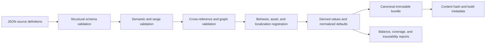

# Content Data and Validation

## Purpose

This document defines content authoring, schemas, stable IDs, compilation, cross-reference validation, derived data, localization, compatibility versions, and the workflow AI agents use to change content safely.

## Source-of-truth boundary

- Gameplay Markdown remains authoritative for accepted player-visible rules and design intent.
- Strict JSON is the authoritative machine-consumed representation used by builds.
- C# behavior implementations are authoritative for runtime mechanics that cannot be represented as parameters.
- Generated bundles, reports, CSVs, balance summaries, and imported Godot resources are derived artifacts.

A gameplay value change is incomplete until the gameplay document, JSON definition, generated reports, dependent estimates, and verification fixtures agree. CI detects mechanical disagreement where a comparison can be automated.

## JSON codec and schema baseline

- Use the built-in `System.Text.Json` reader/writer with explicit typed DTOs and source-generated serialization metadata; do not add Newtonsoft.Json, runtime contract reflection, or dynamic JSON objects to production paths.
- Source files and persisted JSON are UTF-8. Comments, trailing commas, duplicate object properties, nonfinite numbers, and unknown fields are errors. Property names use `snake_case`; stable enum/kind/ID tokens remain exact case-sensitive ASCII.
- JSON Schemas use draft 2020-12 for editor/tool interoperability. The project-owned typed structural/semantic validators remain authoritative; a fixture corpus proves the schema and typed validator accept/reject the same structural cases.
- The canonical writer emits fields in schema-declared order, dictionaries as lexically sorted key entries, stable-ID sets in canonical ID order, and semantically ordered arrays in their authored/explicit order. It writes integers without padding and finite floating-point values with invariant round-trip representation, normalizing negative zero to zero.
- File order, operating-system path order, locale, indentation, and original property order do not affect compiled bundle or payload hashes.
- SHA-256 from the .NET base class library hashes canonical UTF-8 payload bytes. Human-readable pretty JSON is a separate derived view and is never hashed or loaded as canonical state.

The same codec policy is reused by content, saves, recovery, manifests, diagnostics, and task evidence unless a schema explicitly requires a compact binary derived asset. Each domain owns its DTOs and validation; codec reuse does not merge domain ownership.

## Accepted content repository layout

```text
content/
  schemas/
  resources/
  mechs/
  enemies/
  bosses/
  weapons/
  branches/
  utilities/
  relics/
  powerups/
  unlocks/
  mining-sites/
  encounters/
  maps/
  presentation/
  localization/
assets-manifest/
  assets/
  licenses/
generated/
  content.bundle.json
  content.bundle.sha256
  reports/
```

Catalog directories are the authoring boundary. Definitions are grouped by stable item or the smallest cohesive aggregate such as the standard encounter schedule; generated/source separation is mandatory. A layout change must update build tooling, schemas, importers, documentation, and clean-checkout tests atomically rather than adding a second search path.

## Stable ID policy

- Reuse accepted gameplay IDs exactly for defined content: `MCH-01`, `EN-01`, `BOSS-01`, `W-AB`, `REL-01`, and equivalent utility/PowerUp/unlock IDs.
- Generated map instances append or separately store run-local generated IDs; they do not modify content IDs.
- IDs are case-sensitive ASCII tokens matching a schema pattern and never localized.
- Display names and localization keys may change without changing IDs.
- Removing shipped content retires its ID and leaves a migration/tombstone entry; IDs are never reassigned.
- Cross-references contain IDs plus schema-validated expected category where ambiguity is possible.

## Common definition envelope

Every independently addressable definition contains:

| Field | Requirement |
| --- | --- |
| `id` | stable category-valid ID |
| `schema_version` | integer version of its definition schema |
| `content_version` | monotonic revision used for diagnostics and migrations |
| `status` | development, enabled, disabled, or retired; release bundles exclude development/disabled unless configured |
| `name_key` | localization key; never literal player-facing text |
| `summary_key` | concise player-facing summary key where relevant |
| `tags` | closed or validated vocabulary for queries and tooling, never hidden behavior |
| `source_refs` | gameplay document IDs/anchors and decision IDs implemented |
| `presentation_id` | logical presentation entry where the content appears in-world |

Unknown fields are errors rather than silently ignored. Optional fields have explicit defaults materialized into the canonical bundle so runtime never guesses.

## Unit and numeric policy

- Ambiguous numeric names carry suffixes such as `_m`, `_m_per_s`, `_seconds`, `_per_second`, `_hull`, `_degrees`, `_fraction`, or `_count`.
- Percentages in authoring use human-readable percentage points only when the property name says `_percent`; the compiler writes normalized factors into the runtime bundle as a separate derived field.
- Durations are nonnegative and bounded by schema; rates cannot be negative.
- Integer currency and rank values are integral in source and checked for formula overflow.
- Geometry dimensions distinguish radius, diameter, width, range, and area; `area` is never used as a vague scalar name.
- Formulas allowed to players, such as weapon upgrade price, are represented by a registered formula kind plus parameters, not arbitrary script strings.
- Derived values include source operands and calculation version in reports for auditability.

## Content catalogs

### Resources

Resource definition fields include ID, canonical letter, localization keys, icon/pattern/audio identity, inventory scope, persistence class, maximum safe count, and resonance behavior registration if applicable. The six-material set and common ore/Hyper Gold pass graph-specific validators.

### Mechs

Fields include signature weapon ID, trait behavior kind/parameters, base Hull/Armor/Recovery/movement/footprint overrides, availability, presentation, selection order, and comparison text. Validation ensures every signature is an initial weapon, every trait behavior is registered, and every mech remains compatible with profile generation.

### Enemies and bosses

Fields include Hull, movement, contact damage/diameter/cadence, control resistance, behavior registration, projectile or boss-ability parameters, elite eligibility, presentation, spawn classification, and telemetry tags. Validation derives world speeds/footprints and compares them with the survivability report.

### Weapons

Fields include recipe material pair, behavior kind, targeting policy, fixed properties, three stat-track definitions, rank-zero values, increments, snapshot/live classifications, all branch IDs, analytical-model registration, presentation/audio references, and rock-targeting behavior.

The compiler verifies exactly 15 unordered material-pair recipes, no duplicate pair, exactly three stats, one amplification/functional/conversion branch, unique branch materials according to the graph, and behavior registration.

### Branches

Fields include parent weapon, transformation class, two-unit material cost, behavior modifier kind/parameters, affected snapshot/live properties, exclusions/recursion flags, summary/detail keys, and compatibility notes. A branch cannot register against multiple weapons or add an unrecognized fourth stat.

### Utilities

Fields include assigned material or ore-only radar exception, unlock ownership, one-unit fabrication cost, slot behavior, behavior kind, base value, three rank values/prices where applicable, affected named stats, stacking classification, and presentation. Validators enforce no duplicate installed identity, allowed rank count, and exactly the accepted fresh/unlocked distribution.

### Relics

Fields include pool availability/unlock, discovery sentence key, sale value, behavior registration, benefit/tradeoff parameters, hook points, affected weapon categories, live-state meter, and presentation. Validation requires one sentence summary, explicit tradeoff, compatibility results for all weapons, and no hidden unsupported behavior.

### PowerUps and option unlocks

PowerUps include rank cap, fixed costs/values by rank, active-rank policy, refundable flag, named-stat contribution, and UI grouping. Unlocks include exact Hyper Gold cost, nonrefundable flag, owned content additions, and whether ownership may be disabled. Validators recompute total catalog costs and maximum-account envelope.

### Mining sites

Fields include site class, count rule, zone/field dimensions, base work seconds, installment thresholds/payouts, decay/grace, resource result, beacon thresholds, presentation, map marker, and spawn exclusions. Standard mode validates exactly four accepted classes and their totals.

### Encounter schedule

One aggregate standard schedule file contains mode ID, duration, minute rows, composition weights, minimums, pulses, formations, boss warnings/arrivals, beacon response table, and population ceilings. Aggregate validation compares 35 contiguous rows, totals, earliest appearance, boss cadence, formation grammar, and accepted enemy IDs.

### Map generation

Fields include mode/map ID, generation version, region/topology/scale ranges, static obstacle targets, distance bands, site counts, distribution constraints, candidate clearances, retry budgets, discovery settings, rock rules, and landmark pools. Semantic validation checks internal feasibility before sampling maps.

### Presentation and audio

Presentation definitions map logical IDs to models, materials, animation sets, VFX recipes, UI icons, map markers, and fallback proxies. Audio definitions follow the event contract. These definitions never contain damage or other authoritative outcomes.

## Behavior registries

Each owning pure project exposes a manually composed immutable registration table through a narrow contract. `MechaMiner.Tools` combines the pure tables and presentation-recipe descriptors owned by Content, then emits the canonical registry manifest. `MechaMiner.Game` owns a separate explicit implementation table for those presentation recipe IDs; a Godot integration test requires exact descriptor/implementation set equality and compatible parameters without making Tools depend on Game. The manifest is derived and checked for staleness; runtime assembly scanning, reflection discovery, source-generator magic, and a separately hand-edited manifest are forbidden. The content compiler verifies every content `behavior_kind`, targeting policy, formula, modifier hook, formation, effect, and presentation recipe has exactly one registered descriptor with a compatible parameter schema.

An implementation agent adding a new kind must provide:

- stable kind ID and parameter schema;
- domain ownership and lifecycle;
- content validation;
- unit and integration fixtures;
- debug visualization/metrics where applicable; and
- at least one definition using it or an explicit infrastructure-only rationale.

Do not accept a raw type name from JSON and instantiate it through reflection.

## Compilation pipeline



Every stage emits stable diagnostic codes, exact source path/field, content ID, expected constraint, and relevant related IDs. CI fails on errors. Warnings have an owner and expiration; release builds treat unresolved content warnings as errors unless allowlisted with rationale.

The canonical bundle is ordered by category and stable ID, uses normalized numeric formatting, includes schema/generation versions, and hashes identically for identical semantic input regardless of source file enumeration order.

## Validation layers

### Structural

Required fields, types, allowed properties, enum vocabulary, ID syntax, numeric bounds, and array cardinality.

### Semantic

Rules within a definition: positive cadence, branch class, three stats, increasing rank costs, valid geometry, exact reward totals, compatible behavior parameters.

### Relational

References, uniqueness, graph coverage, signature/profile feasibility, unlock ownership, material distribution, schedule availability, asset and localization existence.

### Analytical

Recalculate DPS estimates, price curves, total costs, enemy derived speeds/footprints, boss feasibility reference builds, and resource totals. Reports compare with accepted gameplay tables and fail on unexplained divergence beyond documented rounding.

### Runtime smoke

Instantiate every behavior in a tiny headless fixture, execute at least one activation/state transition, serialize its presentation view, and dispose it without error.

## Localization contract

- Source language is English stored in a dedicated string catalog, not definition files.
- Keys are stable semantic paths tied to content IDs and UI roles.
- Parameterized text uses named placeholders validated against each locale.
- UI definitions declare expected expansion class; pseudo-localization expands text and adds accented/directional stress characters.
- Player-facing numbers use locale-aware formatting while content formulas and saves remain invariant culture.
- Missing release strings are build errors; development builds show the key visibly.
- Final release locale list is product scope; infrastructure supports adding locales without content-schema changes.

## Asset manifest contract

Logical asset entries contain ID, type, source provenance/license record, source file, imported resource path, expected import settings, variants/LODs/animations, budget metadata, and fallback. Content definitions refer only to the logical ID.

The compiler verifies type compatibility and asset budget metadata; the Godot import audit verifies the actual imported resource matches the manifest.

## Content compatibility

Build identity records:

- product version;
- Godot and .NET versions;
- content bundle hash;
- per-schema versions;
- map-generation version;
- random-stream derivation version; and
- save-format version.

Changing numbers without changing behavior increments content revision/hash but not necessarily schema. Changing field meaning increments schema. Changing generation semantics increments map-generation version. Run recovery requires compatible versions declared by migrations; diagnostic seeds require the original version identities.

## Agent content-change workflow

1. Read the authoritative gameplay section, relevant technical behavior contract, and current definition.
2. Change the smallest source JSON set and any approved gameplay Markdown in the same work item.
3. Run structural, semantic, relational, analytical, asset, localization, and behavior-registration validation.
4. Regenerate canonical reports and CSV mirrors using the repository tool; never edit generated files to fix source errors.
5. Run affected headless benchmarks and golden fixtures.
6. Review diffs for unrelated key reordering or generated churn.
7. Record tuning evidence when values change materially.

An agent must not infer a new behavior from a field name, add an unvalidated optional field, encode logic in localization text, or bypass a validator to make a build pass.

## Verification

- Invalid-fixture suites cover every diagnostic code and schema boundary.
- Canonicalization tests permute source order and require identical bundle/hash.
- All cross-reference graphs have reachability/orphan reports.
- Gameplay catalog totals and pair mappings are asserted.
- A clean checkout can compile content without launching the Godot editor.
- Release packaging proves no development/disabled definitions or unlicensed assets enter the bundle.

## Related documents

- [Technical Documentation Conventions](./conventions.md)
- [Simulation Core](./20-simulation-core.md)
- [Combat and Weapon Runtime](./22-combat-and-weapon-runtime.md)
- [Procedural Map Generation](./50-procedural-map-generation.md)
- [Asset Pipeline and Budgets](./80-asset-pipeline-and-budgets.md)
- [Machine-Readable Gameplay Data Index](../data/README.md)
