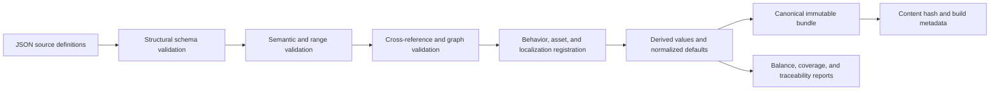

# Content Data and Validation

## Purpose

This document defines content authoring, schemas, stable IDs, compilation, cross-reference validation, derived data, localization, compatibility versions, and the workflow AI agents use to change content safely.

## Source-of-truth boundary

- Gameplay Markdown remains authoritative for accepted player-visible rules and design intent.
- Strict JSON is the authoritative machine-consumed representation used by builds.
- C# behavior implementations are authoritative for runtime mechanics that cannot be represented as parameters.
- Generated bundles, reports, CSVs, balance summaries, and imported Godot resources are derived artifacts.

A gameplay value change is incomplete until the gameplay document, JSON definition, generated reports, dependent estimates, and verification fixtures agree. CI detects mechanical disagreement where a comparison can be automated.

## JSON codec and schema baseline

- Use the built-in `System.Text.Json` reader/writer with explicit typed DTOs and source-generated serialization metadata; do not add Newtonsoft.Json, runtime contract reflection, or dynamic JSON objects to production paths.
- Source files and persisted JSON are UTF-8. Comments, trailing commas, duplicate object properties, nonfinite numbers, and unknown fields are errors. Property names use `snake_case`; stable enum/kind/ID tokens remain exact case-sensitive ASCII.
- JSON Schemas use draft 2020-12 for editor/tool interoperability. The project-owned typed structural/semantic validators remain authoritative; a fixture corpus proves the schema and typed validator accept/reject the same structural cases.
- The canonical writer emits fields in schema-declared order, dictionaries as lexically sorted key entries, stable-ID sets in canonical ID order, and semantically ordered arrays in their authored/explicit order. It writes integers without padding and finite floating-point values with invariant round-trip representation, normalizing negative zero to zero.
- File order, operating-system path order, locale, indentation, and original property order do not affect compiled bundle or payload hashes.
- SHA-256 from the .NET base class library hashes canonical UTF-8 payload bytes. Human-readable pretty JSON is a separate derived view and is never hashed or loaded as canonical state.

The same codec policy is reused by content, saves, recovery, manifests, diagnostics, and task evidence unless a schema explicitly requires a compact binary derived asset. Each domain owns its DTOs and validation; codec reuse does not merge domain ownership.

## Accepted content repository layout

```text
content/
  schemas/
  resources/
  mechs/
  enemies/
  bosses/
  weapons/
  branches/
  utilities/
  relics/
  powerups/
  unlocks/
  mining-sites/
  encounters/
  maps/
  presentation/
  localization/
assets-manifest/
  assets/
  licenses/
generated/
  content.bundle.json
  content.bundle.sha256
  reports/
```

Catalog directories are the authoring boundary. Definitions are grouped by stable item or the smallest cohesive aggregate such as the standard encounter schedule; generated/source separation is mandatory. A layout change must update build tooling, schemas, importers, documentation, and clean-checkout tests atomically rather than adding a second search path.

## Stable ID policy

- Reuse accepted gameplay IDs exactly for defined content: `MCH-01`, `EN-01`, `BOSS-01`, `W-AB`, `REL-01`, and equivalent utility/PowerUp/unlock IDs.
- Generated map instances append or separately store run-local generated IDs; they do not modify content IDs.
- IDs are case-sensitive ASCII tokens matching a schema pattern and never localized.
- Display names and localization keys may change without changing IDs.
- Removing shipped content retires its ID and leaves a migration/tombstone entry; IDs are never reassigned.
- Cross-references contain IDs plus schema-validated expected category where ambiguity is possible.

### Minted content-ID grammars

Several of the prefixes below were agreed between working sessions in conversation before any document authorized them, and this section is what makes them real rather than a record that they already were: a prefix that has only ever appeared in a chat log, a code comment, or a schema `pattern` carries no authority here. That is the standard this project already applied to `common-ore` and `hyper-gold`, which still carry slug IDs because no accepted document ever assigned them an ID token, and being obvious was never a substitute for one. The standard applies to us on the same terms.

Every prefix in the table below is minted by this document. No accepted gameplay document minted an identifier for any of them, and each needs one because every schema in this document references other definitions by stable ID. They follow [Stable ID policy](#stable-id-policy) above: case-sensitive ASCII, never localized, never reassigned. Each numbers from `-01`. Prefixes reused from the accepted gameplay register are governed by the reuse bullet above and are deliberately absent here.

Eleven of them — `FAB-`, `STACK-`, `CACHE-`, `EXCL-`, `HOOK-`, `RESPEC-`, `DEED-`, `HORDE-`, `FOOTPRINT-`, `SIEGE-`, and `BOUNTY-` — name **aggregates** on the same terms as `WAV-01` and `MGC-01`: not embodied in the world and never read by players, so they omit `presentation_id` and `name_key` under [Declared-optional envelope fields](#declared-optional-envelope-fields). `FAB-01` is the utility fabrication and rank contract. `STACK-01` states how modifiers compose and when a new value takes effect. `CACHE-01` is the relic-cache economy: placement, draw, and install-or-sell. `EXCL-01` states that one installed mech-level effect applies at a time, run-local, after additive modifiers. `HOOK-01` is the relic runtime registration model. `RESPEC-01` is the refundable account-rank purchase policy and `DEED-01` the permanent nonrefundable entitlement policy. `HORDE-01` states what every ordinary alien identity is. `FOOTPRINT-01` is the reference geometry every contact circle derives from. `SIEGE-01` states how a boss occupies the field, and `BOUNTY-01` the loot burst every boss death produces.

The remaining two are not aggregates on those terms. `RSC-` identifies ordinary embodied content and omits neither field. `FORMULA-01` is a shared definition players read the effect of, so it carries a `name_key` and omits only `presentation_id`.

| Prefix | Grammar | Category | Instances live in | Minted in |
| --- | --- | --- | --- | --- |
| `RSC-` | `^RSC-[0-9]{2}$` | resource | `content/resources/` | this section |
| `UTL-` | `^UTL-[A-FR][1-9]$` | utility | `content/utilities/` | [Utilities](#utilities) |
| `WAV-` | `^WAV-[0-9]{2}$` | encounter schedule | `content/encounters/` | [Encounter schedule](#encounter-schedule) |
| `MGC-` | `^MGC-[0-9]{2}$` | map generation contract | `content/maps/` | [Map generation](#map-generation) |
| `FORMULA-` | `^FORMULA-[0-9]{2}$` | player-facing formula | `content/weapons/` | this section |
| `FAB-` | `^FAB-[0-9]{2}$` | fabrication and rank contract | `content/utilities/` | this section |
| `STACK-` | `^STACK-[0-9]{2}$` | modifier composition contract | `content/utilities/` | this section |
| `CACHE-` | `^CACHE-[0-9]{2}$` | relic-cache economy | `content/relics/` | this section |
| `EXCL-` | `^EXCL-[0-9]{2}$` | mech-level effect exclusion | `content/relics/` | this section |
| `HOOK-` | `^HOOK-[0-9]{2}$` | relic runtime registration model | `content/relics/` | this section |
| `RESPEC-` | `^RESPEC-[0-9]{2}$` | refundable purchase policy | `content/powerups/` | this section |
| `DEED-` | `^DEED-[0-9]{2}$` | nonrefundable entitlement policy | `content/unlocks/` | this section |
| `HORDE-` | `^HORDE-[0-9]{2}$` | ordinary alien identity contract | `content/enemies/` | this section |
| `FOOTPRINT-` | `^FOOTPRINT-[0-9]{2}$` | reference contact geometry | `content/enemies/` | this section |
| `SIEGE-` | `^SIEGE-[0-9]{2}$` | boss field occupation | `content/bosses/` | this section |
| `BOUNTY-` | `^BOUNTY-[0-9]{2}$` | boss death loot burst | `content/bosses/` | this section |

Three further prefixes — `SITE-`, `ELT-` and `PLAYER-` — are minted not in another document but in this document's own FND-004 revision, under [Map generation](#map-generation), and are deliberately not restated here. This table is therefore complete only once that work package has merged. Until then a reader on a branch without FND-004 should treat those three as minted there rather than as unminted, and any check that reads this table must assert them by name, so that the mint's arrival breaks the build rather than passing silently.

The table is the **machine-readable** form of what the prose in this section and in the sections it cites states in sentences, and the two **must agree**. The prose is what a reader needs in order to know why an ID exists and what it identifies; the row is what a check reads to detect that a schema `pattern` or an implementation category table has drifted from this document. Neither is redundant with the other and neither may be deleted in favor of the other: a check that scraped English would break on the first editorial rewrite, and a table with no prose would leave the next author guessing what an ID means. Every prefix this document mints anywhere owes a row here, including any minted in a catalog subsection below, and the row's **Minted in** cell must name the one section that mints it: no other section may claim to mint the same prefix. Two claimed authorities for one prefix leave a reader no way to tell which section governs it, and leave a check that reads only the row set unable to see the disagreement at all.

Every prefix above was checked against the work-package prefix registry in [Implementation Plan for AI Agents](./110-implementation-plan-for-ai-agents.md#work-package-authority-routing) before it was minted, and none of them collides with a registered work-package prefix. That check is a precondition of minting rather than a courtesy: a content prefix equal to a work-package prefix makes a reference ambiguous between a content definition and a work package in exactly the places both appear — commit messages, task briefs, and the identifier validator — and no downstream reader can resolve it from context. The next person minting a content prefix runs the same check first.

`RSC-01` through `RSC-08` cover the eight resources: the six specialized materials plus common ore and Hyper Gold. The `A`–`F` letters remain what [Specialized Resource Identities](../61-specialized-resource-identities.md) makes them — stable authoring shorthand that preserves the accepted weapon-graph IDs, and a rule about what interfaces may display — and they become a separate `canonical_letter` field. [Resources](#resources) below already lists a canonical letter alongside ID among resource definition fields; it names the concept in prose, and this section is what gives the field its `snake_case` name. The ID and the letter are two fields; neither is derived from the other, and the letter never appears in a cross-reference.

Adopting `RSC-` is therefore **not** a pure rename. The six material files carry no `canonical_letter` today, so the migration changes eight `id` values *and adds a field to six files*: a value-preservation proof over it must expect exactly six new leaves rather than leaf-for-leaf equality, and a proof written for a rename will fail — correctly — on the six additions. Minting an ID does not rename a file, so the file stems are unaffected either way.

The eight outgoing `id` values owe no migration/tombstone entry. Six of them are not outgoing at all: `A` through `F` relocate into `canonical_letter`, as the paragraph above states. `common-ore` and `hyper-gold` do stop being `id` values, but no accepted document ever minted them — this section's opening paragraph says exactly that of both — so an unminted slug is not a retired ID and no tombstone is owed; the entry [Stable ID policy](#stable-id-policy) above prescribes is for removing shipped content, and both resources stay. That is stated rather than left to inference, because a reader arriving from that bullet would otherwise expect eight tombstones this migration does not produce; what the bullet does reach is reuse, and none of the eight tokens may ever identify different content afterward — neither slug is reattached to anything else, and the six letters keep meaning the six materials they mean today.

An aggregate lives in the catalog directory it serves, which is why `WAV-01` sits in `encounters/` and `MGC-01` in `maps/`, and why the directory column above names an existing catalog directory rather than a new one. Placement follows the definition the aggregate governs; if extraction shows an aggregate serves a catalog other than the one named above, the file moves and its ID does not change.

Exclusion from a population assertion is a **separate** rule, and stating it separately is the point. A catalog directory that asserts an exact population excludes the aggregates it hosts *by name*, never by a prefix rule: `content/weapons/` asserts exactly 15 material-pair recipes and excludes `FORMULA-01` by naming it, because a validator that instead excluded "anything not matching the weapon grammar" would silently accept the next unauthorized ID dropped into that directory. Placement decides where a file lives; exclusion decides what a population assertion counts. Changing one is not changing the other.

Minting an ID for an aggregate that extraction may not preserve is deliberate. If one does not survive, [Stable ID policy](#stable-id-policy) above already prescribes the outcome — the ID retires, leaves a migration/tombstone entry, and is never reassigned — and a retired ID with a tombstone costs less than migrating a tree against a pattern no document authorizes.

## Common definition envelope

Every independently addressable definition contains:

| Field | Requirement |
| --- | --- |
| `id` | stable category-valid ID |
| `schema_version` | integer version of its definition schema |
| `content_version` | monotonic revision used for diagnostics and migrations |
| `status` | development, enabled, disabled, or retired; release bundles exclude development/disabled unless configured |
| `name_key` | localization key; never literal player-facing text |
| `summary_key` | concise player-facing summary key where relevant |
| `tags` | closed or validated vocabulary for queries and tooling, never hidden behavior |
| `source_refs` | gameplay document IDs/anchors and decision IDs implemented |
| `presentation_id` | logical presentation entry where the content appears in-world |

Unknown fields are errors rather than silently ignored. Optional fields have explicit defaults materialized into the canonical bundle so runtime never guesses.

### Declared-optional envelope fields

Two envelope fields are declared optional, and authors express absence the same way for both: **omit the key**. A JSON `null` is never legal anywhere in a source definition, because the codec rejects it as a type error rather than reading it as absence. The compiler materializes the documented default into the canonical bundle, so runtime always reads a value.

- `presentation_id` is omitted when a definition never appears in-world. Aggregates, schedules, and other non-embodied definitions omit it.
- `name_key` is required only where a definition has a player-facing name. A definition players never see named — an aggregate schedule or a generation contract — omits it. The localization catalog holds strings players read; internal aggregate titles do not belong in it.

`summary_key` follows the same rule its row already states: present where a concise player-facing summary is relevant, omitted otherwise.

### Initial versions

The initial `schema_version` is `1` and the initial `content_version` is `1` for every first-authored definition. `schema_version` then increments when its schema changes field meaning, and `content_version` increments on each subsequent revision of that definition, both as [Content compatibility](#content-compatibility) below describes. The [Component, Contract, and Schema Registry](./115-component-contract-and-schema-registry.md#schema-registry) delegates version assignment to the implementation; this records the assignment.

### `tags` vocabulary

`tags` accepts an empty array, and an empty array is the expected value for most definitions. The closed vocabulary starts **empty** and gains a term only when a concrete query or tooling need requires it; the term is added to the vocabulary in the same change that first uses it. A tag never carries behavior, never selects an implementation, and never gates a rule: a definition's behavior comes from its registered `behavior_kind` and parameters, never from the presence of a tag.

### `source_refs` element grammar

`source_refs` is an array of stable-ID strings. Each element is one of:

- a gameplay document ID with an optional anchor, for example `GDD-COMBAT` or `GDD-COMBAT#contact-damage`;
- a gameplay decision ID, `DEC-###`;
- a technical decision ID, `TDR-###`; or
- a technical requirement ID, `TR-<DOMAIN>-###`.

The grammar for each is the one declared in [Documentation Conventions](../conventions.md#stable-identifiers) and [Technical Documentation Conventions](./conventions.md#stable-identifiers).

A file path, a line number, or any `path:line` pair is **not** a legal element. Paths and line numbers move whenever a document is edited, so a reference built from them decays silently; [Stable ID policy](#stable-id-policy) above and [TDR-006](./decisions/TDR-006-author-validated-content-as-strict-json.md) establish that IDs, not filenames, connect definitions to their sources. A source that has no stable ID gets one before it can be referenced.

## Unit and numeric policy

- Ambiguous numeric names carry suffixes such as `_m`, `_m_per_s`, `_seconds`, `_per_second`, `_hull`, `_degrees`, `_fraction`, or `_count`.
- Percentages in authoring use human-readable percentage points only when the property name says `_percent`; the compiler writes normalized factors into the runtime bundle as a separate derived field.
- Durations are nonnegative and bounded by schema; rates cannot be negative.
- Integer currency and rank values are integral in source and checked for formula overflow.
- Geometry dimensions distinguish radius, diameter, width, range, and area; `area` is never used as a vague scalar name.
- A multiplicative scale carries the `_multiplier` suffix and keeps one name in every scope it appears in: an enemy's authored body scale is `body_scale_multiplier` in the source definition, in the canonical bundle, in generated reports, and in any code or schema that reads it. `_multiplier` says the value multiplies a reference dimension, which `_factor`, `_scale`, and a bare `scale` do not; and a single spelling everywhere is what lets a derived-value report be traced back to its operand by name.
- Formulas allowed to players, such as weapon upgrade price, are represented by a registered formula kind plus parameters, not arbitrary script strings.
- Derived values include source operands and calculation version in reports for auditability.

## Content catalogs

### Resources

Resource definition fields include ID, canonical letter, localization keys, icon/pattern/audio identity, inventory scope, persistence class, maximum safe count, and resonance behavior registration if applicable. The six-material set and common ore/Hyper Gold pass graph-specific validators.

### Mechs

Fields include signature weapon ID, trait behavior kind/parameters, base Hull/Armor/Recovery/movement/footprint overrides, availability, presentation, selection order, and comparison text. Validation ensures every signature is an initial weapon, every trait behavior is registered, and every mech remains compatible with profile generation.

### Enemies and bosses

The fields an enemy definition **authors** are Hull, the movement percentage, contact damage, contact cadence, `body_scale_multiplier`, control resistance, behavior registration, projectile or boss-ability parameters, elite eligibility, presentation, spawn classification, and telemetry tags. Contact diameter and contact-begin center distance are deliberately absent from that list, because they are derived rather than authored; the next paragraph is the same rule stated in full, not an additional one. Validation derives world speeds and contact footprints from the authored operands above and compares them with the survivability report.

Derived geometry is never authored, which is why the authored-field list above stops at the multiplier. An enemy definition stores its authored `body_scale_multiplier`; the compiler derives the contact diameter from that multiplier and the reference diameter, and derives the contact-begin center distance from the result. This is not a second rule. It is the rule [Unit and numeric policy](#unit-and-numeric-policy) already states, applied to geometry: a `_multiplier` "says the value multiplies a reference dimension", and the compiler is what performs that multiplication and writes the product into the runtime bundle. Authored movement is the same shape in the same policy — a percentage is authored as percentage points because its name says `_percent`, and the compiler "writes normalized factors into the runtime bundle as a separate derived field", which is where world speed comes from. One rule, two operands: the author supplies the multiplier or the percentage, and the compiler supplies every value computed from it.

An author who types a derived value into a definition creates a second source of truth that silently disagrees with the first the moment either operand changes, which is exactly how a gameplay table and a technical table came to disagree by 0.004 M on one enemy. Derived values appear in generated reports with their source operands and calculation version, as [Unit and numeric policy](#unit-and-numeric-policy) requires; they do not appear in source JSON.

Everything above states the rule for **ordinary enemy identities** — the ones the accepted roster gives a body scale, and therefore the ones that have an authored operand to derive geometry from. Boss contact geometry is governed separately and is deliberately not decided here; the paragraphs above must not be read as settling it in either direction, and the boss definition schema that `DAT-002` owns must not be written against an inference drawn from them.

**No gate enforces any of this today, and the correction that produced the wording above
was verified by reading rather than by running anything.** The content compiler and its
validator are `DAT-001`/`DAT-002` deliverables; nothing in `build/`, `src/`, or `tests/`
reads `body_scale_multiplier`, and no content definition exists to check. So the
authored/derived split is a rule a reader applies, not one a runner can catch, and until
`DAT-001` lands a validator that can fail on an authored derived value the only
protection is that this section does not contradict itself. It used to: the authored-field
list said "contact damage/diameter/cadence" while the paragraph below it said derived
geometry is never authored, which is a self-contradiction a schema author could resolve
either way. That correction is recorded in commit `a494f09` as "item 4" of a list whose
numbering resolves to nothing — the non-normative
`docs/technical/delivery-waves.md` § Decision 12 records that separately — and it carries
no exit-class evidence because there is no gate to produce one.

### Weapons

Fields include recipe material pair, behavior kind, targeting policy, fixed properties, three stat-track definitions, rank-zero values, increments, snapshot/live classifications, all branch IDs, analytical-model registration, presentation/audio references, and rock-targeting behavior.

The compiler verifies exactly 15 unordered material-pair recipes, no duplicate pair, exactly three stats, one amplification/functional/conversion branch, unique branch materials according to the graph, and behavior registration.

### Branches

Fields include parent weapon, transformation class, two-unit material cost, behavior modifier kind/parameters, affected snapshot/live properties, exclusions/recursion flags, summary/detail keys, and compatibility notes. A branch cannot register against multiple weapons or add an unrecognized fourth stat.

### Utilities

Fields include assigned material or ore-only radar exception, unlock ownership, one-unit fabrication cost, slot behavior, behavior kind, base value, three rank values/prices where applicable, affected named stats, stacking classification, and presentation. Validators enforce no duplicate installed identity, allowed rank count, and exactly the accepted fresh/unlocked distribution.

The resource radar is a utility definition with the stable ID `UTL-R1`, and it is the one definition that uses the ore-only exception field named above rather than an assigned material. No accepted gameplay document minted an ID for it, because the accepted catalog identifies material utilities by their material letter; `UTL-R1` is minted here so cross-references to the radar are stable IDs like every other utility reference.

### Relics

Fields include pool availability/unlock, discovery sentence key, sale value, behavior registration, benefit/tradeoff parameters, hook points, affected weapon categories, live-state meter, and presentation. Validation requires one sentence summary, explicit tradeoff, compatibility results for all weapons, and no hidden unsupported behavior.

### PowerUps and option unlocks

PowerUps include rank cap, fixed costs/values by rank, active-rank policy, refundable flag, named-stat contribution, and UI grouping. Unlocks include exact Hyper Gold cost, nonrefundable flag, owned content additions, and whether ownership may be disabled. Validators recompute total catalog costs and maximum-account envelope.

### Mining sites

Fields include site class, count rule, zone/field dimensions, base work seconds, installment thresholds/payouts, decay/grace, resource result, beacon thresholds, presentation, map marker, and spawn exclusions. Standard mode validates exactly four accepted classes and their totals.

### Encounter schedule

One aggregate standard schedule file contains mode ID, duration, minute rows, composition weights, minimums, pulses, formations, boss warnings/arrivals, beacon response table, and population ceilings. Aggregate validation compares 35 contiguous rows, totals, earliest appearance, boss cadence, formation grammar, and accepted enemy IDs.

The standard encounter schedule has the stable ID `WAV-01`, and that ID is minted here. No accepted document previously granted a content-ID grammar for the schedule, and it needs one because every schema in this document references other definitions by stable ID. It follows [Stable ID policy](#stable-id-policy) above: case-sensitive ASCII, never localized, never reassigned. It is an aggregate: it is not embodied in the world and players never read its name, so it omits `presentation_id` and `name_key` under [Declared-optional envelope fields](#declared-optional-envelope-fields).

### Map generation

The fields a map generation contract **authors** are mode/map ID, region/topology/scale ranges, static obstacle targets, distance bands, site counts, distribution constraints, candidate clearances, retry budgets, discovery settings, rock rules, and landmark pools. Semantic validation checks internal feasibility before sampling maps.

The map-generation version is deliberately absent from that list. [Content compatibility](#content-compatibility) below makes it part of build identity, which the build records and increments when generation semantics change; a contract that also declared it would be a second source of truth for the same value, disagreeing with build identity the moment either side moved. This is not an additional rule. It is the rule [Enemies and bosses](#enemies-and-bosses) above states for a derived field — derived values "do not appear in source JSON" — applied one layer up, to a whole contract rather than to one field: authoring is where operands live, and a version the build owns is not one of them.

The standard map generation contract has the stable ID `MGC-01`, and it is an aggregate on the same terms as `WAV-01`.

`MGC-01` is minted here; `WAV-01` is minted under [Encounter schedule](#encounter-schedule) above, which is the section its row in [Minted content-ID grammars](#minted-content-id-grammars) names. No accepted document previously granted a content-ID grammar for the map generation contract, and it needs one because every schema in this document references other definitions by stable ID. It follows [Stable ID policy](#stable-id-policy) above: case-sensitive ASCII, never localized, never reassigned.

### Presentation and audio

Presentation definitions map logical IDs to models, materials, animation sets, VFX recipes, UI icons, map markers, and fallback proxies. Audio definitions follow the event contract. These definitions never contain damage or other authoritative outcomes.

## Behavior registries

Each owning pure project exposes a manually composed immutable registration table through a narrow contract. `MechaMiner.Tools` combines the pure tables and presentation-recipe descriptors owned by Content, then emits the canonical registry manifest. `MechaMiner.Game` owns a separate explicit implementation table for those presentation recipe IDs; a Godot integration test requires exact descriptor/implementation set equality and compatible parameters without making Tools depend on Game. The manifest is derived and checked for staleness; runtime assembly scanning, reflection discovery, source-generator magic, and a separately hand-edited manifest are forbidden. The content compiler verifies every content `behavior_kind`, targeting policy, formula, modifier hook, formation, effect, and presentation recipe has exactly one registered descriptor with a compatible parameter schema.

An implementation agent adding a new kind must provide:

- stable kind ID and parameter schema;
- domain ownership and lifecycle;
- content validation;
- unit and integration fixtures;
- debug visualization/metrics where applicable; and
- at least one definition using it or an explicit infrastructure-only rationale.

Do not accept a raw type name from JSON and instantiate it through reflection.

## Compilation pipeline



Every stage emits stable diagnostic codes, exact source path/field, content ID, expected constraint, and relevant related IDs. CI fails on errors. Warnings have an owner and expiration; release builds treat unresolved content warnings as errors unless allowlisted with rationale.

The canonical bundle is ordered by category and stable ID, uses normalized numeric formatting, includes schema/generation versions, and hashes identically for identical semantic input regardless of source file enumeration order.

## Validation layers

### Structural

Required fields, types, allowed properties, enum vocabulary, ID syntax, numeric bounds, and array cardinality.

### Semantic

Rules within a definition: positive cadence, branch class, three stats, increasing rank costs, valid geometry, exact reward totals, compatible behavior parameters.

### Relational

References, uniqueness, graph coverage, signature/profile feasibility, unlock ownership, material distribution, schedule availability, asset and localization existence.

### Analytical

Recalculate DPS estimates, price curves, total costs, enemy derived speeds/footprints, boss feasibility reference builds, and resource totals. Reports compare with accepted gameplay tables and fail on unexplained divergence beyond documented rounding.

### Runtime smoke

Instantiate every behavior in a tiny headless fixture, execute at least one activation/state transition, serialize its presentation view, and dispose it without error.

## Localization contract

- Source language is English stored in a dedicated string catalog, not definition files.
- Keys are stable semantic paths tied to content IDs and UI roles.
- Parameterized text uses named placeholders validated against each locale.
- UI definitions declare expected expansion class; pseudo-localization expands text and adds accented/directional stress characters.
- Player-facing numbers use locale-aware formatting while content formulas and saves remain invariant culture.
- Missing release strings are build errors; development builds show the key visibly.
- Final release locale list is product scope; infrastructure supports adding locales without content-schema changes.

### Source catalog format and key pattern

- Source catalogs are strict JSON under the same codec policy as every other source file: UTF-8, no comments, no trailing commas, no duplicate properties, unknown fields rejected.
- There is one file per locale at `content/localization/<locale>.json`.
- Each file is a flat object of key to string. There is no nesting, no metadata wrapper, and no array.
- Keys are lexically sorted, so a diff shows only the strings that changed and two authors adding different keys do not conflict on ordering.
- The key pattern is `<category>.<stable_id>.<role>`. The category is `snake_case`. The stable ID appears **verbatim**, in its own case, so `weapon.W-AB.name` and not `weapon.w_ab.name`: a localization key that transforms an ID is no longer traceable to it, and [Stable ID policy](#stable-id-policy) makes IDs case-sensitive.
- The role comes from a small set, beginning with `name` and `summary`, matching the `name_key` and `summary_key` envelope fields. The set grows with the same discipline as the `tags` vocabulary: a role is added when a definition or a UI surface needs it, not in advance.

## Asset manifest contract

Logical asset entries contain ID, type, source provenance/license record, source file, imported resource path, expected import settings, variants/LODs/animations, budget metadata, and fallback. Content definitions refer only to the logical ID.

The compiler verifies type compatibility and asset budget metadata; the Godot import audit verifies the actual imported resource matches the manifest.

## Content compatibility

Build identity records:

- product version;
- Godot and .NET versions;
- content bundle hash;
- per-schema versions;
- map-generation version;
- random-stream derivation version; and
- save-format version.

Changing numbers without changing behavior increments content revision/hash but not necessarily schema. Changing field meaning increments schema. Changing generation semantics increments map-generation version. Run recovery requires compatible versions declared by migrations; diagnostic seeds require the original version identities.

## Agent content-change workflow

1. Read the authoritative gameplay section, relevant technical behavior contract, and current definition.
2. Change the smallest source JSON set and any approved gameplay Markdown in the same work item.
3. Run structural, semantic, relational, analytical, asset, localization, and behavior-registration validation.
4. Regenerate canonical reports and CSV mirrors using the repository tool; never edit generated files to fix source errors.
5. Run affected headless benchmarks and golden fixtures.
6. Review diffs for unrelated key reordering or generated churn.
7. Record tuning evidence when values change materially.

An agent must not infer a new behavior from a field name, add an unvalidated optional field, encode logic in localization text, or bypass a validator to make a build pass.

## Verification

- Invalid-fixture suites cover every diagnostic code and schema boundary.
- Canonicalization tests permute source order and require identical bundle/hash.
- All cross-reference graphs have reachability/orphan reports.
- Gameplay catalog totals and pair mappings are asserted.
- A clean checkout can compile content without launching the Godot editor.
- Release packaging proves no development/disabled definitions or unlicensed assets enter the bundle.

## Related documents

- [Technical Documentation Conventions](./conventions.md)
- [Simulation Core](./20-simulation-core.md)
- [Combat and Weapon Runtime](./22-combat-and-weapon-runtime.md)
- [Procedural Map Generation](./50-procedural-map-generation.md)
- [Asset Pipeline and Budgets](./80-asset-pipeline-and-budgets.md)
- [Machine-Readable Gameplay Data Index](../data/README.md)
