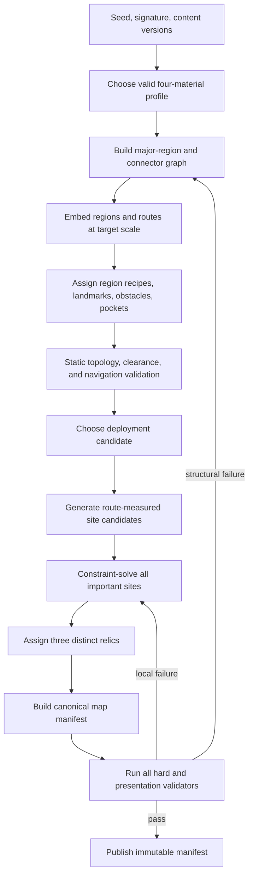

# Procedural Map Generation

## Purpose

This document selects a concrete generate-and-validate pipeline for the [Standard Map Generation Contract](../51-standard-map-generation-contract.md). It defines seed ownership, resource-profile selection, region topology, geometric construction, landmarks, site placement, navigation, validation, retries, manifests, dynamic rocks, tooling, and performance.

## Core approach

Use staged constrained generation, not unrestricted noise and not a small set of fixed complete maps.

- Authored region recipes, landmark scenes, obstacle stamps, boundary pieces, and connector treatments provide visual quality.
- A seeded generator chooses, transforms, recombines, and places them into a new abstract topology and geometry.
- Important content locations are selected from validated candidates through a constraint solver.
- Every stage produces inspectable intermediate data and may retry locally before restarting the whole attempt.
- Only a complete manifest passing every hard validator reaches the player.

## Seed and version identity

A standard generation request contains:

- master run seed;
- selected mech/signature weapon;
- active map/mode definition;
- content bundle hash;
- map-generation version;
- random derivation version; and
- generation attempt index.

Named child streams cover profile, topology, embedding, region recipes, landmarks, obstacles, deployment, each site category, relic assignment, and dressing. Retrying one placement category does not consume unrelated streams.

The generated manifest records every identity and attempt count. A seed is reproducible only with compatible content/generation versions as established by TDR-002.

## Resource profile selection

1. Read the signature weapon's two recipe materials and distinct conversion-branch material.
2. Enumerate the four-of-six material subsets containing at least two of those three materials.
3. Select uniformly from the valid subsets using the profile stream.
4. For each present material independently select 8, 9, or 10 geodes with equal initial probability.
5. Order materials canonically for survey, data, and deterministic placement; random order never becomes identity.

Profile selection does not inspect map topology, chosen region recipes, prior runs, account PowerUps, or player history. A soft-balance audit may identify a catalog-wide problem but runtime does not reroll “weak” profiles.

## Generation pipeline

Each back edge has a bounded deterministic retry count. No stage performs an unbounded search.

## Major-region topology

### Region count

Select six, seven, or eight major regions with initial weights 25%, 50%, and 25%. Seven remains the target without making every map identical.

### Bridgeless backbone

To guarantee that removing one major connector cannot isolate a major region:

1. sample region centers with Poisson separation inside an oversized candidate boundary that is deterministically rescaled during spatial embedding;
2. order centers around their centroid and connect them into one non-self-intersecting cycle;
3. build a Delaunay candidate-edge set or equivalent local-neighbor set;
4. add noncrossing chords until average major-region degree is initially 2.6–3.2, favoring varied route lengths; and
5. reject any graph with degree below two, a bridge, excessive diameter, or one connector dominating shortest paths.

The cycle alone supplies two edge-disjoint routes. Chords create meaningful route choices. If two connector centerlines cross, the crossing becomes an explicit broad junction or one chord is rejected; invisible overpasses are not introduced.

### Optional pockets

Choose zero to two shallow spur pockets after the major graph is valid. A pocket is not a major region and does not weaken the no-bridge rule for major regions. Its route depth, exit visibility, holdout clearance, and content caps are validated independently.

## Spatial embedding and world scale

The abstract graph embeds onto a distorted ellipse or rounded polygon. Region centers and connector splines are scaled until the longest clearance-valid route between traversable extremes targets 810M and remains in the accepted 720–900M band.

- Major regions contain broad open combat cells joined by wide connectors.
- Connector walkable width is derived from the active mining-zone diameter, never hard-coded independently, and targets at least 1.5 diameters.
- Curves avoid hairpins and local widths below the hard one-diameter minimum.
- The outer boundary is generated around the union of regions/connectors with enough shoulder for presentation and offscreen spawning where camera clamping allows.
- Base-travel distance uses route cost divided by the fixed 3.0M/s baseline, never selected mech speed.

After embedding, raster navigation and all-pairs major-region route data provide exact validation distances.

## Region recipes and authored structures

A region recipe describes gameplay-neutral layout tendencies rather than reward identity:

- open-ground shape and obstacle-density range;
- allowed obstacle/prop stamps and rotations/reflections;
- connector socket treatment;
- landmark candidate list and required clearance;
- ground palette/material family;
- dressing rules and occlusion masks; and
- navigation/presentation budget metadata.

No recipe prefers a specialized material, relic, Hyper Gold, boss, compass direction, or deployment. A run does not repeat a primary landmark or exact region-recipe/landmark combination.

Obstacle placement targets 8–12% solid footprint per major region and never exceeds 15%. Stamps are clipped/rejected to preserve connector widths, mining candidates, spawn corridors, and six-second maximum ordinary detours. Dressing is placed only after important sites and cannot alter validated collision.

## Landmark assignment

Assign one prominent landmark per major region through a no-replacement draw from compatible candidates. A landmark has:

- unique run identity and localized name;
- conservative solid/occlusion footprint;
- camera-scale silhouette validation;
- site and route exclusion envelopes;
- map icon and discovery footprint; and
- asset budget metadata.

Landmarks are navigation anchors, not fixed rewards. Site placement randomizes independently after their exclusions are known.

## Deployment selection

Generate candidates on open interior ground of each major region, then filter by:

- complete player and one-mining-zone clearance;
- not boundary, connector, pocket, solid, or landmark exclusion;
- at least two visually distinct broad routes;
- valid ordinary entry ground in at least three general directions;
- no important site inside the initial camera view; and
- capacity to satisfy all Near-band resource guarantees.

Score surviving candidates for route choice, distance-band capacity, region centrality diversity, and camera/spawn clearance. Choose from the best quartile using the deployment stream rather than always choosing the numeric maximum.

## Site candidate generation

Generate a reusable candidate set over traversable ground using Poisson-disc sampling and region-specific open-area samples. Each candidate precomputes:

- world position and major region/pocket;
- route distance/time from deployment;
- pairwise route and straight-line distances to other candidates as needed;
- complete site-zone and maneuver-band clearance by supported site sizes;
- resonance-field clearance;
- camera/landmark/connector/boundary exclusions;
- local spawn-sector availability; and
- visual occlusion score.

Candidates use route distance for Near/Middle/Far constraints. Straight-line distance is used only for physical non-overlap and presentation clutter.

## Constraint-solved placement

Use randomized backtracking with forward checking, most-constrained-variable ordering, and deterministic candidate order from each category stream. Place categories in this dependency order:

1. Hyper Gold sites;
2. relic caches;
3. one guaranteed Near geode for each present material;
4. remaining material geodes;
5. rich ore seams;
6. standard ore seams; and
7. any optional nonpersistent dressing sites.

Earlier categories have the strongest region/separation constraints. Forward checking aborts a partial assignment as soon as a remaining category lacks enough legal candidates.

### Hard counts and constraints

The solver encodes the complete gameplay contract, including:

- 20 standard seams and 8 rich seams;
- 8–10 geodes for each of exactly four materials;
- 3 Hyper Gold sites and 3 relic caches;
- one Near geode per material, two Near standard seams, and one Near rich seam;
- every material in at least five major regions and at most two same-material geodes per region;
- no region above 30% of all geodes or 25% of all ore seams;
- rich seams in at least four regions and no more than two per region;
- Hyper Gold in three regions, at least one Middle and one Far, with 60-second pair separation;
- caches in three regions, at least one Middle and one Far, with 45-second pair separation;
- optional-pocket content caps; and
- no overlap among extraction circles, resonance fields, maneuver envelopes, or important presentation footprints.

Distribution constraints are hard. “No dominant cluster” adds a quantitative audit: compare material/ore directional concentration and route-nearest-neighbor distribution against configurable thresholds; reject outliers rather than relying on visual judgment alone.

## Relic assignment

After cache locations are valid, draw exactly three distinct relic IDs without replacement from the profile's unlocked pool using a dedicated stream. Validate the pool contains at least three definitions. Assignment order follows stable cache generated ID, not discovery distance.

## Generated manifest

The immutable manifest contains:

- all request/version/seed identities;
- resource profile and abundance;
- region graph, geometry, recipes, transforms, landmarks, boundary, and pockets;
- navigation raster metadata and route-distance bands;
- deployment and entry sectors;
- every static site with generated ID, content ID, position, zones, region, band, and assignment;
- all validation results and generation attempt counts;
- asset logical IDs and transforms;
- fog/exploration grid definition; and
- canonical checksum.

The manifest contains no mutable run progress, enemies, pickups, or current discovery. It can be rendered in audit tools without running combat.

## Retry and failure strategy

Limits:

- up to 16 site-solver restarts for one static layout;
- up to 8 deployment choices per layout;
- up to 32 full topology/layout attempts; and
- two seconds p95 generation target on Steam Deck, with a five-second release watchdog.

Development builds fail loudly with the full rejected-attempt package when limits are exceeded. Release builds log the package and choose through the registered fallback stream from **three** bundled prevalidated manifests for the selected four-material profile and selected major-region count. The release pool therefore contains 15 profiles × 3 region counts × 3 variants = **135 manifests**, regenerated and revalidated against the shipping content/generator versions. A fallback remains a normal valid randomized layout, not a fixed handcrafted exception. It never bypasses profile/signature rules.

## Dynamic destructible rocks

Rocks are not in the static site solver. At deployment and each active one-second replenishment attempt:

1. derive the 18–45M annulus around the current player;
2. subtract camera footprint plus 2M, static solids, boundary, connectors, mining/cache/site zones, important presentation footprints, existing rocks, and invalid navigation cells;
3. sample at most 32 candidates from the rock stream;
4. if below 16 active, fill an empty slot; otherwise identify the farthest eligible offscreen rock and replace it only after a new valid point exists; and
5. if no candidate/replacement is valid, do nothing.

The 10% success roll occurs once per attempt before placement. A failed placement after a successful roll does not retry the chance or carry credit forward. Rocks never appear/disappear on-screen.

## Discovery initialization

The manifest marks every site undiscovered, except boss loot does not yet exist. On deployment the exploration grid reveals the camera footprint and margin but the important-site validator guarantees none appears in the initial view. The geological survey is derived from profile/count data and reveals no site IDs or coordinates.

## Generation tooling

Provide a standalone map audit tool that accepts seed, signature mech/weapon, content bundle, generation version, and output directory. It produces:

- canonical manifest and validation report;
- top-down map image with optional layers;
- region/connector graph;
- route-distance heatmap;
- site category/material map;
- clearance and resonance envelopes;
- spawn-sector coverage map;
- distribution statistics; and
- retry/failure trace.

Batch mode summarizes thousands of seeds by profile, region count, diameter, obstacle coverage, distances, clustering, solve time, and failure reason. Any failing seed is directly rerunnable.

## Verification

- Unit fixtures cover graph bridges, route bands, candidate clearance, connector width, pocket depth, and every placement constraint.
- Property tests generate at least 10,000 seeds per signature/profile combination in nightly CI and require zero published invalid manifests.
- Determinism tests require identical canonical manifests for identical compatible requests.
- Independence reports measure correlation between region/landmark and each reward/material category and flag predictive bias.
- Presentation audits confirm every region landmark and site remains readable at both reference resolutions.
- Performance reports record stage timing and retry distributions on desktop and Steam Deck.
- Known-invalid fixtures prove validators reject exact count, reachability, clearance, separation, clustering, and spawn failures.

## Related documents

- [World Geometry, Navigation, and Spatial Queries](./21-world-geometry-navigation-and-spatial-queries.md)
- [Content Data and Validation](./40-content-data-and-validation.md)
- [Standard Map Generation Contract](../51-standard-map-generation-contract.md)
- [Maps, Resources, and Navigation](../50-maps-resources-and-navigation.md)
- [TDR-002 — Use Seeded Reproducibility Without Lockstep Replay](./decisions/TDR-002-use-seeded-reproducibility-without-lockstep-replay.md)
