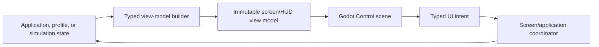

# UI, Input, and Accessibility

## Purpose

This document specifies the implementation architecture for the accepted screen flow, HUD, fabrication, maps, relic resolution, results, hangar, logical input, controller navigation, responsive layouts, localization, settings, onboarding hooks, and accessibility presentation.

## UI architecture

Use Godot `Control` scenes for composition and a unidirectional view-model flow:

- Views format and animate already-calculated values; they do not recompute prices, affordability, DPS, resource availability, or settlement.
- Coordinators own route transitions, pause reasons, confirmation flow, focus restoration, and transaction submission.
- Domain state never stores Control nodes or UI selection.
- Each screen has a stable route ID and typed route parameters.
- UI-only state such as selected tab, focus ID, filters, drawer state, pan/zoom, and scroll position belongs to a scoped presentation state store.

Avoid a general web-style UI framework inside Godot. Shared widgets are explicit reusable scenes with typed binding adapters and screenshot/test fixtures.

## Top-level state and routing

Routes implement the accepted Hangar, Active Deployment, Run Console, blocking Relic Resolution, Results, and Unlock Notification flow.

- Only the application coordinator changes top-level routes.
- Opening Status, Fabrication, or Map first acquires the corresponding pause reason, captures a consistent view-model version, then shows the route.
- Switching run-console destinations retains pause and never briefly resumes.
- Relic Resolution blocks other run-console routes until its transaction commits.
- Results opens only after a terminal result manifest exists and any required pending settlement state is known.
- Back behavior is declared per route; it is never inferred from scene-tree parentage.

Every transition is idempotent and protected against repeated input during animation. Transition animation never delays an authoritative pause, transaction, or terminal state.

## Logical input actions

Gameplay and UI consume logical actions rather than physical key/button checks. Initial actions are:

| Domain | Logical actions |
| --- | --- |
| Active play | move vector, open status, open fabrication, open map |
| Menu | focus up/down/left/right, confirm, back, previous/next top tab, previous/next subpage, details, secondary action |
| Map | pan vector, zoom in/out, recenter, place/open, remove waypoint, cycle filter |
| System | screenshot if supported, toggle diagnostic overlay in development builds only |

The baseline has no fire, aim, mine, interact, dodge, sprint, reload, or utility activation action.

### Movement processing

- Keyboard/D-pad inputs combine and normalize diagonals.
- Analog movement uses a configurable radial deadzone, initially 0.18, remaps remaining magnitude to `[0,1]`, then the gameplay rule converts any nonzero magnitude to full movement speed while preserving direction.
- Tiny input below deadzone does not change persistent facing.
- On resume, menu-open/close actions are consumed; movement is sampled fresh on the following simulation tick.

### Input-family detection

Switch prompts only after a deliberate input: key/button press, mouse movement beyond six pixels, wheel, or analog magnitude above 0.35 for at least two frames. Stick drift, device enumeration, and pointer jitter do not switch glyphs. Manual glyph-family override supersedes automatic switching.

## Remapping

- All non-platform-reserved logical actions are remappable.
- Keyboard/mouse and gamepad maintain independent binding sets.
- Multiple bindings per action are supported; defaults can be restored per device or globally.
- The remap screen detects exact conflicts, distinguishes allowed shared bindings from blocking conflicts, and requires confirmation before replacing another action.
- A player cannot leave the UI without at least one usable confirm, back, and navigation method for the active device; recovery defaults remain available through a documented hold-on-boot safe mode.
- Bindings serialize by standardized physical/logical input identity and migrate when Godot identifiers change.

## Gamepad navigation

Every focusable element has a stable focus ID and explicit directional neighbors for nontrivial layouts.

- Opening a route selects a safe, nondestructive default or restores the last still-valid focus ID.
- Disabled controls remain focusable for explanation but cannot confirm.
- Hidden controls are removed from the focus graph before focus restoration.
- Lists virtualize only when necessary and keep a focused row instantiated.
- Scroll containers automatically reveal focus with a visible margin.
- Repeating directional input has an initial delay and repeat rate exposed as accessibility settings, initially 0.35 and 0.10 seconds.
- Pointer hover mirrors focus details but never owns unique information.
- No scroll region or drawer traps Back, bumpers, or focus.

Controller disconnect during active play immediately adds focus-loss/device pause and routes to Status. During menus it preserves focus and allows keyboard/mouse. Reconnection restores prompts without synthesizing confirmation.

## Responsive layout system

Build layouts from anchors, containers, minimum sizes, and two explicit composition modes rather than uniformly scaling a desktop canvas.

### Desktop composition

Reference: 1920×1080. Fabrication uses three columns; relic comparison is side by side; results use broad page sections.

### Handheld composition

Reference: 1280×800. Category rail becomes a top row; details use a toggleable full-height drawer; relic columns stack; results sections scroll vertically; boss bars compress as specified.

The layout service selects composition based on available logical size/aspect, not platform name. Intermediate and ultrawide sizes use the nearest safe composition with constrained central width and expanded world viewport. Ultrawide may show more horizontal world only within a later accepted limit; until then, pillarboxing or capped camera width preserves gameplay framing.

Safe-area insets apply to all edge HUD and menus. Required text targets 12 physical pixels and never falls below 9 at the handheld reference after user scaling.

## HUD implementation

The HUD binds to one immutable view model per simulation snapshot and separate UI-clock animation state.

Persistent widget groups match the accepted regions: Hull, timer/threshold/bosses, minimap/defeats, resources, weapons, utilities/relic, and contextual lower-center panel.

- Numeric changes animate from events but reconcile to snapshot values.
- Event loss cannot leave a stale wallet or Hull bar.
- Empty/occupied/disabled/conditional slot states are distinct enum states, not inferred from opacity.
- Boss bars are keyed by boss entity ID and ordered by scheduled arrival.
- Lower-center notices enter a priority queue with bounded age and category coalescing.
- Pausing freezes gameplay-linked animation phases; UI focus and menu transitions continue.

## Minimap and full map

One map-view service consumes the discovered exploration raster and marker model.

- Compact minimap renders to a cached texture or efficient custom draw surface updated when discovery/markers change, not by instantiating one UI node per cell.
- It remains north-up and player-centered with no enemy markers.
- Full map uses the same data at three discrete zoom levels and four filters.
- Pan is clamped so some explored content remains visible; recenter is always available.
- Marker details use stable generated IDs and resolved localized content.
- Waypoint placement validates explored ground but does not promise reachability or pathfinding.
- Active waypoint and radar bearings are independent models.

## Edge-bearing layout

Simulation supplies world bearings/categories; UI projects them to the safe viewport edge.

1. Project direction from player/camera center to the safe edge.
2. Group resource bearings whose angular separation is within six degrees.
3. Fan up to three clockwise using a fixed pixel spacing that scales with HUD scale.
4. Collapse remaining members into `+N`, retaining stable category ordering.
5. Resolve collision with waypoint bearing by giving the waypoint a separate outer/inner track rather than hiding a resource.

Retarget/exhaustion events animate icon identity but never interpolate through a misleading bearing. Exact distances are absent from the model and therefore cannot leak through accessibility labels or debug-disabled release UI.

## Fabrication and transactional UI

Fabrication receives an immutable catalog view with exact availability/rejection reasons and state version.

- Selection never mutates game state.
- Details and comparison compute from authoritative preview results returned by domain services.
- Confirmation creates the exact typed transaction and disables repeat submission until response.
- Accepted response replaces the view model and restores focus to the relevant stable item/row.
- Rejected stale response refreshes and states why nothing changed.
- A transaction is never retried automatically after an ambiguous persistence failure.
- Irreversible confirmation copy names item, cost, slot, excluded choices, and resulting balance.

Weapon-rank and utility-rank single-confirm actions still show the full preview in the focused row. Holding confirm produces at most one purchase until released; menu repeat cannot buy ranks.

## Relic resolution

Relic compatibility tags are generated from behavior registration and current loadout, not hard-coded in the UI. Install/sell comparison uses an immutable pause-state version. Back returns from expanded details to comparison but never closes the modal.

After commit, the simulation publishes a new snapshot before the pause reason clears. HUD and affected weapon view models therefore update before active play resumes.

## Results and hangar

Results views are constructed from the immutable result manifest, not the disposed run.

- Settlement status distinguishes pending local persistence, banked success, and forfeited failure.
- Continue is disabled only while an actually required atomic settlement is unresolved; a recoverable pending settlement gives clear retry/exit behavior without losing the record.
- Unlock notifications are persisted as an acknowledgement queue, so skipping animation never loses ownership or repeats purchase cost.
- Run history stores presentation-ready summaries plus stable IDs, not a full replay.

Hangar screens bind to a profile snapshot. PowerUp refunds and option purchases use the same transaction/persistence pattern as run fabrication.

## Settings model

Initial settings groups and defaults:

### Display

- window mode: borderless/fullscreen/windowed, platform-safe default;
- resolution and display on Windows where supported;
- 60 FPS cap default, optional 30/uncapped for unsupported or diagnostic use;
- VSync on by default;
- quality preset with advanced individual controls;
- render scale only if validated; and
- brightness/gamma preview that cannot erase telegraphs.

### Interface

- HUD scale 80–140%, default 100%;
- menu/text scale 100–150%, default 100%;
- high-contrast panels;
- resource identity palette/pattern preview;
- automatic or forced glyph family;
- damage numbers and optional noncritical HUD reduction; and
- caption mode/size/background.

### Effects

- VFX intensity Low/Medium/High;
- screen shake 0–100%, default 60%;
- damage flash Full/Reduced/Off;
- reduced motion toggle;
- reduced flash toggle; and
- haptic intensity/toggle.

### Audio

Bus volumes, mute, background audio, caption controls, and UI preview from the audiovisual specification.

### Controls

Bindings, analog deadzone 0.10–0.35, menu repeat delay/rate, vibration, and restore defaults.

Settings that can make the interface unusable apply through a timed preview with automatic revert. Gameplay difficulty assists are not invented by this technical specification and remain out of scope until player-facing design accepts them.

## Onboarding framework

Provide a content-driven tutorial coordinator supporting:

- one-time account flags and per-run conditions;
- nonmodal callout, contextual HUD hint, blocking modal, and paused practice step types;
- completion by observed domain event rather than button sequence alone;
- pause behavior declared per step;
- skip/dismiss and reset-tutorial controls;
- gamepad/mouse glyph substitution; and
- accessibility/caption/localization support.

Initial required hooks include movement, automatic combat, geological survey, entering/leaving a mine, decay, ore payout, opening fabrication, slot commitment, geode completion payout/resonance, unsecured Hyper Gold, relic resolution, and extraction settlement. Exact teaching sequence/text remains gameplay-content work.

## Localization and text

- Views use localization keys and named parameters from the content bundle.
- Layout tests use pseudo-localized strings at 40% expansion and stress long resource/branch descriptions.
- Critical concise labels have separately authored short forms rather than runtime truncation.
- Dynamic text is accessible to screen readers only if the target platform/engine integration is validated; visual/controller completeness does not wait on unproven platform narration.
- Fonts include required glyphs per shipped locale and use deterministic fallback assets.

## Accessibility invariants

- No required distinction relies on color, audio, haptics, motion, flash, hover, or sustained button hold alone.
- Reduced settings preserve timing and geometry, not merely turn effects invisible.
- Focus remains visible at every contrast setting.
- Settings previews demonstrate the affected warning/effect safely.
- Critical captions and warnings do not overlap the mining panel or each other without priority resolution.
- The complete standard flow is operable with gamepad only at 1280×800.

## Verification

- Automated route tests cover every screen, direct shortcut, Back path, pause overlap, confirmation, transaction rejection, and controller disconnect.
- Focus-graph traversal proves all visible controls are reachable and no loops trap navigation.
- Screenshot matrices cover desktop/handheld, both layout modes, HUD scale extremes, text scale extremes, pseudo-localization, empty/full states, four bosses, seven radar bearings, and accessibility modes.
- Input tests cover normalization, deadzones, drift-resistant glyph switching, conflict recovery, held-confirm suppression, and resume consumption.
- Minimap tests compare exploration/marker model with rendered pixels and filter state.
- Usability acceptance follows every task in the gameplay interface specification.

## Related documents

- [Runtime Architecture](./10-runtime-architecture.md)
- [Mining, Fabrication, and Progression Runtime](./24-mining-fabrication-and-progression-runtime.md)
- [Presentation and Rendering](./30-presentation-and-rendering.md)
- [Audiovisual Feedback](./31-audiovisual-feedback.md)
- [Interface, Screen Flow, and Information Architecture](../73-interface-screen-flow-and-information-architecture.md)
- [DEC-113 — Target Windows PC and Steam Deck First](../decisions/DEC-113-target-windows-pc-and-steam-deck-first.md)
